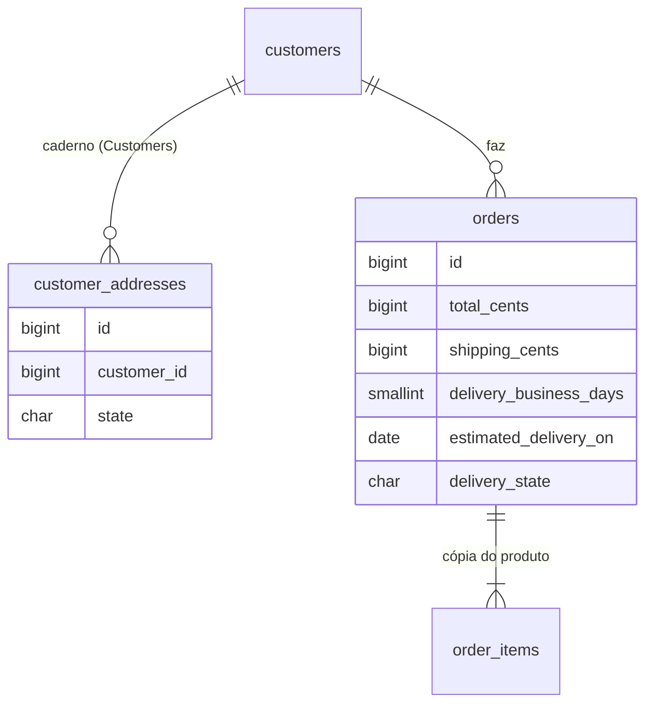
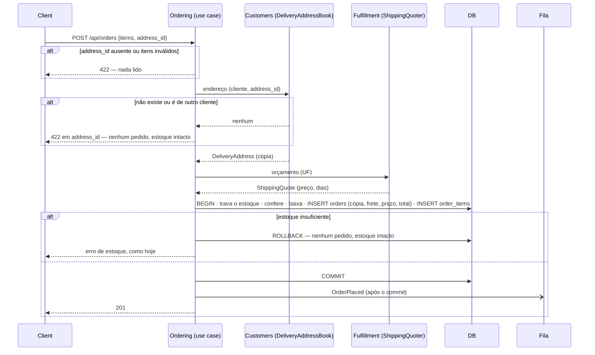
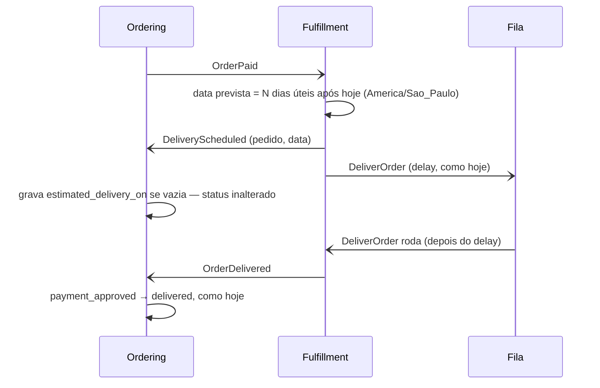

# Endereços e frete

> Plan from this document. Each slice below carries its own shape - copy it, do not re-derive it.
> Status: confirmed by diashelter, 2026-10-07

## Situation

- Project: em construção. É um projeto de estudo, sem produção e sem dados reais. O banco é recriado pelo `make setup` e pelo `make fresh`.
- Decision: decidida por diashelter em 2026-10-07 ("vamos evoluir a estrutura de entrega para um módulo de frete"). Reabre o README, que listava frete e endereços como "fora do escopo por definição".
- In flight: segue o precedente do contrato definido por quem consome e implementado por quem fornece (`ProductOrderHistory`) e o da cópia que `order_items` guarda do nome e do preço do produto. Não há branch aberta, e nada em andamento toca Customers, Fulfillment ou o checkout.
- At stake: se der errado, desfaz-se com `make fresh` e um dia de retrabalho. A mudança toca o núcleo (a criação do pedido e o valor cobrado), mas não há dados para migrar e o único consumidor da API é o frontend do repositório.

## Problem

Hoje o pedido não tem destino. A entrega é um job que espera 10 segundos e anuncia "entregue", qualquer que seja o lugar onde o cliente mora, e o total cobrado é só a soma dos itens. A [análise de domínio](../docs/domain-analysis.md) deixou dois contextos em 7/10 pela mesma lacuna. O Customers "não tem dados próprios de cliente (endereços)" e por isso grava direto na conta do Identity. O Fulfillment "não tem estado próprio" nem regra própria.

Esta peça deve tornar três coisas possíveis: o cliente guarda vários endereços, escolhe um na compra, e o módulo de entrega decide, com regras dele, quanto custa o frete e quando o pedido chega. Sem ela, toda evolução de entrega (rastreio, transportadora, tarifa por peso) não tem onde se apoiar. O momento é este porque os 5 passos do plano de evolução e o gateway de pagamento estão concluídos e o checkout está estável. Não há usuários nem número a medir.

## Success

- Worked if: um cliente compra para qualquer uma das 27 UFs, paga itens + frete e vê a data prevista de entrega depois que o pagamento é aprovado. Editar ou excluir um endereço não muda nenhum pedido feito, e a análise de domínio sobe a coesão do Customers e do Fulfillment com o motivo escrito. A checagem é estrutural: o `ModuleBoundariesTest` prova que o Ordering não usa o Customers e só conhece o Fulfillment pelos eventos e contratos.
- Going wrong: um preço de frete, um número de dias ou uma contagem de dias úteis aparece fora do Fulfillment (no Ordering, no frontend ou num seeder que não passa pela tabela de frete), ou a página do pedido lê `customer_addresses`.

## Boundary

In: o caderno de endereços em "Minha conta"; a tabela de frete por UF e o orçamento; a escolha do endereço e o frete no checkout; a cópia do endereço, do frete e do prazo no pedido; a data prevista fixada quando a entrega é agendada; o endereço, o frete e o prazo no detalhe do pedido (loja e admin); as regras novas no `ModuleBoundariesTest`; os dados do seeder.

Out:
- Edição da tabela de frete pela equipe: a tabela é fixa e só muda com deploy. Reabre quando alguém precisar mudar um preço sem deploy, e aí entra a decisão sobre frete que muda entre o orçamento e a compra.
- Mais de uma modalidade (Econômica/Expressa): uma só, "Padrão".
- Frete por peso ou dimensões: os produtos não têm esses dados.
- Consulta de CEP (ViaCEP) e tarifa por faixa de CEP: o CEP é validado só no formato.
- Frete grátis acima de um valor.
- Rastreio, etapa "Enviado" e tabela de remessas: o pedido mantém os 4 status.
- Feriados na contagem de dias úteis.
- Endereços do cliente na tela "Clientes" do admin.
- Transportadora real ou serviço de frete pronto (Correios, Melhor Envio, Frenet): o objetivo é o módulo ter regras próprias.
- Simular o frete no carrinho antes do login.

Unchanged: `OrderStatus` e a timeline de 4 passos; o Payment, que já cobra `orders.total_cents`; o job `DeliverOrder` e o `ORDER_DELIVERY_DELAY_SECONDS` (a transportadora fake continua entregando depois do delay, mesmo antes da data prevista); `POST /api/cart/validate` e a página do carrinho; o `CustomerAccount` e a tabela `customers`; o dashboard, que não soma `total_cents`.

## Shape

O caderno de endereços é o primeiro registro próprio do Customers, e o pedido passa a nascer com uma cópia do endereço escolhido, do frete e do prazo prometido, com o frete somado ao total cobrado. O Fulfillment ganha regras, mas não estado: a tabela de frete por UF, o orçamento e a data prevista que ele calcula ao agendar a entrega, que o Ordering registra no pedido. A porta é a forma do pedido (a cópia em colunas e o total com frete). Mudá-la depois custa `make fresh` e retrabalho no checkout, porque não há dados reais.

A alternativa mais pesada é uma remessa (`shipments`) com ciclo de vida próprio no Fulfillment e um orçamento gravado com validade, que o pedido referencia. Ela é a sugestão da análise de domínio e só se paga com rastreio, etapa "Enviado", várias remessas por pedido ou tarifas que mudam entre o orçamento e a compra. Nenhuma dessas condições está no escopo.

## Key decisions

1. **O pedido guarda uma cópia do endereço de entrega, do frete e do prazo prometido, feita na criação do pedido. Editar ou excluir o endereço, ou mudar a tabela de frete, nunca altera um pedido feito.** A cópia fica em colunas `NOT NULL` de `orders`, sem referência para `customer_addresses`. Assim, o banco garante que nenhum pedido existe sem destino.
2. **`orders.total_cents` passa a ser a soma das linhas mais `shipping_cents`, calculada no servidor, e é o valor que o Payment cobra.** O cliente nunca envia preço nem frete. O frete mostrado no checkout é só exibição: o pedido usa a tabela vigente na criação, como já acontece com o preço dos produtos.
3. **O caderno de endereços pertence ao Customers (`customer_addresses`). O Ordering o lê só pelo contrato `DeliveryAddressBook`, que ele mesmo define e o Customers implementa.** A dependência continua indo do Customers para o Ordering, e o `ModuleBoundariesTest` proíbe o Ordering de usar o Customers.
4. **As regras de frete pertencem ao Fulfillment: a tabela de preço e prazo por UF e a contagem de dias úteis. O Ordering pede o orçamento pelo contrato `ShippingQuoter`, que ele define e o Fulfillment implementa.** Nenhum outro lugar calcula preço, dias ou data: o frontend mostra os valores da API.
5. **A data prevista é fixada uma única vez, pelo Fulfillment, quando ele agenda a entrega em reação ao `OrderPaid`. Ela conta os dias úteis prometidos no pedido, no fuso `America/Sao_Paulo`, e chega ao pedido pelo evento `DeliveryScheduled`, que o Ordering registra.** Só o Ordering escreve em `orders`, como já acontece com o `OrderDelivered`. A primeira gravação vale, então um retry não muda a data, e registrar a data não muda o status.
6. **O vocabulário que os contratos trocam (`DeliveryAddress`, `ShippingQuote` e o enum de UFs `BrazilianState`) fica no Ordering, ao lado dos contratos.** O Customers e o Fulfillment já dependem do Ordering, então nenhuma dependência nova aparece. O `Shared` foi descartado porque o `AGENTS.md` o reserva para infraestrutura.

## Work

| Slice | Delivers | Status |
|---|---|---|
| [CustomerAddress](#customeraddress) | o caderno de endereços em "Minha conta → Endereços", com API própria no Customers | clear |
| [Shipping Quote](#shipping-quote) | a tabela de frete das 27 UFs e `GET /api/shipping/quote` no Fulfillment | clear |
| [Place Order](#place-order) | o checkout com endereço e frete; o pedido com a cópia e o total com frete | clear |
| [Delivery Estimate](#delivery-estimate) | a data prevista fixada ao agendar a entrega e o bloco de entrega no detalhe do pedido | clear |

Order: CustomerAddress e Shipping Quote em paralelo → Place Order → Delivery Estimate. O Place Order passa a exigir `address_id` em `POST /api/orders`, e o checkout muda no mesmo pull request.

Already handled by existing code: estoque insuficiente na confirmação (a resposta atual do checkout); pagamento recusado e nova tentativa (o Payment cobra o novo `total_cents` sem mudança); pedido de outro cliente (`403`, `OrderPolicy`); a entrega fake e a transição idempotente para `delivered`.

Seed: cada cliente do seeder ganha um endereço (o `cliente@example.com` em SP). Os pedidos do seeder ganham a cópia desse endereço e o frete calculado pela tabela, e os pagos e entregues ganham também a data prevista.

Derivable from the repository, left to the plan:
- o formato do erro, como o `ApiErrorResponse` já faz, com `409` `BUSINESS_RULE_VIOLATION` para regra de negócio;
- a validação no padrão dos outros `ApiFormRequest`, com mensagens em português;
- o `403` por policy, como a `OrderPolicy` faz;
- o dinheiro em centavos, com o sufixo `_cents` e `CHECK >= 0`, como em `orders.total_cents`;
- uma migration nova para tabela nova (como `payments`) e a migration original editada para tabela existente (como no money-in-cents);
- a ligação de cada contrato no service provider do módulo que o implementa, como o `OrderingServiceProvider` faz;
- o *throttle*, como em `POST /api/cart/validate`;
- uma expectativa por namespace no `ModuleBoundariesTest`;
- o README e a análise de domínio, como pede o `AGENTS.md`. O README tira frete e endereços de "fora do escopo"; a análise de domínio remove a pendência "Customers grava pelo repositório do `CustomerAccount`" e atualiza as seções Customers e Fulfillment e a matriz.

### CustomerAddress

**Delivers** o caderno de endereços do cliente: listar, cadastrar, editar e excluir em "Minha conta → Endereços" (`/account/addresses`). **Status: clear.**

| State | What should happen | Caller sees |
|---|---|---|
| Nenhum endereço | Lista vazia | `200` `[]`; a página mostra "Nenhum endereço cadastrado" e o botão de cadastrar |
| Cadastro válido | Grava o endereço do cliente logado | `201`, e o endereço aparece no topo da lista (mais recente primeiro) |
| CEP com hífen (`01310-100`) | Aceito e gravado só com os dígitos (`01310100`) | `201`, com `postal_code` em 8 dígitos |
| CEP sem 8 dígitos, UF fora das 27, campo obrigatório vazio | Nada é gravado | `422` no campo |
| 11º endereço | Nada é gravado; o limite é 10 por cliente. Dois cadastros simultâneos podem passar do limite, e isso é aceito sem trava | `409`, "Você pode cadastrar até 10 endereços." |
| Edição | Atualiza o endereço; os pedidos feitos com ele não mudam (Key decision 1) | `200` |
| Exclusão | Remove o endereço; os pedidos feitos com ele não mudam (Key decision 1) | a página pede confirmação; `204` |
| Endereço de outro cliente | Nada é lido nem gravado | `403` |
| Não autenticado | | `401` |

`GET /api/account/addresses` → `200` `{ data: CustomerAddress[] }`
`POST /api/account/addresses` `{ recipient_name, postal_code, street, number, complement?, district, city, state }` → `201` `{ data: CustomerAddress, message }`
`PUT /api/account/addresses/{address}` mesmo corpo → `200` `{ data: CustomerAddress, message }`
`DELETE /api/account/addresses/{address}` → `204`

`CustomerAddress` = `{ id, recipient_name, postal_code, street, number, complement | null, district, city, state, created_at }`.

Table `customer_addresses`; nenhuma tabela existente muda.

| Column | Type | Null | References | Note |
|---|---|---|---|---|
| `id` | bigint | no | | |
| `customer_id` | bigint | no | `customers.id` | `cascadeOnDelete`; índice |
| `recipient_name` | string(120) | no | | quem recebe |
| `postal_code` | char(8) | no | | `CHECK` só dígitos |
| `street` | string(150) | no | | logradouro |
| `number` | string(20) | no | | texto, aceita "S/N" |
| `complement` | string(100) | yes | | |
| `district` | string(100) | no | | bairro |
| `city` | string(100) | no | | não é validada contra a UF |
| `state` | char(2) | no | | `BrazilianState` (Key decision 6); `CHECK` nas 27 siglas |
| `created_at`, `updated_at` | timestamp | yes | | |

Alternatives considered:
- Endereço "principal" (flag por cliente). Ganha quando os clientes tiverem muitos endereços e o "último cadastrado" errar com frequência no checkout.
- Preencher o endereço pelo CEP (ViaCEP). Ganha quando digitar o endereço inteiro virar a queixa. É uma integração externa, com falha e tempo de resposta próprios.

### Shipping Quote

**Delivers** a tabela de frete do Fulfillment e o orçamento por UF, servido ao checkout e ao Ordering (Key decision 4). **Status: clear.**

A tabela fica na configuração do Fulfillment, não no banco. A origem é São Paulo, e toda UF tem tarifa, então não existe o estado "não entregamos aqui".

| UFs | Frete | Prazo |
|---|---|---|
| SP | R$ 15,00 (`1500`) | 2 dias úteis |
| RJ, MG, ES | R$ 22,00 (`2200`) | 4 dias úteis |
| PR, SC, RS | R$ 25,00 (`2500`) | 5 dias úteis |
| DF, GO, MT, MS | R$ 30,00 (`3000`) | 6 dias úteis |
| BA, SE, AL, PE, PB, RN, CE, PI, MA | R$ 38,00 (`3800`) | 8 dias úteis |
| PA, AP, AM, RR, AC, RO, TO | R$ 45,00 (`4500`) | 10 dias úteis |

| State | What should happen | Caller sees |
|---|---|---|
| UF válida | Devolve o frete e o prazo da tabela | `200` |
| UF ausente ou fora das 27 | | `422` em `state` |

`GET /api/shipping/quote?state=SP` → `200` `{ data: { state, price_cents, delivery_business_days } }` (rota pública, como `POST /api/cart/validate`)

`ShippingQuoter` (contrato do Ordering, implementado pelo Fulfillment): recebe uma `BrazilianState` e devolve um `ShippingQuote` com `price_cents` e `delivery_business_days`. O endpoint e o contrato usam a mesma regra.

Alternatives considered:
- Tabela `shipping_rates` no banco. Ganha quando a equipe editar as tarifas no admin, e então o seed pode sair desta tabela.
- Orçar por `address_id`. Ganha quando a regra precisar de mais do que a UF (CEP, cidade). Hoje, isso faria o Fulfillment ler o Customers sem necessidade.

### Place Order

**Delivers** o checkout com endereço e frete, e o pedido criado com a cópia do endereço, o frete, o prazo prometido e o total com frete. **Status: clear.** É a porta de mão única (Key decisions 1 e 2).

| State | What should happen | Caller sees |
|---|---|---|
| Checkout sem endereço cadastrado | O formulário de endereço abre no próprio checkout. Ao salvar, o endereço vai para o caderno (`POST /api/account/addresses`) e já fica selecionado | "Confirmar compra" desabilitado até haver endereço selecionado |
| Checkout com endereços | O último cadastrado vem selecionado, e o frete e o prazo dele são orçados | Subtotal, Frete, Total e "Entrega em até N dias úteis após a aprovação do pagamento" |
| Troca de endereço ou "Adicionar outro endereço" | Novo orçamento para a UF do endereço selecionado | Frete e Total atualizados |
| Orçamento falhou (rede) | Nada é confirmado | "Não foi possível calcular o frete." e a opção de tentar de novo; "Confirmar compra" desabilitado |
| Confirmação válida | Cria o pedido com a cópia do endereço, `shipping_cents` e `delivery_business_days` da tabela vigente e `total_cents` = linhas + frete, numa transação só com a baixa do estoque | `201`, e o cliente vai para a página de pagamento como hoje, onde o total já inclui o frete |
| `address_id` ausente | Nada é lido | `422` em `address_id`, "Escolha um endereço de entrega." |
| `address_id` excluído ou de outro cliente | Nenhum pedido é criado e o estoque não muda | `422` em `address_id`, "Endereço de entrega não encontrado."; o checkout recarrega os endereços |
| Endereço editado ou excluído depois da compra | O pedido mantém a cópia (Key decision 1) | |
| Tabela de frete mudou entre o orçamento e a confirmação | O pedido usa a tabela vigente (Key decision 2) | o total real na página de pagamento, antes de pagar |

`POST /api/orders` `{ items: [{ product_id, quantity }], address_id }` → `201` `{ data: Order, message }`

Table `orders` (migration original editada):

| Column | Type | Null | References | Note |
|---|---|---|---|---|
| `total_cents` | bigint | no | | linhas + `shipping_cents`; `CHECK (total_cents >= shipping_cents)` |
| `shipping_cents` | bigint | no | | frete cobrado; `CHECK >= 0` |
| `delivery_business_days` | smallint | no | | prazo prometido no checkout; `CHECK > 0` |
| `estimated_delivery_on` | date | yes | | gravada pela [Delivery Estimate](#delivery-estimate) |
| `delivery_recipient_name` | string(120) | no | | cópia de `customer_addresses` |
| `delivery_postal_code` | char(8) | no | | cópia |
| `delivery_street` | string(150) | no | | cópia |
| `delivery_number` | string(20) | no | | cópia |
| `delivery_complement` | string(100) | yes | | cópia |
| `delivery_district` | string(100) | no | | cópia |
| `delivery_city` | string(100) | no | | cópia |
| `delivery_state` | char(2) | no | | cópia; `CHECK` nas 27 siglas |

`orders` não referencia `customer_addresses`: o endereço chega ao pedido como cópia.

O endereço é lido antes da transação. Se ele for excluído entre a leitura e o commit, o pedido fica com a cópia do que o cliente escolheu, e isso é aceito.

Alternatives considered:
- Cópia numa tabela 1:1 (`order_delivery_addresses`). Ganha quando o pedido tiver mais de um endereço (cobrança, entregas divididas). Em colunas, o `NOT NULL` garante o destino de graça.
- Recusar com `409` quando o frete mudou entre o orçamento e a confirmação. Ganha quando a tabela puder mudar sem deploy.

### Delivery Estimate

**Delivers** a data prevista de entrega, fixada pelo Fulfillment ao agendar a entrega, e o bloco "Entrega" no detalhe do pedido da loja e do admin. **Status: clear.** A regra é a Key decision 5.

A data prevista é o N-ésimo dia útil (segunda a sexta) depois da data em que a entrega é agendada, em `America/Sao_Paulo`. O dia do agendamento não conta.

| State | What should happen | Caller sees |
|---|---|---|
| Pedido em `placed` ou `awaiting_payment` | `estimated_delivery_on` vazia | "Entrega em até N dias úteis após a aprovação do pagamento" |
| Pagamento aprovado, entrega ainda não agendada pela fila | Igual ao anterior. A página do pedido na loja já faz *polling*; a do admin mostra a data ao recarregar | o mesmo texto |
| Entrega agendada numa quarta, prazo 2 | Data prevista: sexta | "Entrega prevista: dd/mm/aaaa" |
| Agendada numa sexta ou num sábado, prazo 2 | Data prevista: terça | "Entrega prevista: dd/mm/aaaa" |
| Agendada às 23h30 de quarta em Brasília (quinta em UTC) | Conta a partir de quarta | |
| Listener ou evento repetido (retry) | A data não muda: a primeira gravação vale | |
| `DeliveryScheduled` processado depois do `OrderDelivered` | A data é gravada mesmo assim; o status não muda | |
| Pedido entregue | O status manda; a data prevista fica guardada | "Pedido entregue" no lugar da previsão |
| Detalhe do pedido (loja e admin) | Mostra o destinatário e o endereço copiados, o subtotal, o frete, o total e o prazo ou a data | o mesmo bloco nas duas telas |

`DeliveryScheduled` (evento do Fulfillment) leva o pedido e a data prevista. O Ordering o escuta e grava `orders.estimated_delivery_on` (Key decision 5).

Campos novos em `Order` (`GET /api/orders/{order}`, `GET /api/admin/orders/{order}` e as listagens, que usam o mesmo recurso):
`{ items_total_cents, shipping_cents, total_cents, delivery: { business_days, estimated_on: "YYYY-MM-DD" | null, address: { recipient_name, postal_code, street, number, complement | null, district, city, state } } }`

Alternatives considered:
- Contar a partir do instante do pagamento aprovado, não do agendamento. Ganha se a fila atrasar dias. Exigiria que o `OrderPaid` levasse esse instante, porque o Fulfillment não pode conhecer o Payment.
- Feriados no calendário. Ganha quando uma data prevista errada por causa de um feriado for notada.

## Sources

- `README.md`, seção "Escopo e decisões": frete e endereços listados como fora do escopo por definição, agora reabertos.
- `docs/domain-analysis.md`, seções Fulfillment e Customer Account, e "Pendências depois do plano": a coesão 7/10 de cada um pelo mesmo motivo (sem estado ou dados próprios) e a remessa sugerida como exemplo.
- `AGENTS.md`: só o Ordering muda o pedido, o contrato definido por quem consome (como o `ProductOrderHistory`) e uma expectativa por namespace no `ModuleBoundariesTest`.
- [.design/money-in-cents.md](money-in-cents.md): dinheiro como inteiro de centavos, com a unidade no nome da coluna.
- [.design/fake-payment-gateway.md](fake-payment-gateway.md): o Payment cobra `orders.total_cents` no momento da tentativa.
- [.design/staff-and-customer-accounts.md](staff-and-customer-accounts.md): `customers` como tabela da conta do comprador e o guard `customer` nas rotas da loja.
