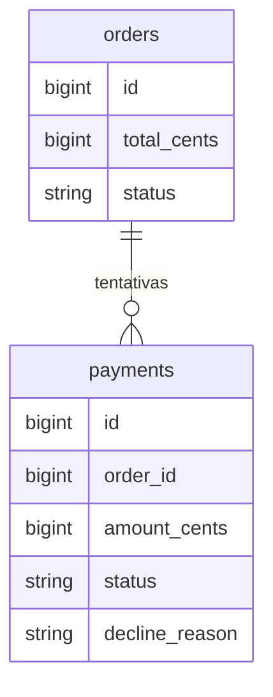
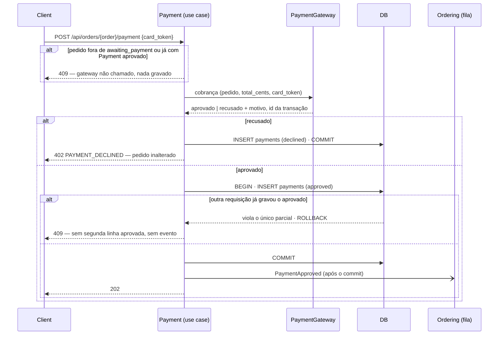

# Gateway de pagamento fake

> Plan from this document. Each slice below carries its own shape - copy it, do not re-derive it.
> Status: confirmed by diashelter, 2026-10-06

## Situation

- Project: em construção. É um projeto de estudo, sem produção e sem dados reais. O banco é recriado pelo `make setup` e pelo `make fresh`.
- Decision: decidida por diashelter em 2026-10-06, como item do backlog ("Evoluir para um Gateway de pagamento fake, utilizando uma interface porque pode trocar"). É um exercício do padrão porta/adaptador. Nenhum gateway real (Stripe, Mercado Pago, Pagar.me) está planejado.
- In flight: segue o precedente dos contratos do Inventory, com a interface no próprio módulo e a ligação no service provider do módulo, e a convenção de dinheiro em centavos de [money-in-cents](money-in-cents.md). Nada em andamento toca o módulo Payment, que não muda desde o commit inicial.
- At stake: se der errado, desfaz-se em uma tarde. A mudança cria só uma tabela nova, não há dados para migrar e o único consumidor do endpoint de pagamento é o frontend do repositório.

## Problem

O módulo Payment não tem gateway nem modelo próprio. Todo pagamento é aprovado na hora, e o README registra que o "pagamento recusado" não foi implementado. A análise de domínio dá nota 7/10 de coesão ao Payment justamente por isso ("não haver um modelo próprio, nem `Payment`, nem transação"). A matriz entre contextos também deixa como próximo passo "evoluir para um modelo `Payment` próprio quando houver gateway".

Esta peça deve tornar duas coisas possíveis. A primeira é trocar o gateway escrevendo só um adaptador novo. A segunda é o cliente ter o pagamento recusado e tentar de novo. Nada a jusante fica travado sem ela: é a próxima peça de estudo, e o momento é este porque os 5 passos do plano de evolução estão concluídos e a costura no Payment ainda sai de graça. Não há usuários nem número a medir.

## Success

- Worked if: trocar o gateway exige apenas uma classe nova que implementa `PaymentGateway` e a troca de uma ligação. Use case, controller, request, contrato da API e frontend não mudam. A checagem é estrutural: os testes de feature passam com outro adaptador ligado no lugar do fake.
- Going wrong: um token de cartão de teste ou o nome `FakePaymentGateway` aparece fora do adaptador fake, do service provider do Payment e da lista de cartões do frontend; ou o use case decide algo com base em qual gateway está ligado.

## Boundary

In: a porta `PaymentGateway` e o adaptador `FakePaymentGateway`; a tabela `payments` e o model `Payment`; o caminho de recusa em `POST /api/orders/{order}/payment`; a escolha do cartão de teste na página de pagamento; a regra nova no `ModuleBoundariesTest`; a atualização do README e da análise de domínio.

Out:
- Simular falha do gateway (fora do ar, timeout): é um terceiro caminho, com erro e retry próprios. Reabre quando houver um gateway real ou quando o estudo for retry.
- Pagamento assíncrono (pendente, webhook, Pix, 3DS): exige um estado pendente e um endpoint de callback. Reabre com um gateway que confirme depois.
- Estorno e cancelamento: não há fluxo de cancelamento de pedido.
- Telas de histórico de tentativas, tanto para o cliente quanto para o admin: os dados ficam gravados e prontos para uma tela futura.
- Escolher o gateway por configuração: só existe um adaptador. Reabre quando existir o segundo.
- Mais de uma moeda: o README deixa fora do escopo. O valor é sempre BRL em centavos.

Unchanged:
- `OrderStatus` continua com quatro valores; a recusa não cria status no pedido.
- O evento `PaymentApproved` e o seu conteúdo (o `Order`), o listener `MarkOrderAsPaid` e o fluxo `OrderPaid` → entrega.
- A resposta de aprovação: `202` com o pedido e a mesma mensagem.
- O `409` com "Este pedido não está aguardando pagamento." e o `403` da policy `pay`.
- `OrderResource`: não ganha campo de pagamentos.

## Shape

Cada tentativa de pagar um pedido vira um `Payment`, aprovado ou recusado, gravado pelo próprio módulo Payment. Pagar envia o total do pedido e o token de um cartão de teste pela porta `PaymentGateway` ao `FakePaymentGateway`, que decide o resultado pelo token. A aprovação anuncia `PaymentApproved` como hoje, e a recusa responde `402` sem mexer no pedido. A porta de mão única é o contrato da porta, que é uma cobrança síncrona: um gateway que confirme depois exige um estado novo e um endpoint novo, não só um adaptador novo.

A alternativa mais pesada grava a tentativa como pendente antes de cobrar e envia o id dela ao gateway como chave de idempotência. Só compensa quando um gateway movimenta dinheiro de verdade, e nenhum está planejado. O formato leve não sobrevive a um gateway real com duplo envio simultâneo: a requisição perdedora já foi cobrada quando o banco a recusa (Key decision 4). É isso que forçaria a reescrita.

## Key decisions

1. **O contrato da porta não carrega nada do fake.** A entrada é a referência do pedido, o valor em centavos e o token do cartão; a saída é aprovado ou recusado, o motivo da recusa (lista fechada: `insufficient_funds`, `card_declined`, `invalid_card`) e o id da transação no gateway. O valor vem sempre de `orders.total_cents` no momento da tentativa, nunca da requisição.
2. **Só o service provider do Payment conhece o adaptador.** Use case e controller dependem de `PaymentGateway`, ligado ao `FakePaymentGateway` por `$bindings`, como o Inventory faz com os seus contratos. O `ModuleBoundariesTest` cobra a regra, com um namespace por expectativa e uma violação de propósito para confirmar que ela falha.
3. **Toda tentativa vira uma linha em `payments`, inclusive a recusada, mesmo que a requisição responda com erro.** Não copie o precedente de lançar `BusinessRuleException` dentro da transação da escrita: ele desfaria a linha da recusa. A linha não muda depois de gravada, então `approved` e `declined` são finais e há um só escritor.
4. **Há no máximo um `Payment` aprovado por pedido, garantido pelo banco.** Quando duas aprovações correm juntas, a perdedora recebe `409`, não deixa uma segunda linha aprovada e não anuncia nada. `PaymentApproved` sai uma vez por pagamento aprovado e só depois do commit.
5. **"Pode ser pago" passa a olhar também os registros do próprio Payment.** O pedido precisa estar em `awaiting_payment` **e** não ter `Payment` aprovado. Isso fecha a janela em que a aprovação já foi gravada, mas a fila ainda não moveu o pedido. Antes dessa regra, um segundo clique nessa janela chegaria ao gateway.
6. **A recusa não muda o pedido.** Ele fica em `awaiting_payment`, as novas tentativas são ilimitadas, e o Payment continua sem alterar o status do pedido.

## Work

| Slice | Delivers | Status |
|---|---|---|
| [PaymentGateway](#paymentgateway) | a porta e o adaptador fake que decide pelo token, ligados no service provider do Payment | clear |
| [Pay Order](#pay-order) | `POST /api/orders/{order}/payment` cobrando pela porta, gravando `payments` e recusando com `402` | clear |
| [PaymentPage](#paymentpage) | a página de pagamento com a escolha do cartão de teste e a recusa com nova tentativa | clear |

Order: PaymentGateway → Pay Order → PaymentPage, no mesmo pull request: o corpo da requisição passa a exigir `card_token`, e o frontend muda junto.

Already handled by existing code: cliente não autenticado (`401`) e pedido de outro cliente (`403`, policy `pay`); pedido ainda em `placed` (a página já faz *polling* e mantém o botão desabilitado); a transição idempotente `awaiting_payment → payment_approved` no Ordering.

Derivable from the repository, left to the plan:
- formato do erro, como o `ApiErrorResponse` já faz, com o código novo `PAYMENT_DECLINED` em `ApiErrorCode`;
- validação no padrão dos outros `ApiFormRequest`;
- enum de status, factory e `#[UseFactory]` no padrão de `OrderStatus` e `Order`;
- `CHECK` de valor não negativo, como em `orders.total_cents`;
- atualização do README (fluxo de pagamento, API, testes, "Escopo e decisões") e da análise de domínio (seção Payment, matriz, nota de coesão), como pede o `AGENTS.md`.

### PaymentGateway

**Delivers** a porta `PaymentGateway` e o `FakePaymentGateway`, que decide o resultado só pelo token do cartão. **Status: clear.** É a porta de mão única (Key decisions 1 e 2).

| Token recebido | Resultado |
|---|---|
| `fake_card_approved` | aprovado |
| `fake_card_insufficient_funds` | recusado, `insufficient_funds` |
| `fake_card_declined` | recusado, `card_declined` |
| qualquer outro | recusado, `invalid_card` |
| qualquer token | devolve um id de transação novo, com prefixo `fake_`; o valor não influencia o resultado |

Alternatives considered: escolher o adaptador por uma chave de configuração, que ganha quando existir o segundo adaptador.

### Pay Order

**Delivers** o pagamento de um pedido pela porta, com a tentativa gravada e a recusa devolvida ao cliente. **Status: clear.**

| State | What should happen | Caller sees |
|---|---|---|
| Pedido em `awaiting_payment`, cartão aprovado | Grava o `Payment` aprovado com `amount_cents` = total do pedido e anuncia `PaymentApproved` depois do commit; a fila move o pedido | `202`, pedido + "Pagamento aprovado. O pedido será atualizado em instantes." |
| Cartão com saldo insuficiente | Grava o `Payment` recusado (`insufficient_funds`); pedido inalterado; nenhum evento | `402` `PAYMENT_DECLINED`, "Pagamento recusado: saldo insuficiente." |
| Cartão recusado pelo emissor | Grava o `Payment` recusado (`card_declined`); pedido inalterado | `402` `PAYMENT_DECLINED`, "Pagamento recusado pelo emissor do cartão." |
| Token desconhecido | Grava o `Payment` recusado (`invalid_card`); pedido inalterado | `402` `PAYMENT_DECLINED`, "Cartão inválido." |
| Nova tentativa depois de uma recusa | Permitida; grava um `Payment` novo (Key decision 6) | o resultado do novo cartão |
| `card_token` ausente ou não é texto | Nada é gravado e o gateway não é chamado | `422` em `card_token` |
| Pedido fora de `awaiting_payment` | Nada é gravado e o gateway não é chamado | `409`, "Este pedido não está aguardando pagamento." |
| Pedido já tem `Payment` aprovado, mas a fila ainda não o moveu | Nada é gravado e o gateway não é chamado (Key decision 5) | `409`, mesma mensagem |
| Duas aprovações simultâneas | Uma única linha aprovada e um único `PaymentApproved` (Key decision 4) | uma recebe `202`, a outra `409` |

`POST /api/orders/{order}/payment` `{ card_token: string }` → `202` `{ data: Order, message }`

Table `payments`; nenhuma tabela existente muda.

| Column | Type | Null | References | Note |
|---|---|---|---|---|
| `id` | bigint | no | | |
| `order_id` | bigint | no | `orders.id` | `restrictOnDelete`; índice |
| `amount_cents` | bigint | no | | `CHECK (amount_cents >= 0)`; cópia de `orders.total_cents` no momento da tentativa |
| `status` | string(20) | no | | `approved` \| `declined` |
| `decline_reason` | string(40) | yes | | `insufficient_funds` \| `card_declined` \| `invalid_card`; `CHECK`: preenchido se e só se `status = 'declined'` |
| `card_token` | string(64) | no | | o token do cartão de teste usado |
| `gateway` | string(30) | no | | qual adaptador processou: `fake`. Distingue as linhas antigas quando outro gateway entrar |
| `gateway_transaction_id` | string(100) | no | | id devolvido pelo gateway, também nas recusas |
| `created_at`, `updated_at` | timestamp | yes | | |

Índice único parcial em `order_id` onde `status = 'approved'` (Key decision 4).

Alternatives considered:
- Responder a recusa com `422`. Ganha se a recusa for tratada como erro de formulário. O `402` foi escolhido porque o pedido é válido e quem recusa é o pagamento.
- Responder `200` com o `Payment` recusado no corpo. Ganha quando as tentativas virarem um recurso que o cliente lista, o que fica fora desta rodada.

### PaymentPage

**Delivers** a página `/payment/:orderId` com a escolha do cartão de teste e a nova tentativa depois de uma recusa. **Status: clear.**

| State | What should happen | Caller sees |
|---|---|---|
| Pedido em `awaiting_payment` | Lista os três cartões de teste, nenhum marcado; "Pagar" fica desabilitado até a escolha | "Cartão aprovado", "Recusado: saldo insuficiente", "Recusado pelo emissor" |
| Pagamento aprovado (`202`) | Vai para a página do pedido, como hoje | notificação de sucesso e a timeline atualizando |
| Pagamento recusado (`402`) | Continua na página com o cartão marcado e permite tentar de novo | a mensagem da API em destaque na página |
| Pedido já pago ou fora de `awaiting_payment` (`409`) | Recarrega o pedido, como hoje | notificação de erro e "O pagamento deste pedido já foi processado." |
| Pedido ainda em `placed` | *Polling*, como hoje; cartões e botão desabilitados | "Processando o pedido na fila..." |

Alternatives considered: buscar a lista de cartões de teste num endpoint da API. Ganha quando mais de um cliente precisar da lista. Hoje, a lista no frontend faz o papel do SDK do gateway.

## Sources

- `README.md`, seção "Escopo e decisões": registra o gateway real fora do escopo e o "pagamento recusado" não implementado.
- `docs/domain-analysis.md`, seção "Payment" e matriz entre contextos: coesão 7/10 pela falta de modelo próprio, e a Anti-Corruption Layer prevista para quando houver gateway.
- `AGENTS.md`: fronteiras entre contextos (o Payment só publica eventos) e a regra de uma expectativa por namespace no `ModuleBoundariesTest`.
- [.design/money-in-cents.md](money-in-cents.md): dinheiro como inteiro de centavos, com a unidade no nome da coluna.
