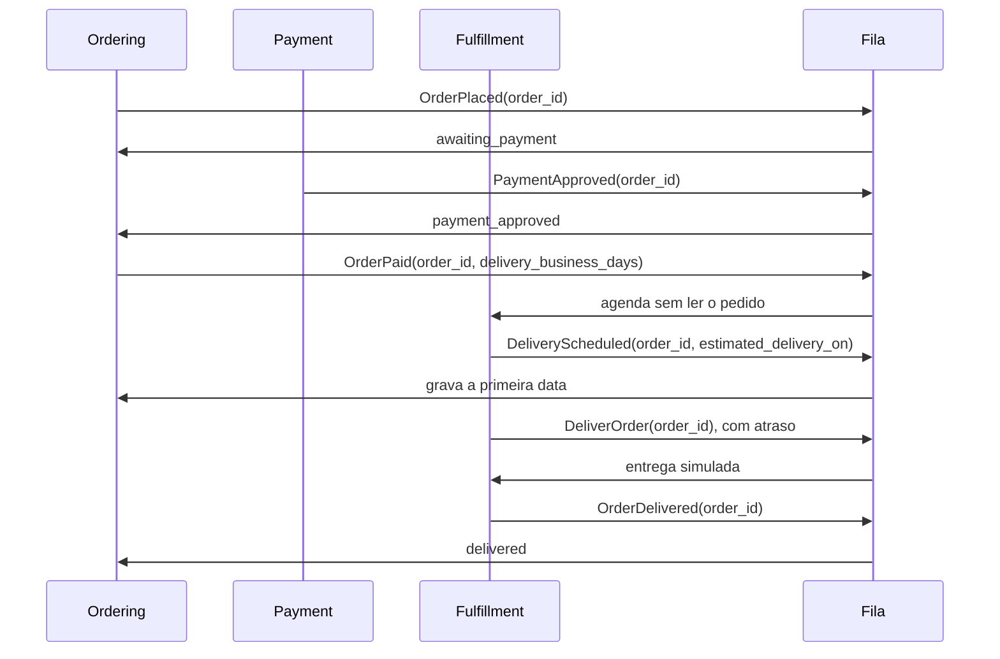
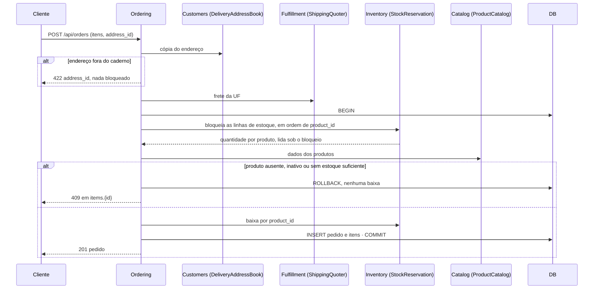

# Facades dos módulos: contratos como única porta entre contextos

> Faça o plano a partir deste documento. Cada slice abaixo já traz a sua forma: copie, não derive de novo.
> Status: confirmed by diashelter, 2026-10-08

## Situation

- Project: em construção. É um projeto de estudo, sem produção e sem usuários. O banco é recriado por `make fresh`, então não há dados a migrar.
- Decision: decidida por diashelter na [HEL-7](https://linear.app/helter/issue/HEL-7/vamos-evoluir-a-estrutura-e-determinar-algums-limites-para-os) em 2026-10-08: um módulo não acessa as dependências de outro, e cada módulo oferece uma facade que encapsula a sua lógica. Esta discovery decidiu o significado de "facade", o alcance e a ordem: a HEL-7 vem antes da HEL-9 (outbox) e da HEL-6 (CQRS).
- In flight: segue o precedente dos seis contratos por papel que já existem e do `ModuleBoundariesTest`, incluindo os contratos definidos pelo módulo consumidor para evitar ciclos. A HEL-8 (observabilidade) toca o `Shared` e o Docker e não cruza com esta mudança. A HEL-9 e a HEL-6 ficam de fora, mas vão ser construídas sobre o que este documento define.
- At stake: médio. São cerca de 60 arquivos em todos os módulos. Errar custa só retrabalho, sem dados envolvidos. O custo real está na superfície pública: depois que a HEL-9 e a HEL-6 forem construídas sobre ela, mudá-la custa mais.

## Problem

Construção. A HEL-7 existe para que uma mudança dentro de um módulo não obrigue outro a mudar. Sem isso, a HEL-9 não tem payloads de evento que possa gravar num outbox, e a HEL-6 não sabe quais leituras atravessam módulos. Fazer a HEL-7 depois delas significaria escrever a fronteira duas vezes.

Hoje a fronteira é uma lista de proibições: cerca de 20 regras pontuais no `ModuleBoundariesTest`, e tudo o que nenhuma regra nomeia é permitido. Há 102 referências de um arquivo para uma classe de outro módulo, sem contar o `Shared`. Só 12 passam por `Contracts` ou `Events`. As outras 90 entram nas partes internas:

- 48 entram em `Models`, `Repositories` e `Services`. É o alcance desta rodada.
- 42 entram em `Http`, `ValueObjects`, `Enums` e `DTOs`.

Até os contratos públicos vazam modelo: o `StockInitializer` recebe um `Product` e devolve um `Stock`. A contagem saiu das declarações `use` em `backend/app/Modules`, em 2026-10-08.

## Success

- Worked if:
  - as 39 referências de um módulo para os `Models`, `Repositories` e `Services` de outro caem para 0;
  - sobram só as 9 exceções declaradas da Key decision 7, cada uma apontando para a HEL-6;
  - o `ModuleBoundariesTest` falha quando uma classe de qualquer pasta privada é usada por outro módulo, e isso foi conferido com uma violação de propósito;
  - `make test` e o Pint passam;
  - o ciclo completo de um pedido (criar → pagar → entregar) roda com o worker real.
- Going wrong:
  - um contrato devolve um model ou uma coleção de models, e o vazamento só muda de lugar;
  - um slice ganha uma exceção nova para o teste passar;
  - o `Contracts` de algum módulo ganha uma classe que não é interface.
- Review: quando a HEL-9 ou a HEL-6 começar. diashelter relê as exceções da Key decision 7.

## Boundary

In:
- As travessias para `Models`, `Repositories` e `Services` de outro módulo nos pares Payment → Ordering, Fulfillment → Ordering, Customers → Ordering, Customers → Identity, Ordering → Catalog, Ordering → Inventory, Ordering → Identity, Catalog → Inventory e Inventory → Catalog.
- O payload dos cinco eventos e do job `DeliverOrder`.
- O `ModuleBoundariesTest` como lista do que é permitido.
- A atualização do README, da análise de domínio e dos tipos do frontend.

Out:
- Travessias para `Http`, `ValueObjects`, `Enums` e `DTOs` (42 referências): ficam para a [HEL-10](https://linear.app/helter/issue/HEL-10/fechar-as-travessias-de-http-value-objects-enums-e-dtos-entre-modulos). Até lá continuam permitidas (Key decision 1).
- Envelope dos eventos, outbox e disparo transacional: pertencem à HEL-9. Aqui muda só o que cada evento carrega.
- O dashboard do Backoffice, a vitrine e a lista de estoque do admin: são leituras montadas com dados de vários módulos e ficam para a HEL-6 (Key decision 7).
- Separar a persistência: chaves estrangeiras entre módulos, o `Customer` do Ordering lendo a tabela `customers`, esquemas por módulo. Ver Shape.
- Facades estáticas do Laravel.

Unchanged:
- As chaves estrangeiras `order_items.product_id`, `payments.order_id`, `orders.customer_id` e `stocks.product_id`.
- Os nomes `StockReservation`, `StockInitializer`, `ProductOrderHistory`, `DeliveryAddressBook`, `ShippingQuoter` e `PaymentGateway`.
- As regras de direção que já estão no `ModuleBoundariesTest`.
- A projeção somente leitura `Customer` do Ordering.
- As rotas, os códigos HTTP e as mensagens de erro.
- Os corpos de resposta, exceto os dois que estreitam: o do slice [PayableOrders](#payableorders) e o do slice [CustomerOrderHistory](#customerorderhistory).

## Prior art

- O Spring Modulith trata cada módulo como uma API explícita (o pacote base e as "named interfaces") e esconde o resto em subpacotes internos. A verificação bloqueia referências a tipos internos, e um módulo "open" serve para a migração gradual. **Adotamos:** `Contracts` e `Events` são a API, o resto é privado por padrão, e as exceções declaradas fazem o papel do módulo aberto.
- No retrospecto do Packwerk, a Shopify tirou do núcleo a checagem de privacidade (v3.0). A pasta pública virou depósito de código "que nunca deveria ser público", e a atenção foi da direção das dependências para o desenho de API. As Key decisions 1 e 3 existem para evitar isso: `Contracts` só aceita interfaces, só há contrato para travessia real, e as regras de direção continuam.
- Os dois oferecem uma lista de violações congeladas, uma catraca. Não adotamos: é um autor só, há cerca de 30 ligações no alcance, e a HEL-9 e a HEL-6 devem começar sobre a fronteira limpa.

## Shape

A facade de cada módulo é o conjunto dos seus contratos por papel em `Contracts`, que falam só em dados, mais os seus `Events`, que passam a carregar ids e valores. Todo o resto do módulo é privado, e o `ModuleBoundariesTest` vira uma lista do que é permitido, gerada a partir das pastas que existem. As 39 travessias dão lugar a cinco contratos novos (`ProductCatalog`, `StockLevels`, `PayableOrders`, `CustomerOrderHistory` e `CustomerAccounts`) e aos dois contratos do Inventory reescritos para falar em ids. A porta é essa superfície pública: depois que a HEL-9 e a HEL-6 forem construídas sobre esses contratos e payloads, mudar um deles significa mudar cada consumidor e o formato gravado no outbox.

A alternativa mais pesada é separar também a persistência: nenhuma FK entre módulos, nenhum módulo lendo a tabela de outro e um esquema por módulo. Ela só se paga se algum módulo for extraído ou ganhar banco próprio, e nada no roadmap (HEL-6, HEL-8, HEL-9) faz isso.

Fora da comparação, só para referência:
- Uma interface única por módulo (`OrderingFacade`) foi descartada: todo consumidor passaria a depender de tudo.
- Uma facade estática do Laravel pode ser posta depois por cima de um contrato, sem mudar a fronteira.
- O Deptrac faria o mesmo papel do teste, mas o precedente do projeto é o arch test do Pest.

## Key decisions

1. **A facade de um módulo é o seu `Contracts` mais os seus `Events`. O resto é privado, e uma pasta nova já nasce privada.** O `Contracts` só aceita interfaces; essa regra hoje vale para Inventory, Ordering e Payment e passa a valer para todos os módulos. Até a HEL-10, `DTOs`, `ValueObjects`, `Enums` e `Http` continuam alcançáveis (Boundary). A raiz de composição fica fora da regra: `routes/api.php`, `AppServiceProvider`, factories, seeders e testes.
2. **Contratos e eventos falam em dados, nunca em models do Eloquent nem em coleções de models.** Isso quer dizer ids, value objects e enums, e vale também para os contratos que já existem: o `StockInitializer` e o `StockReservation` deixam de receber e devolver `Product` e `Stock`. O que um contrato devolve é um value object imutável do módulo que define o contrato, como já são o `DeliveryAddress` e o `ShippingQuote`.
3. **Um contrato só existe para uma travessia que existe hoje, e o seu nome é o papel de que o chamador precisa.** Payment e Fulfillment não ganham facade, porque ninguém os chama. Quando o fornecedor já depende do consumidor, o consumidor define o contrato, como no `ProductOrderHistory`, no `DeliveryAddressBook` e no `ShippingQuoter`. Assim, se A chama um contrato de B, B nunca chama um contrato de A (a única exceção é a da Key decision 7). As regras de direção que o `ModuleBoundariesTest` já tem continuam: a regra de privacidade se soma a elas, não as substitui.
4. **O checkout continua sendo uma única transação entre Ordering, Inventory e Catalog.** Bloquear as linhas de estoque, conferir a disponibilidade com as quantidades lidas sob o bloqueio, baixar o estoque e criar o pedido acontecem juntos, ou nada acontece. Os contratos chamados ali rodam dentro da transação de quem chama, e a ordem dos bloqueios (por `product_id`) continua dentro do Inventory. Um checkout concorrente pelo mesmo produto espera e perde com o erro de estoque, sem pedido e sem baixa.
5. **Eventos carregam o id do pedido e os valores de que o consumidor precisa, nunca o model.** O `OrderPaid` leva os dias úteis da entrega, e o `DeliveryScheduled` leva a data prevista. Se o consumidor precisar de mais alguma coisa, pergunta ao dono por contrato. Isso vale para os cinco eventos, inclusive o `OrderPlaced`, que hoje só o Ordering escuta. O envelope e o disparo são da HEL-9.
6. **Fora do Identity, o cliente autenticado é um id, e o registro de outro módulo chega pela rota como id.** Policies e use cases recebem o id pelo `Authenticatable` do framework, nunca o `CustomerAccount`. Um parâmetro de rota que aponta para o registro de outro módulo é resolvido pelo contrato do dono, nunca por route model binding, com `404` quando o contrato não devolve nada. Hoje são dois casos: `{order}` no pagamento e `{customer}` no admin de clientes.
7. **As exceções ficam declaradas no teste, uma por travessia, cada uma com a issue que a remove.** São elas:
   - o Backoffice lendo os repositories de quatro módulos (HEL-6);
   - a vitrine e a lista de estoque do admin, com `Product::stock`, `Stock::product` e a regra de disponibilidade chamada pelo Catalog e pelo Inventory (HEL-6).

   A regra de disponibilidade continua escrita uma vez só, no Ordering: a vitrine e a lista de estoque continuam chamando essa regra em vez de copiá-la, senão o problema 2 da análise de domínio volta.

## Work

| Slice | Delivers | Status |
|---|---|---|
| [ModuleBoundariesTest](#moduleboundariestest) | A regra de lista permitida, as exceções da Key decision 7 e a prova por violação de propósito | clear |
| [Eventos do pedido](#eventos-do-pedido) | Os cinco eventos e o job `DeliverOrder` levando ids e valores | clear |
| [StockInitializer](#stockinitializer) | A abertura do estoque de um produto novo por id | clear |
| [ProductCatalog e StockLevels](#productcatalog-e-stocklevels) | O carrinho e o checkout sem models do Catalog e do Inventory | clear |
| [PayableOrders](#payableorders) | O pagamento sem o model `Order`, com a tentativa de pagamento na resposta | clear |
| [CustomerAccounts](#customeraccounts) | As telas de conta e de clientes sem o model `CustomerAccount` | clear |
| [CustomerOrderHistory](#customerorderhistory) | A contagem e os pedidos recentes do cliente por contrato, com o JSON mais estreito | clear |

Order: ModuleBoundariesTest → Eventos do pedido → StockInitializer → ProductCatalog e StockLevels → PayableOrders → CustomerAccounts → CustomerOrderHistory. O teste é escrito primeiro e falha listando as 39 travessias; cada slice zera a sua parte.

Derivable from the repository, left to the plan:
- Uma expectativa por namespace, o alvo montado por concatenação, as regras geradas a partir das pastas que existem e a prova por violação de propósito: como o `ModuleBoundariesTest` já faz.
- A mensagem do `404`: a genérica do `ApiExceptionRenderer`.
- A ligação de cada contrato à sua implementação: no service provider do módulo que implementa, como o `OrderingServiceProvider` faz com o `ProductOrderHistory`.
- A atualização do README, da análise de domínio e dos tipos do frontend: como o `AGENTS.md` pede.

### ModuleBoundariesTest

**Delivers** a fronteira como lista do que é permitido, com as exceções nomeadas. **Status: clear.**

| State | What should happen |
|---|---|
| Um módulo usa uma classe do `Contracts` ou dos `Events` de outro | Permitido |
| Um módulo usa uma classe de `DTOs`, `ValueObjects`, `Enums` ou `Http` de outro | Permitido até a HEL-10 |
| Um módulo usa uma classe de qualquer outra pasta de outro módulo, ou da raiz dele | O teste falha e nomeia o módulo de origem e o namespace atravessado |
| Um módulo ganha uma pasta nova | Ela é privada sem que ninguém mexa no teste |
| Uma classe que não é interface entra no `Contracts` de qualquer módulo | O teste falha |
| Uma travessia listada na Key decision 7 | Permitida, com a issue que a remove escrita ao lado da exceção |
| Uma regra nova recebe uma violação de propósito | O teste falha; isso é conferido antes da entrega |

### Eventos do pedido

**Delivers** os eventos `OrderPlaced`, `PaymentApproved`, `OrderPaid`, `DeliveryScheduled` e `OrderDelivered`, e o job `DeliverOrder`, carregando dados em vez do model `Order` (Key decision 5). **Status: clear.**

| State | What should happen |
|---|---|
| Pedido criado | O `OrderPlaced` leva o id. O Ordering carrega o pedido e o move para `awaiting_payment` |
| Pagamento aprovado | O `PaymentApproved` leva o id. O Ordering move o pedido para `payment_approved` e só então publica o `OrderPaid` |
| `OrderPaid` chega ao Fulfillment | A data prevista é calculada com os dias úteis do evento, sem ler o pedido |
| `DeliveryScheduled` repetido por retry | O Ordering mantém a primeira data (inalterado) |
| `OrderDelivered` repetido | O Ordering ignora a duplicata (inalterado) |

### StockInitializer

**Delivers** a abertura do estoque de um produto novo, com o Inventory recebendo só o id do produto e a quantidade. **Status: clear.**

| State | What should happen | Caller sees |
|---|---|---|
| O admin cria um produto com estoque inicial | Produto e linha de estoque são criados na mesma transação | `201` (inalterado) |
| A abertura do estoque falha | Não fica nem o produto nem o estoque | inalterado |

`StockInitializer` (Inventory; muda): abre o estoque de um `product_id` com a quantidade inicial e não devolve nada.

### ProductCatalog e StockLevels

**Delivers** o carrinho (`POST /api/cart/validate`) e o checkout (`POST /api/orders`) usando os dados dos produtos pelo `ProductCatalog` e as quantidades pelo Inventory, sem models de Catalog nem de Inventory no Ordering. **Status: clear.** Este slice tem a porta da Key decision 4.

| State | What should happen | Caller sees |
|---|---|---|
| O produto não existe no catálogo | A linha é marcada no carrinho; o checkout é recusado | carrinho `200` com "Produto não encontrado."; checkout `409` em `items.{id}` (inalterado) |
| O produto está inativo | Indisponível | "Produto indisponível."; checkout `409` (inalterado) |
| A quantidade é maior que o estoque | Recusado, nada é baixado | "Estoque insuficiente. Disponível: N."; checkout `409` (inalterado) |
| Dois checkouts disputam as últimas unidades | O segundo espera o bloqueio do primeiro, vê a quantidade nova e perde | `409` para quem perde, sem pedido e sem baixa |
| O endereço não está no caderno | Recusado antes de bloquear qualquer estoque | `422` em `address_id` (inalterado) |
| Tudo disponível | Pedido criado com a cópia de nome e preço, estoque baixado, tudo na mesma transação | `201` (inalterado) |

Contratos (não há endpoint novo):
- `ProductCatalog` (Catalog; novo): recebe `ProductIds` e devolve, para cada produto encontrado, o id, o nome, o `image_url`, o `price_cents` e se ele está ativo.
- `StockLevels` (Inventory; novo): recebe `ProductIds` e devolve a quantidade por produto, sem bloquear; um produto sem linha de estoque tem quantidade 0.
- `StockReservation` (Inventory; muda): bloqueia pelos `ProductIds` e devolve a quantidade por produto lida sob o bloqueio; a baixa recebe o `product_id` e a quantidade.

O `OrderItem` deixa de conhecer a classe `Product`. A chave estrangeira continua (Boundary › Unchanged).

Alternatives considered: o Catalog devolver a quantidade junto com o produto. Perde, porque isso só leva a travessia `Product::stock` para dentro do Catalog.

### PayableOrders

**Delivers** o pagamento (`POST /api/orders/{order}/payment`) com o Payment lendo o pedido pelo `PayableOrders`, sem o model `Order`. **Status: clear.**

| State | What should happen | Caller sees |
|---|---|---|
| O id do pedido não existe | Nada é cobrado | `404` |
| O pedido é de outro cliente | Recusado antes da cobrança | `403` (inalterado) |
| O pedido não está aguardando pagamento, ou já tem pagamento aprovado | Recusado antes da cobrança | `409` "Este pedido não está aguardando pagamento." (inalterado) |
| Dois pagamentos aprovados correm para o mesmo pedido | O segundo registro perde no índice único; só existe uma aprovação | `409` (inalterado) |
| O gateway recusa | A tentativa é gravada como recusada e o pedido não muda | `402` com o motivo (inalterado) |
| O gateway aprova | A tentativa é gravada e o `PaymentApproved` é publicado com o id | `202` com a tentativa de pagamento |

`POST /api/orders/{order}/payment` `{card_token}` → `202` `{data: {id, order_id, status, amount_cents}, message}`

`PayableOrders` (Ordering; novo): recebe o id do pedido e devolve o id, o `customer_id`, o `total_cents` e o status, ou nada quando o pedido não existe.

Quem confere se o pedido é do cliente que está pagando é o Payment; a permissão `pay` sai da `OrderPolicy`. A relação `Payment::order`, que ninguém usa, deixa de existir; a chave estrangeira continua. O frontend só lê o `message` dessa resposta.

Alternatives considered: o `PayableOrders` filtrar pelo cliente e devolver nada para o pedido de outro. Ganha se esconder a existência de um pedido de outro cliente passar a importar, porque o `403` vira `404`. Hoje o `GET /api/orders/{order}` responde `403` nesse caso, e o pagamento acompanha.

### CustomerAccounts

**Delivers** a edição do perfil (`PUT /api/account/profile`), o admin de clientes (`/api/admin/customers`) e o caderno de endereços funcionando sobre o `CustomerAccounts` do Identity e o id do cliente, sem o model `CustomerAccount` no Customers (Key decision 6). **Status: clear.**

| State | What should happen | Caller sees |
|---|---|---|
| O admin cria um cliente com um e-mail livre | O Identity cria a conta com as suas regras (e-mail normalizado, senha com hash) | `201`, com `orders_count` 0 (inalterado) |
| O e-mail já é de outro cliente | Recusado | `422` em `email` (inalterado) |
| O admin abre ou edita um cliente que não existe | Nada muda | `404` |
| O cliente edita o próprio perfil e deixa a senha em branco | Nome e e-mail mudam, a senha fica | `200` (inalterado) |
| O cliente mexe no endereço de outro cliente | Recusado | `403` (inalterado) |

`CustomerAccounts` (Identity; novo): cria uma conta de cliente, atualiza o perfil de uma conta pelo id, busca uma conta pelo id e lista as contas por página. As quatro operações devolvem os dados da conta (`id`, `name`, `email`, `created_at`) e nunca o model. Na busca, a ausência vem como nada.

Alternatives considered: levar as telas de conta e de clientes para o Identity. Perde, porque a lista de clientes precisa da contagem de pedidos e o Identity não pode depender do Ordering (regra que já existe).

### CustomerOrderHistory

**Delivers** a contagem e os pedidos recentes do cliente pelo `CustomerOrderHistory` do Ordering, em `GET /api/account`, `GET /api/admin/customers` e `GET /api/admin/customers/{customer}`. Os pedidos recentes passam a ter só os campos que as telas usam. **Status: clear.**

| State | What should happen | Caller sees |
|---|---|---|
| O cliente sem pedidos abre a conta | Contagem 0, nenhum último pedido, lista vazia | `200` com `orders_count` 0, `last_order` null e `recent_orders` [] |
| O cliente com pedidos abre a conta | A contagem, o mais recente e até 5 recentes | `200`, com cada pedido no formato resumido |
| O admin lista os clientes | Contagem por cliente da página numa consulta só, sem N+1 | `200` (inalterado) |
| O admin abre um cliente | A contagem e os pedidos recentes | `200`, com `orders` no formato resumido |

`GET /api/account` → `200` `{data: {customer, orders_count, last_order: {id, status, status_label, total_cents, created_at} | null, recent_orders: [{id, status, status_label, total_cents, created_at}]}}`

`GET /api/admin/customers/{customer}` → `200` `{data: {id, name, email, created_at, orders_count, orders: [{id, status, status_label, total_cents, created_at}]}}`

`CustomerOrderHistory` (Ordering; novo):
- a contagem de pedidos de um cliente;
- a contagem por cliente para `CustomerIds`;
- os pedidos mais recentes de um cliente, até um limite, cada um com id, status, `total_cents` e a data de criação.

Os tipos do frontend para esses três campos trocam o `Order` por um resumo. O frontend é o único consumidor e já usa só esses campos.

## Sources

- [HEL-7](https://linear.app/helter/issue/HEL-7/vamos-evoluir-a-estrutura-e-determinar-algums-limites-para-os): a decisão e o objetivo das facades.
- HEL-9 (outbox), HEL-6 (CQRS para leitura) e HEL-10 (segunda rodada das fronteiras) no Linear: o que vem depois e o que ficou de fora.
- [Análise de domínio](../docs/domain-analysis.md): os padrões de integração, a matriz de coesão, as pendências e o problema 2 (a regra de disponibilidade escrita uma vez só).
- [Endereços e frete](addresses-and-shipping.md): os contratos definidos pelo consumidor e o vocabulário deles no módulo que os define.
- [Value objects e listas tipadas](value-objects-and-typed-lists.md): a camada `ValueObjects` e as listas tipadas, como `ProductIds` e `CustomerIds`.
- [Spring Modulith, Fundamentals](https://docs.spring.io/spring-modulith/reference/fundamentals.html): a API explícita por módulo, os tipos internos, as named interfaces e os módulos abertos.
- [A Packwerk Retrospective](https://railsatscale.com/2024-01-26-a-packwerk-retrospective/) e [Shopify/packwerk#247](https://github.com/Shopify/packwerk/pull/247): por que a checagem de privacidade saiu do núcleo do Packwerk.
