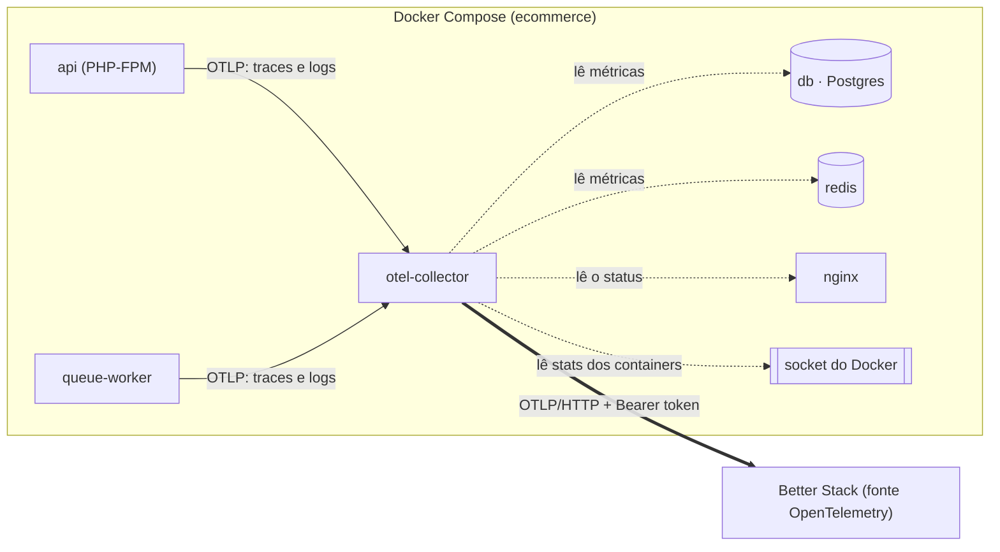

# Observabilidade com Better Stack

> Plan from this document. Each slice below carries its own shape - copy it, do not re-derive it.
> Status: confirmed by diashelter, 2026-10-08

## Situation

- Project: em construção. É um projeto de estudo, sem produção e sem usuários. O único ambiente é o Docker local, mais o CI.
- Decision: decidida por diashelter na [HEL-8](https://linear.app/helter/issue/HEL-8/vamos-adicionar-observabilidade-com-better-stack-de-maneira-gratuita) em 2026-10-08: logs estruturados, traces e métricas no plano gratuito do Better Stack, com OpenTelemetry se possível, sem pagar nada.
- In flight: segue dois precedentes. O `AssignRequestId` já dá um `request_id` a cada requisição e o leva para os jobs, e o `phpunit.xml` já desliga Pulse, Telescope e Nightwatch nos testes. Não há branch aberta, e nada em andamento toca o Docker, o logging ou o módulo `Shared`.
- At stake: pouco. A mudança se desfaz numa tarde, removendo a extensão, os pacotes e o container, e não há dados para migrar. Os riscos reais são de custo (estourar uma cota) e de dados saindo da máquina para um serviço externo.

## Problem

Hoje os logs vão para um arquivo dentro do container (`storage/logs/laravel.log`, canal `single`) e só são lidos com `make logs` ou com o `pail`. O fluxo mais interessante do sistema é assíncrono: um pagamento aprovado dispara cinco listeners na fila e um job atrasado em 10 segundos até o pedido ser entregue. Para segui-lo, é preciso procurar o mesmo `request_id` em linhas soltas do arquivo. Também não há métrica nenhuma: não se sabe quanto de CPU ou de memória cada container usa, nem como estão o Postgres e o Redis.

A HEL-8 quer tornar isso visível num lugar só: os logs com estrutura, cada fluxo como um trace e as métricas da infraestrutura, aprendendo OpenTelemetry no caminho. Nada do produto trava sem isso. É o objetivo de estudo desta peça, e o momento é este porque o checkout ficou completo (pagamento, frete e entrega) e estável. É a primeira vez que há um fluxo entre processos que vale a pena seguir.

Não há usuários nem volume a medir. O tráfego é o de uma pessoa desenvolvendo, muito abaixo das cotas grátis lidas na [página de preços](https://betterstack.com/pricing) em 2026-10-08: 3 GB de logs e 3 GB de traces por mês, guardados por 3 dias, e 30 GB de métricas por mês.

## Success

- Worked if: com o token preenchido, três coisas acontecem.
  - Um pagamento feito no navegador aparece no Better Stack como um único trace, do `POST /api/orders/{order}/payment` até o `MarkOrderAsDelivered`, com os spans de SQL e os logs do fluxo ligados a ele.
  - CPU e memória dos containers, Postgres, Redis e Nginx aparecem num dashboard.
  - A conta continua em US$ 0, sem cartão cadastrado.
- Going wrong: depois da primeira semana ligada, o uso de alguma cota passa de 10% ou aparecem traces de migrations, seeders ou testes.
- Review: uma semana depois de ligar pela primeira vez, diashelter confere o uso na conta do Better Stack.

## Boundary

In:
- o container do Collector e o liga/desliga pelo token;
- traces e logs da `api` e do `queue-worker`;
- as métricas dos containers deste projeto, do Postgres, do Redis e do Nginx;
- a regra nova no `ModuleBoundariesTest`;
- README e `.env.example`.

Out:
- Frontend Vue (traces do navegador e web events do Better Stack): fica para outra task.
- Métricas de negócio (pedidos, pagamentos, entregas): a escolha foi a infraestrutura, e a latência HTTP já sai dos traces.
- Tamanho da fila como métrica: exigiria uma métrica própria. O tempo de espera de cada job já aparece no trace.
- Error tracking (SDK do Sentry) e monitores de uptime do Better Stack: as exceções já chegam nos traces e nos logs.
- Logs em JSON no arquivo local ou no stderr: o arquivo continua legível, porque a estrutura importa é no Better Stack.
- `Log::` novos: os 7 que já existem bastam para esta peça.
- Logs de stdout dos containers (acesso do Nginx, PHP-FPM): duplicariam os traces.
- Dashboards e alertas: são montados à mão na interface do Better Stack, fora do repositório.
- Amostragem: vão 100% dos traces enquanto o volume for de desenvolvimento.
- Configuração de produção: não há produção.

Unchanged:
- o contrato do `X-Request-ID` e o corpo de erro do `ApiExceptionRenderer`;
- `LOG_CHANNEL`, `LOG_STACK=single` e o arquivo `laravel.log`;
- os casos de uso e os 7 `Log::` existentes;
- os passos do workflow de CI, que continua sem token;
- o job `DeliverOrder` e o `ORDER_DELIVERY_DELAY_SECONDS`.

## Shape

O PHP (a `api` e o `queue-worker`) é instrumentado por OpenTelemetry sem tocar no código de negócio e entrega traces e logs a um container OpenTelemetry Collector. O Collector também coleta as métricas dos containers, do Postgres, do Redis e do Nginx, e é a única saída para o Better Stack. A porta é o Collector como fronteira: trocar de fornecedor, filtrar ou amostrar muda só a configuração dele, nunca o PHP.

Exportar do PHP direto para o Better Stack só ganharia se não houvesse Collector, e as métricas de infraestrutura exigem um.

## Key decisions

1. **O Collector é a única saída para o Better Stack.** O PHP exporta OTLP para ele pela rede do Docker e nunca fala com a internet. O token do Better Stack existe só no ambiente do Collector, nunca no `backend/.env`. A [documentação PHP do Better Stack](https://betterstack.com/docs/logs/php/) põe o token no app, num handler do Monolog: não copiar.
2. **A telemetria vem desligada e só liga pelo token no `.env` da raiz.** Sem token, o Collector não sobe e o SDK não inicializa. Um clone novo e o CI ficam como hoje, sem nada esperando a rede. Com o token, só requisições HTTP e jobs da fila geram telemetria. Testes, migrations, seeders e comandos avulsos nunca exportam. Nos testes vale o precedente do `phpunit.xml`, porque o SDK só inicializa no primeiro uso: um desligamento aplicado pelo PHPUnit depois do autoload é respeitado (verificado com o `open-telemetry/sdk` 1.15.0).
3. **O custo zero é garantido pela conta: nenhum cartão no Better Stack e o ambiente abaixo de 10% de cada cota grátis.** A página de preços não diz o que acontece quando uma cota estoura, então a falta de cartão é a garantia. O volume é controlado na coleta: o intervalo das métricas, o `LOG_LEVEL` e só os containers deste projeto.
4. **Um fluxo é um trace, atravessando a fila.** O contexto do trace viaja no payload de cada listener e de cada job, então o pagamento e todo o encadeamento até a entrega formam um único trace, com os serviços `api` e `queue-worker`. O `request_id` continua sendo o contrato do `X-Request-ID` e passa a ser também um atributo do span da requisição, para que o id visto num erro leve ao trace.
5. **Só metadados saem da máquina.** Saem a rota, o método, o status, a duração, o SQL sem os valores, os nomes dos jobs e o contexto dos `Log::` (ids). Corpo de requisição, cabeçalhos, cookies, `card_token` e valores das queries nunca saem, e nenhuma captura de corpo ou de cabeçalho é ligada.
6. **O OpenTelemetry fica na infraestrutura: a imagem PHP, as dependências do Composer, o Collector e o módulo `Shared`.** Nenhum módulo de negócio importa a API do OpenTelemetry, e o `ModuleBoundariesTest` cobra isso com uma expectativa por módulo.
7. **O Collector lê o socket do Docker como root.** A imagem roda com um usuário sem permissão no socket (verificado: `permission denied` no Docker 29.8.2), e as métricas por container dependem dele. Isso vale só para o ambiente local, o único que existe. Uma produção pediria outra fonte.

## Work

| Slice | Delivers | Status |
|---|---|---|
| [Collector](#collector) | o container `otel-collector`, que recebe OTLP e envia os três sinais ao Better Stack, ligado pelo token | clear |
| [Traces](#traces) | um span para cada requisição e para cada job, e um trace por fluxo | clear |
| [Logs](#logs) | os `Log::` do Laravel no Better Stack, estruturados e ligados ao trace | clear |
| [Metrics](#metrics) | as métricas dos containers do projeto, do Postgres, do Redis e do Nginx | open — 2 defaults taken |

Order: Collector → Traces → Logs. Metrics vem depois do Collector, em paralelo com Traces e Logs.

Already handled by existing code:
- o id por requisição e a sua ida para os jobs (`AssignRequestId`, com o `Context` do Laravel);
- os jobs que falham e voltam para a fila (`tries=3`, `make queue-failed`);
- o log local em arquivo.

Derivable from the repository, left to the plan:
- a documentação de containers, variáveis e comandos, como o README já faz nas seções "Containers", "Configuração do `.env`" e "Comandos do Makefile";
- as variáveis novas comentadas em inglês, como o `.env.example` já faz;
- a imagem com versão fixa, como os serviços do `docker-compose.yml`.

### Collector

**Delivers** o container `otel-collector` (`otel/opentelemetry-collector-contrib:0.161.0`). Ele recebe traces e logs do PHP, coleta as métricas e envia tudo a uma fonte OpenTelemetry do Better Stack. **Status: clear.** É a porta (Key decisions 1, 2 e 7).

Pré-requisito manual: criar a conta no Better Stack, sem cartão, e nela uma fonte do tipo OpenTelemetry. A fonte fornece o token e o host de ingestão. Uma fonte recebe os três sinais com o mesmo token, como mostra a configuração de Collector da [documentação OpenTelemetry do Better Stack](https://betterstack.com/docs/logs/open-telemetry/).

Configuração: o `.env` da raiz ganha `BETTER_STACK_SOURCE_TOKEN` e `BETTER_STACK_INGESTING_HOST`, os nomes que a documentação do Better Stack usa. No `.env.example`, os dois ficam vazios.

| State | What should happen | Caller sees |
|---|---|---|
| Token e host preenchidos no `.env` da raiz, `make up` | O Collector sobe e encaminha logs, traces e métricas | dados no Better Stack em segundos |
| Token vazio (clone novo, CI) | O Collector não sobe e nada é exportado | `make up` e `make test` como hoje |
| Sem internet ou Better Stack fora do ar | O Collector tenta de novo por um tempo limitado e depois descarta. O PHP não espera | a API responde no tempo de sempre |
| Token inválido | O Collector registra a recusa no próprio log | erro nos logs do `otel-collector`, app normal |
| Collector parado com o token preenchido | O PHP descarta a telemetria sem atrasar a resposta | API normal |

Alternatives considered: exportar do PHP direto para o Better Stack. Ganharia se não houvesse métricas de infraestrutura, mas põe o token no app e uma chamada pela internet em cada processo PHP.

### Traces

**Delivers** um span para cada requisição HTTP da `api` e para cada listener e job do `queue-worker`, com os spans de SQL, cache e Redis, ligados num trace por fluxo (Key decision 4). **Status: clear.**

Dependências: a extensão `opentelemetry` 1.4.2 na imagem PHP 8.5, que compila e carrega no `php:8.5-fpm-alpine` (verificado em 2026-10-08), e o `open-telemetry/opentelemetry-auto-laravel` 1.9.1, a última versão estável, que aceita Laravel 13. Os serviços se chamam `api` e `queue-worker`, como os containers, e o ambiente é `local`.

| State | What should happen | Caller sees (no Better Stack) |
|---|---|---|
| `POST /api/orders/{order}/payment` aprovado | Um trace vai da requisição ao `MarkOrderAsDelivered`, passando por `MarkOrderAsPaid`, `ScheduleOrderDelivery`, `RecordEstimatedDelivery` e o `DeliverOrder`, 10 s depois | um trace com os serviços `api` e `queue-worker` |
| `POST /api/orders` | Trace da requisição mais o `MarkOrderAsAwaitingPayment` | um trace |
| Pagamento recusado | Trace só da requisição, sem filhos na fila. A recusa é regra de negócio, não erro | span com status HTTP `402`, sem marca de erro |
| Erro 500 | O span da requisição é marcado como erro e guarda a exceção | trace com erro |
| Alguém informa o `X-Request-ID` de um erro | O id está no span da requisição | a busca pelo `request_id` acha o trace |
| Job que falha e volta para a fila | Cada tentativa é um span no mesmo trace | até 3 spans do job |
| `make test`, `make fresh`, `make migrate`, `make seed` ou `make artisan` com o token preenchido | Nada é exportado (Key decision 2) | nenhum trace de comando |
| Um módulo de negócio importa `OpenTelemetry\` | O `ModuleBoundariesTest` falha (Key decision 6) | `make test` vermelho |

Alternatives considered: amostrar menos de 100% dos traces. Ganha se os traces passarem de 10% da cota (Key decision 3).

### Logs

**Delivers** cada `Log::` do Laravel no Better Stack como um log OpenTelemetry estruturado: mensagem, nível, os atributos do contexto, o serviço e o `trace_id`/`span_id` do ponto onde foi escrito. **Status: clear.**

| State | What should happen |
|---|---|
| `Log::info` numa requisição (por exemplo, no `PayOrderUseCase`) | Chega um log com a mensagem, o nível, o contexto (`order_id`...) como atributos e o serviço `api`, ligado ao span |
| `Log::info` num listener ou job | O mesmo, com o serviço `queue-worker` e o trace do fluxo |
| Nível abaixo do `LOG_LEVEL` | Não é enviado, assim como hoje não é gravado |
| Exceção não tratada | Chega um log de erro com a exceção, ligado ao span marcado como erro |
| Telemetria desligada | Só o arquivo, como hoje |
| Arquivo local | O `laravel.log` continua igual e legível, com o `request_id` |

Alternatives considered:
- Copiar o `request_id` em cada log enviado ao Better Stack. Ganha se alguém precisar buscar logs pelo `request_id` sem passar pelo trace.
- Usar o handler `logtail/monolog-logtail` da documentação PHP do Better Stack. Ganharia se só os logs importassem, mas ele envia direto para a internet e não liga o log ao trace (Key decision 1).

### Metrics

**Delivers** as métricas de CPU, memória, rede e disco de cada container deste projeto, e as do Postgres (conexões, tamanho do banco, transações), do Redis (memória, clientes, comandos) e do Nginx (conexões e requisições), coletadas pelo Collector. **Status: open — 2 defaults taken.**

| State | What should happen |
|---|---|
| Ambiente ligado | O Collector lê cada fonte a cada 60 s |
| Containers de outros projetos no mesmo Docker (hoje há 6 rodando nesta máquina) | São ignorados: só entram os containers do projeto `ecommerce` do Compose (Key decision 3) |
| Container parado ou reiniciado | A série para e volta, sem erro no Collector |
| Status do Nginx pedido de fora (`localhost:8080`) | É recusado: o status só responde para a rede interna do Docker |
| Postgres ou Redis ainda subindo | O Collector tenta de novo na próxima leitura |

Open, default taken:
1. Intervalo de coleta: fica em 60 s e só muda se a revisão de uso pedir.
2. Suporte do receiver de PostgreSQL do Collector ao Postgres 18: não foi verificado. Se não funcionar, a fatia sai sem as métricas do Postgres e o README registra.

## Sources

- [HEL-8](https://linear.app/helter/issue/HEL-8/vamos-adicionar-observabilidade-com-better-stack-de-maneira-gratuita): o pedido, os três sinais e a restrição de custo zero.
- [Better Stack: preços](https://betterstack.com/pricing): as cotas do plano grátis, lidas em 2026-10-08. A página não diz o que acontece quando uma cota estoura.
- [Better Stack: OpenTelemetry](https://betterstack.com/docs/logs/open-telemetry/): OTLP/HTTP com Bearer token, por Collector ou direto do SDK, e os nomes `$SOURCE_TOKEN` e `$INGESTING_HOST`.
- [Better Stack: PHP](https://betterstack.com/docs/logs/php/): o handler do Monolog, descartado, e o nome `BETTER_STACK_SOURCE_TOKEN`.
- [OpenTelemetry: autoinstrumentação PHP](https://opentelemetry.io/docs/zero-code/php/auto/): a extensão e o SDK como requisitos.
- [Packagist: opentelemetry-auto-laravel](https://packagist.org/packages/open-telemetry/opentelemetry-auto-laravel): a versão 1.9.1, estável, com Laravel 13.
- [opentelemetry-php-contrib, instrumentação Laravel](https://github.com/open-telemetry/opentelemetry-php-contrib/tree/main/src/Instrumentation/Laravel): o contexto injetado no payload da fila, os `Log::` emitidos como logs OpenTelemetry e o SQL gravado sem os valores.
- [PECL: opentelemetry](https://pecl.php.net/package/opentelemetry): a versão 1.4.2.
- [Releases do OpenTelemetry Collector](https://github.com/open-telemetry/opentelemetry-collector-releases/releases): a versão 0.161.0, de 2026-09-16.
