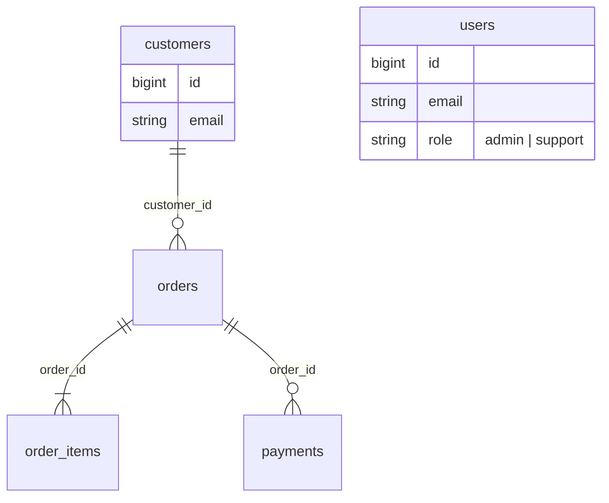

# Contas de equipe e contas de cliente

> Plan from this document. Each slice below carries its own shape - copy it, do not re-derive it.
> Status: confirmed by diashelter, 2026-10-07; implemented on 2026-10-07 (spec em [.specs/features/staff-and-customer-accounts](../.specs/features/staff-and-customer-accounts/plan.md))

## Situation

- Project: em construção. É um projeto de estudo, sem produção e sem dados reais. O banco é recriado pelo `make fresh`, e a pasta `storage-dumps/` está vazia.
- Decision: decidida por diashelter em 2026-10-07 ("Vamos separar Clientes de Users"). O objetivo é a fronteira: equipe e clientes são contas diferentes, mesmo quando usam o mesmo e-mail.
- In flight: segue a separação já feita entre o `User` (identidade) e o `Customer` do Ordering (projeção somente leitura), registrada no passo 2 do plano de evolução da [análise de domínio](../docs/domain-analysis.md). Nenhum branch aberto toca Identity ou Customers.
- At stake: desfaz-se em uma tarde. Os módulos Identity e Customers têm dois dias e um único autor, não há dados para migrar e o único consumidor da API é o frontend do repositório.

## Problem

Hoje existe uma única tabela de contas, `users`. Nela, cliente e administrador se distinguem só pelo `role`, entram pelo mesmo login e não podem compartilhar um e-mail. A área administrativa tem um único perfil, o admin, que pode tudo. Não existe forma de dar acesso a alguém que atende clientes e mantém o catálogo sem dar também o poder de excluir.

Esta peça deve tornar possível ter uma equipe com dois papéis, admin e suporte, separada da base de clientes. O suporte cadastra, edita e consulta. Só o admin remove. Um funcionário que compra na loja tem uma conta de cliente própria. A tela "Clientes" para de misturar administradores com compradores.

O momento é agora porque é a próxima peça de estudo depois do gateway fake, e as contas só existem nos dados do seed. Separar a tabela agora é de graça. Depois de existir histórico de pedidos, a mesma separação exige backfill. Não há usuários nem número a medir.

## Success

- Worked if: três verificações estruturais passam, e cada uma é coberta por teste:
  - o suporte recebe `403` em todo `DELETE` de `/api/admin` e em `/api/admin/users`;
  - uma sessão de cliente recebe `401` em `/api/admin/*`, e uma sessão de equipe recebe `401` em `POST /api/orders`;
  - um e-mail que já pertence a um membro da equipe consegue se cadastrar como cliente.

## Boundary

In:
- as tabelas `users` (equipe) e `customers`;
- os papéis `admin` e `support`;
- o login da equipe em `/admin/login`;
- a tela "Usuários", só para o admin;
- a tela "Clientes" em `/api/admin/customers`, para admin e suporte;
- a regra de que só o admin remove;
- o seed com um admin, um suporte e os clientes de demonstração;
- as regras novas no `ModuleBoundariesTest`;
- a atualização do README, da análise de domínio e do glossário.

Out:
- Excluir clientes: `orders.customer_id` impede a exclusão, e ainda não há decisão de LGPD sobre anonimizar.
- Endereços e outros dados próprios do cliente: a pendência "Customers grava pelo `UserRepository`" continua com o mesmo motivo, agora valendo para a conta de cliente.
- "Esqueci minha senha", tanto para a equipe quanto para os clientes: não existe hoje.
- Log de auditoria de quem criou, editou ou removeu o quê.
- Permissões configuráveis (tabela de permissões por papel): dois papéis fixos bastam enquanto o produto tiver dois perfis.

Unchanged:
- As rotas da loja, que continuam as mesmas: `/api/auth/*`, `/api/orders`, `/api/orders/{order}/payment`, `/api/account` e `/api/account/profile`.
- As mensagens de `401`, `403` e `422` do `ApiExceptionRenderer`.
- Os value objects `Email` e `Password` e as regras `EmailRule` e `PasswordRule`, que passam a valer para as duas tabelas.
- `OrderStatus`, `payments` e os eventos do pedido.
- `PATCH /api/admin/products/{product}/status`: desativar é edição e continua liberado para o suporte.

## Shape

Equipe e clientes passam a ser dois registros em duas tabelas: `users` guarda a equipe, com papel `admin` ou `support`, e `customers` guarda os compradores. Cada área da aplicação aceita só a sessão da sua própria conta. O login da loja nunca abre o admin, e o login do admin nunca compra. Dentro do admin, o papel decide quem pode remover e quem gerencia a equipe. A porta de mão única é a tabela separada, com a chave estrangeira `orders.customer_id`. Voltar para uma tabela só exigiria unificar e-mails duplicados e reescrever o histórico de pedidos.

A alternativa mais pesada isola as sessões por completo, com o admin numa origem própria (`admin.<domínio>`), cookie próprio e logout independente. Ela só compensa se o admin for publicado separado da loja, e o repositório serve um único SPA numa única origem. O formato leve não sobrevive a essa publicação separada, nem a um terceiro papel com permissões parciais de exclusão: o primeiro caso força a troca do mecanismo de sessão, e o segundo transforma a Key decision 6 em uma matriz de permissões.

## Key decisions

1. **Membro da equipe e cliente são contas diferentes, em tabelas diferentes, e não compartilham nada.** O e-mail é único dentro de cada tabela, e o mesmo e-mail pode existir nas duas com senhas independentes. Clientes nascem pelo cadastro da loja ou pela tela "Clientes". A equipe nasce pela tela "Usuários" ou pelo seed, nunca por autocadastro.
2. **Cada área autentica só a sua própria conta.** Uma sessão de cliente nunca autentica `/api/admin/*`, e uma sessão de equipe nunca autentica as rotas da loja que pedem login. Credenciais da outra tabela recebem o mesmo "E-mail ou senha inválidos." de uma senha errada, sem revelar que a conta existe do outro lado. **Não copie o grupo atual com `auth:sanctum`:** ele aceita qualquer guard que o Sanctum conheça, e acrescentar a equipe à lista dele deixaria uma sessão de equipe fazer pedidos. Cada grupo de rotas declara a sua própria conta.
3. **As duas contas ficam no Identity, que continua dono do login:** o `User` (equipe) e o `CustomerAccount` (tabela `customers`). Se a conta do cliente ficasse no Customers, a policy de pedidos do Ordering passaria a depender do Customers, que já depende do Ordering para contar pedidos, e isso criaria um ciclo. O Ordering mantém o `Customer` como projeção somente leitura, agora sobre `customers`. O `ModuleBoundariesTest` passa a cobrar que Ordering, Payment e Fulfillment não usem o `User`, com um namespace por expectativa e uma violação de propósito para confirmar que a regra falha.
4. **`orders.user_id` vira `orders.customer_id`, referencia `customers.id` e mantém o `restrictOnDelete`.** O nome muda agora porque o banco vai ser recriado de qualquer jeito. Depois, a troca seria uma migração com dados. Além disso, manter `user_id` passaria a dizer "um membro da equipe fez este pedido".
5. **O papel existe só na equipe: `admin` ou `support`, sem valor padrão e nunca por atribuição em massa.** O valor `customer` sai do `UserRole`. "Só clientes fazem pedidos" deixa de ser uma checagem de papel e passa a ser estrutural: fazer e pagar pedidos exige uma sessão de `CustomerAccount`.
6. **Todo `DELETE` em `/api/admin` e o recurso `/api/admin/users` inteiro são exclusivos do admin. O suporte faz todo o resto.** O suporte recebe `403`. A regra vale também para as rotas que vierem depois: um teste percorre a tabela de rotas e falha se algum `DELETE` em `/api/admin` não exigir o papel `admin`. O frontend esconde os botões, mas quem garante a regra é a API.
7. **O admin não remove a própria conta nem muda o próprio papel.** Com isso, sempre resta pelo menos um admin. A exceção são dois admins se removendo ou se rebaixando ao mesmo tempo. Esse caso fica aceito neste projeto de estudo e se recupera pelo seed.

## Work

| Slice | Delivers | Status |
|---|---|---|
| [CustomerAccount](#customeraccount) | Clientes na tabela `customers`, com login da loja próprio e pedidos em `orders.customer_id` | clear |
| [Staff login](#staff-login) | Equipe na tabela `users`, com papel `admin` ou `support` e login próprio em `/admin/login` | open — 1 default taken |
| [Admin customers](#admin-customers) | A tela "Clientes" em `/api/admin/customers`, só com compradores, para admin e suporte | clear |
| [Admin-only removal](#admin-only-removal) | Suporte recebe `403` em todo `DELETE` do admin, e o frontend esconde a remoção para ele | clear |
| [Staff management](#staff-management) | A tela "Usuários": admin cadastra, edita, troca o papel e remove membros da equipe | clear |

Order: CustomerAccount + Staff login + Admin customers (as três dividem a mesma tabela e não funcionam separadas) → Admin-only removal → Staff management.

Already handled by existing code:
- Sessão expirada → `401` pelo `ApiExceptionRenderer` e redirecionamento pelo interceptor do frontend.
- Produto com pedidos não pode ser excluído → regra atual do `DeleteProductUseCase`, que não muda.
- Clique duplo em "Salvar" → os formulários do admin já desabilitam o botão.

Derivable from the repository, left to the plan:
- `throttle:10,1` no login da equipe, como no login da loja;
- normalização do e-mail e `CHECK` de e-mail canônico na tabela nova, como `users` faz;
- paginação de 15 por página nas listas do admin;
- conflitos de regra de negócio como `BusinessRuleException` (`409`);
- recursos JSON no envelope `{ data }`, como os recursos atuais;
- páginas novas do admin copiando `UserListPage` e `UserFormPage`;
- `/admin/login` copiando a `LoginPage`.

### CustomerAccount

**Delivers** a conta do comprador na tabela `customers`, usada pelo cadastro, pelo login da loja, por "Minha conta" e pelos pedidos. **Status: clear.** É a porta de mão única (Key decisions 1 e 4).

| State | What should happen | Caller sees |
|---|---|---|
| Cadastro com e-mail novo | Cria a conta de cliente e abre a sessão de cliente | `201` |
| Cadastro com e-mail que já pertence a um membro da equipe | Cria uma conta de cliente independente (Key decision 1) | `201` |
| Cadastro com e-mail que já pertence a outro cliente | Recusado | `422` em `email` |
| Login da loja com credenciais de um membro da equipe | Recusado sem revelar a conta (Key decision 2) | `422` "E-mail ou senha inválidos." |
| Sessão só de equipe faz `POST /api/orders` ou paga um pedido | Recusado; nada é gravado | `401`; o frontend leva para `/login` |
| Cliente troca o e-mail no perfil para o de um membro da equipe | Aceito | `200` |
| Cliente troca o e-mail no perfil para o de outro cliente | Recusado | `422` em `email` |
| Admin ou suporte abre um pedido | Nome e e-mail do comprador vêm de `customers` | `200` |

`GET /api/auth/me` → `200` `{ data: { id, name, email, created_at } }`: a resposta perde `role` e `role_label`, porque toda conta da loja é de cliente. `GET /api/account` muda da mesma forma.

Table `customers`; `orders`: `user_id` → `customer_id`.

| Column | Type | Null | References | Note |
|---|---|---|---|---|
| `id` | bigint | no | | |
| `name` | string | no | | |
| `email` | string | no | | único na tabela; `CHECK` de e-mail canônico |
| `password` | string | no | | hash |
| `remember_token` | string | yes | | |
| `created_at`, `updated_at` | timestamp | yes | | |

| Column | Type | Null | References | Note |
|---|---|---|---|---|
| `orders.customer_id` | bigint | no | `customers.id` | substitui `user_id`; `restrictOnDelete` |

`users` não se liga a nenhuma tabela de negócio.

Alternatives considered: uma tabela `accounts` para as credenciais, com `customers` e `staff` como perfis 1:1. Vence se a mesma pessoa tiver que usar uma única senha nos dois lados, e a Key decision 1 diz o contrário.

### Staff login

**Delivers** a conta do membro da equipe na tabela `users`, com papel e login próprios, e a página `/admin/login`. **Status: open — 1 default taken.**

| State | What should happen | Caller sees |
|---|---|---|
| Credenciais válidas de equipe em `/admin/login` | Abre a sessão de equipe e leva para o dashboard (ou para o `redirect`) | `200` |
| Credenciais de cliente em `/admin/login` | Recusado sem revelar a conta (Key decision 2) | `422` "E-mail ou senha inválidos." |
| Sem sessão de equipe, acessa `/api/admin/*` | Recusado | `401` |
| Sem sessão de equipe, abre `/admin/*` no frontend (inclusive com sessão de cliente) | Vai para `/admin/login?redirect=…`, não para "Acesso negado" | página de login |
| Já com sessão de equipe, abre `/admin/login` | Vai para o dashboard | dashboard |
| Membro removido enquanto está logado | A próxima requisição não o reconhece | `401` |
| Papel alterado enquanto está logado | A próxima requisição já usa o papel novo | conforme o papel |
| Membro da equipe navega pela loja | É tratado como visitante: vê o catálogo e o carrinho; o checkout pede o login de cliente | visitante |

`POST /api/admin/auth/login` `{ email, password }` → `200` `{ data: { id, name, email, role, role_label, created_at } }`
`POST /api/admin/auth/logout` → `204`
`GET /api/admin/auth/me` → `200` `{ data: { id, name, email, role, role_label, created_at } }`

`users`: `role` perde o valor padrão `customer` e passa a aceitar só `admin` ou `support` (Key decision 5). As outras colunas não mudam.

1. Sair de uma área quando o navegador tem as duas sessões abertas: o logout encerra a sessão do navegador e desconecta as duas. Isso é mais simples e mais seguro, e o caso é raro (um membro da equipe testando a loja). Decide-se na construção.

### Admin customers

**Delivers** a tela "Clientes" lendo `customers`, em `/api/admin/customers`, para admin e suporte. **Status: clear.** As rotas trocam de nome porque "usuários" passa a significar equipe.

| State | What should happen | Caller sees |
|---|---|---|
| Admin ou suporte lista os clientes | Só aparecem compradores, com a contagem de pedidos. Membros da equipe não aparecem mais | `200` |
| Admin ou suporte cadastra um cliente | Cria em `customers` | `201` |
| Cadastro com e-mail de outro cliente | Recusado | `422` em `email` |
| Cadastro com e-mail de um membro da equipe | Aceito (Key decision 1) | `201` |
| Admin ou suporte edita um cliente | Grava em `customers` | `200` |
| Dashboard | "Total de clientes" conta `customers` | `200` |

`GET /api/admin/customers` → `200` página de `{ id, name, email, created_at, orders_count }`
`POST /api/admin/customers` `{ name, email, password, password_confirmation }` → `201` `{ data: customer summary }`
`GET /api/admin/customers/{customer}` → `200` `{ data: customer summary + orders }` (os 10 pedidos mais recentes)
`PUT /api/admin/customers/{customer}` `{ name, email, password? }` → `200` `{ data: customer summary }`

As rotas `/api/admin/users` deste recurso deixam de existir aqui e passam a ser da [Staff management](#staff-management). A regra "administradores não são editados pela tela de clientes" deixa de ser necessária, porque administradores não estão mais em `customers`. No frontend, `/admin/users` vira `/admin/customers`, com o menu "Clientes".

### Admin-only removal

**Delivers** a regra de permissão da Key decision 6 nas rotas de exclusão que existem hoje e nas que vierem depois. **Status: clear.**

| State | What should happen | Caller sees |
|---|---|---|
| Suporte faz `DELETE /api/admin/products/{product}` ou `DELETE /api/admin/categories/{category}` | Nada é removido | `403` "Você não tem permissão para realizar esta ação." |
| Admin faz a mesma exclusão | Comportamento atual | `204`, ou o `409` atual |
| Suporte cadastra, edita, ajusta estoque, muda o status do produto ou consulta pedidos | Permitido | como hoje |
| Rota nova de `DELETE` em `/api/admin` sem a restrição de admin | O teste da tabela de rotas falha | falha no CI |
| Suporte vê as listas de produtos e categorias | O botão "Excluir" não aparece | sem botão |

### Staff management

**Delivers** a tela "Usuários" do admin, onde ele cadastra, edita, troca o papel e remove membros da equipe. **Status: clear.**

| State | What should happen | Caller sees |
|---|---|---|
| Admin lista a equipe | Membros com nome, e-mail e papel | `200` |
| Admin cadastra um membro com papel `admin` ou `support` | Cria em `users` | `201` |
| Papel fora de `admin` ou `support` | Recusado | `422` em `role` |
| E-mail de outro membro da equipe | Recusado | `422` em `email` |
| E-mail de um cliente | Aceito (Key decision 1) | `201` |
| Admin edita outro membro (dados, senha ou papel) | Grava; o papel novo vale na próxima requisição do membro | `200` |
| Admin muda o próprio papel | Recusado (Key decision 7) | `409` "Você não pode alterar o próprio papel." |
| Admin remove outro membro | Remove; a sessão do removido para de valer | `204` |
| Admin remove a própria conta | Recusado (Key decision 7) | `409` "Você não pode remover a própria conta." |
| Suporte faz qualquer chamada em `/api/admin/users` | Recusado (Key decision 6) | `403` |
| Suporte abre `/admin/users` no frontend | O menu "Usuários" não aparece; o acesso direto vai para "Acesso negado" | página `forbidden` |

`GET /api/admin/users` → `200` página de `{ id, name, email, role, role_label, created_at }`
`POST /api/admin/users` `{ name, email, password, password_confirmation, role }` → `201` `{ data: staff user }`
`GET /api/admin/users/{user}` → `200` `{ data: staff user }`
`PUT /api/admin/users/{user}` `{ name, email, password?, role }` → `200` `{ data: staff user }`
`DELETE /api/admin/users/{user}` → `204`

## Sources

- [Análise de domínio](../docs/domain-analysis.md): o passo 2 do plano de evolução (separar `Customer` de `User`), a matriz Identity × Ordering, a pendência "Customers grava pelo `UserRepository`" e o glossário (Usuário, Cliente).
- [Gateway de pagamento fake](fake-payment-gateway.md): o precedente de formato e de "Situation" em projeto de estudo.
