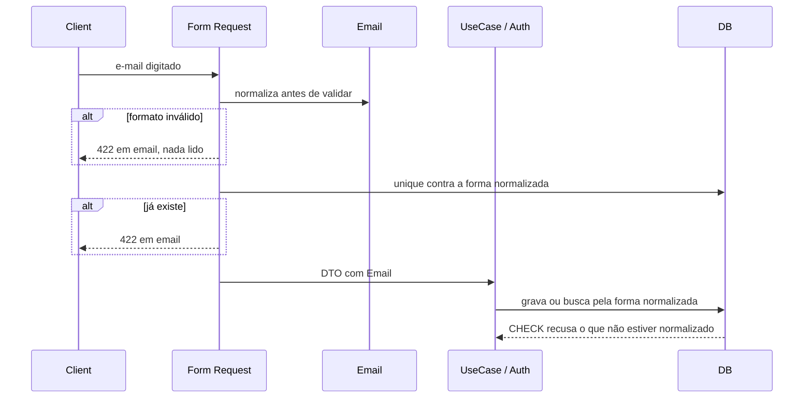
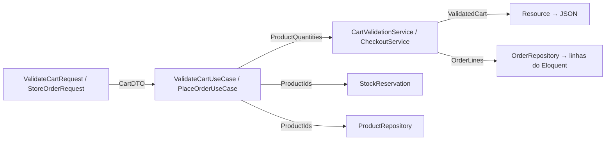

# Value objects de e-mail e senha e listas tipadas

> Faça o plano a partir deste documento. Cada slice abaixo já traz a sua forma: copie, não derive de novo.
> Status: confirmed by diashelter, 2026-10-06

## Situation

- Project: em construção. É um projeto de estudo, sem produção e sem dados reais. O banco é recriado pelo `make setup` e pelo `make fresh`.
- Decision: decidida por diashelter antes desta discovery, como duas atividades a cumprir: "ValueObjects para regras de e-mail e senha" e "tipos fortes para listas: classes em vez de array". Esta discovery decide só a forma e o alcance.
- In flight: segue o precedente do `money-in-cents`. A invariante fica no banco com `CHECK`, as migrations são editadas no lugar e o contrato da API muda junto com quem o consome. Não há nada em andamento que toque Identity, Customers ou o fluxo do carrinho e do checkout.
- At stake: baixo. Se der errado, desfaz-se em uma tarde, não há dados a migrar e o contrato da API não muda (Key decision 7).

## Problem

Construção: as duas atividades existem para praticar modelagem tática. Elas tiram do código as regras e as estruturas que hoje viajam como `string` e `array` sem nome. O levantamento no backend mostrou três coisas.

- **A regra de e-mail está escrita em 5 Form Requests e a política de senha (`Password::min(8)`) em 4:** `RegisterRequest`, `StoreCustomerRequest`, `UpdateCustomerRequest`, `UpdateProfileRequest` e `LoginRequest`. Mudar a política hoje significa caçar as cópias.
- **Achado real:** o e-mail não é normalizado em lugar nenhum, e a coluna `users.email` do Postgres compara diferenciando maiúsculas de minúsculas. Conferido no banco local: `ADMIN@example.com` encontra 0 linhas e `admin@example.com` encontra 1. Hoje dá para cadastrar `Ana@x.com` e `ana@x.com` como duas contas, e o login com o e-mail em outra caixa falha. Ficou decidido que os dois são **a mesma conta**.
- **As listas de domínio do carrinho, do checkout e do catálogo atravessam use cases, services, repositórios e o contrato `StockReservation` como `array`.** O formato delas só existe em docblocks: `array<int, int>` de quantidades, `list<array<string, mixed>>` de linhas do pedido e `array{items, total_cents, is_valid}` da validação do carrinho. Os totais são acumulados ao lado das linhas, em vez de derivados delas.

## Success

- Worked if:
  - login com `ADMIN@example.com` entra na conta `admin@example.com`, e cadastrar `Ana@x.com` quando já existe `ana@x.com` responde `422`;
  - a regra de formato do e-mail e o mínimo de 8 da senha aparecem escritos uma única vez cada, nos value objects;
  - nenhum use case, service ou contrato do alcance (Boundary › In) recebe ou devolve `array` para essas listas;
  - os testes de feature de carrinho, checkout, conta e clientes passam sem mudar o JSON esperado;
  - `make test` e Pint passam.
- Going wrong: um value object volta a ser `string` ou uma lista volta a ser `array` no meio de uma camada e segue adiante, ou um Form Request reescreve a regra literal em vez de derivá-la do value object.

## Boundary

In:
- O `Email` e o `Password` nos cinco fluxos de conta: cadastro, login, admin criando cliente, admin editando cliente e edição do próprio perfil.
- O `CHECK` de e-mail normalizado em `users`.
- As listas tipadas de:
  - itens do carrinho;
  - quantidades por produto;
  - ids de produto (busca no catálogo e lock de estoque);
  - linhas do pedido;
  - resultado da validação do carrinho;
  - ids de categoria do produto;
  - ids de cliente e contagem de pedidos por cliente.
- A atualização do README (camadas e estrutura de pastas) e da análise de domínio.

Out:
- `Email` como cast do Eloquent em `User::email` (ver Shape): nada no código lê o e-mail para fazer algo com ele.
- Política de senha mais forte: decidido manter o mínimo de 8.
- Dashboard (`cards`, `orders_per_day`, `orders_per_month`) e a timeline do `OrderResource`: são estruturas de apresentação montadas para o JSON, fora do alcance escolhido.
- As fronteiras do framework continuam `array` porque o Laravel exige array nelas e uma classe só seria convertida de volta na linha seguinte: `rules()`, `casts()`, `messages()`, os `toArray()` dos Resources, os atributos de `BaseRepository::create/update`, os error bags (`BusinessRuleException` e `InsufficientStockException`), `ApiErrorResponse` e os `$bindings` dos providers.
- Classe base genérica de lista no Shared (Key decision 5).
- Frontend: o contrato não muda (Key decision 7).

Unchanged:
- O `email` do read model `Customer` continua `string`, porque ele lê dados que já foram gravados normalizados.
- Os retornos `Collection` do Eloquent nos repositórios (`findManyKeyedById`, `lockForProducts`, `recentForCustomer` e as contagens do dashboard) já são classes e não mudam.
- O cast `hashed` do `User`.
- As regras `unique`, `confirmed` e `current_password` nos Form Requests.
- Os nomes `CartDTO` e `CartItemDTO`.

## Shape

E-mail e senha passam a existir como value objects do Identity. Eles são criados na borda HTTP depois da validação, levados pelos DTOs até o repositório e convertidos para `string` só na gravação e na busca do login. As listas de domínio viram classes imutáveis, uma por conceito, e o `array` aparece só onde o Eloquent ou o Resource o exigem. A porta mais difícil de desfazer é o `CHECK` de e-mail normalizado no banco, porque ele torna "mesma conta" uma garantia e não uma convenção. A camada nova `ValueObjects` nos módulos é o único desvio das camadas que o README descreve.

A alternativa mais pesada é o `Email` como cast do Eloquent, fazendo `User::email` devolver o value object em todo o sistema. Ela ganha quando algum código precisar de comportamento do e-mail (domínio, mascaramento para LGPD, envio). Hoje ninguém precisa, e ela mexeria no provider de autenticação, nas factories e nos Resources sem regra nova.

## Key decisions

1. **Value objects e listas tipadas ficam em uma camada nova, `ValueObjects`, dentro do módulo dono do conceito.**
   - No Identity: `Email` e `Password`.
   - No Catalog: `ProductIds` e `CategoryIds`.
   - No Ordering: `ProductQuantities`, `OrderLines`/`OrderLine`, `ValidatedCart`/`ValidatedCartLine`, `CustomerIds` e `OrderCountsByCustomer`.

   O `CartDTO` continua em `DTOs`, agora como a lista tipada de `CartItemDTO`. Nada vai para o Shared, que é só infraestrutura. O `ProductIds` fica no Catalog porque o Inventory e o Ordering já dependem dele, então não nasce nenhuma dependência nova entre módulos.
2. **O e-mail é normalizado (sem espaços nas pontas, tudo em minúsculas) antes de qualquer uso: a checagem de `unique`, a busca do login e a gravação.** O banco garante a forma normalizada com `CHECK`, então uma escrita que fuja do `Email` (factory, seeder, tinker) falha em vez de criar uma segunda conta. Como o valor gravado já é canônico, nenhuma consulta usa `lower()`.
3. **Cada regra é escrita uma vez, no value object, e a validação HTTP deriva dela.** O Form Request continua respondendo `422` com as mensagens de hoje. Se o value object recusar um valor que passou na validação, isso é bug (`500`), nunca um caminho de erro de negócio. As regras que dependem do banco ou do HTTP (`unique`, `confirmed`, `current_password`) continuam no Form Request.
4. **`Password` é a senha escolhida que cumpre a política (mínimo de 8 caracteres).** O login não constrói `Password`: ele confere qualquer senha não vazia contra o hash, para que endurecer a política nunca tranque quem já tem conta. O texto da senha nunca aparece em conversão para string, dump, serialização, log ou stack trace. O hash continua sendo feito só pelo cast `hashed` do `User`. Na edição, "não trocar a senha" é a ausência de `Password` (null), não uma string vazia.
5. **Lista tipada é uma classe `final` e imutável, uma por conceito, sem classe base compartilhada e sem estender a `Collection` do Laravel.** O tipo dos elementos é garantido em tempo de execução na construção. Totais e flags derivados das linhas (`total_cents` do carrinho e do pedido, `is_valid` do carrinho) são calculados pela própria lista, nunca passados ao lado dela, então o total não pode divergir das linhas.
6. **O `array` só aparece na fronteira do framework: no repositório (`sync`, `whereIn`, `createMany`) e no Resource.** Use cases, services e contratos entre módulos (`StockReservation`) só recebem e devolvem as classes.
7. **O contrato da API não muda: nenhum endpoint, campo, código HTTP ou mensagem.** A única diferença visível é que o `email` nas respostas passa a vir normalizado (`Ana@X.com` vira `ana@x.com`). Por isso o frontend não é tocado.

## Work

| Slice | Delivers | Status |
|---|---|---|
| [Email](#email) | `Email` normalizado e validado nos cinco fluxos de conta, garantido pelo `CHECK` em `users` | clear |
| [Password](#password) | `Password` com a política escrita uma vez, nos quatro fluxos que escolhem senha | clear |
| [Checkout lists](#checkout-lists) | carrinho, quantidades, ids de produto, linhas do pedido e validação do carrinho como classes | clear |
| [CategoryIds](#categoryids) | ids de categoria do produto como classe do Catalog | clear |
| [OrderCountsByCustomer](#ordercountsbycustomer) | contagem de pedidos por cliente como classe, com zero para quem não tem pedidos | clear |

Order: Email → Password, em um pull request; Checkout lists → CategoryIds → OrderCountsByCustomer, em outro. Os dois grupos são independentes.

Already handled by existing code:
- e-mail com formato inválido → regra `email` dos Form Requests, mantida pela Key decision 3;
- carrinho vazio ou com mais de 50 itens → `ValidateCartRequest`;
- preço vindo do cliente → ignorado pelo `ValidateCartRequest`, que só aceita `product_id` e `quantity`;
- ordem de lock sem deadlock → `orderBy('product_id')` no `StockRepository`, que não depende da ordem em que os ids chegam.

Derivable from the repository, left to the plan:
- normalização antes da validação, como o `CategoryRequest` faz com o slug;
- serialização do `ValidatedCart` por um Resource, como os outros endpoints fazem;
- testes unitários dos value objects e das listas em `tests/Unit`, como os services puros;
- ajuste dos testes que hoje montam arrays (`CheckoutServiceTest`, `RequestToDtoTest` e os testes de repositório);
- README e análise de domínio: incluir a camada `ValueObjects` em "Arquitetura" e em "Estrutura de pastas" e corrigir a nota que chama `CartDTO`/`CartItemDTO` de value objects, como pede o `AGENTS.md`.

### Email

**Delivers** o `Email` como único caminho do e-mail digitado até o banco e até a busca do login. **Status: clear.** Contém a porta da Key decision 2.

| State | What should happen | Caller sees |
|---|---|---|
| Cadastro com `  Ana@X.com ` | Grava `ana@x.com` | `201`, `email: "ana@x.com"` |
| Cadastro com `ANA@x.com` quando já existe `ana@x.com` | Recusado como duplicado | `422` em `email`, mensagem atual de e-mail já em uso |
| Login com `ADMIN@example.com` e a senha certa | Autentica a conta `admin@example.com` | `200` |
| Login com e-mail e senha que não batem | Recusado como hoje | `422` em `email`, "E-mail ou senha inválidos." |
| Cliente edita o perfil e troca só a caixa do próprio e-mail | Aceito: a conta é ela mesma | `200`, e-mail normalizado |
| Admin cria ou edita cliente com e-mail em outra caixa de uma conta existente | Recusado como duplicado | `422` em `email` |
| E-mail fora do formato ou acima de 255 caracteres | Recusado como hoje | `422` em `email` |
| Escrita direta no banco com e-mail não normalizado | Recusada pelo `CHECK` | erro de banco, sem linha gravada |

O login só passa pelo formato e pela busca. Ele não tem checagem de `unique`.

Table `users`: `email` ganha `CHECK (email = lower(btrim(email)))`. A migration original é editada no lugar.

| Column | Type | Null | References | Note |
|---|---|---|---|---|
| `email` | varchar(255) | no | | `unique` como hoje; `CHECK` de forma normalizada; escrito só a partir do `Email` |

Alternatives considered: índice único em `lower(email)` em vez do `CHECK`. Ele ganharia se fosse preciso preservar a caixa digitada, e ficou decidido que não é. Ele também deixaria passar gravações não normalizadas, que a busca exata do login depois não encontraria.

### Password

**Delivers** o `Password` nos quatro fluxos que escolhem senha, com o login fora dele (Key decision 4). **Status: clear.**

| State | What should happen | Caller sees |
|---|---|---|
| Cadastro, ou admin criando cliente, com senha de 7 caracteres | Recusado | `422` em `password`, mensagem atual de mínimo de 8 |
| Senha e confirmação diferentes | Recusado como hoje | `422` em `password` |
| Login com uma senha válida mais curta que a política vigente | Autentica, se o hash bater | `200` |
| Edição do perfil ou do cliente sem enviar senha | Mantém a senha atual | `200` |
| Troca de senha no perfil sem `current_password` correta | Recusado como hoje | `422` em `current_password` |
| Senha nova válida | Gravada com hash pelo cast do `User` | `200` / `201`, sem senha na resposta |
| Exceção ou log durante o fluxo de conta | O texto da senha não aparece | |

Alternatives considered: um segundo value object para a senha digitada no login. Ele ganharia se o login passasse a ter regra própria, como limite de tamanho, e hoje ele não tem nenhuma.

### Checkout lists

**Delivers** as listas do carrinho e do checkout como classes, do `ValidateCartRequest` até o repositório. **Status: clear.**

| State | What should happen | Caller sees |
|---|---|---|
| Carrinho com o mesmo produto em duas linhas | As quantidades são somadas em uma linha por produto, como hoje | `200`, uma linha por produto, em ordem de `product_id` |
| Carrinho com produto inexistente | Linha inválida e fora do total, como hoje | `unit_price_cents: null`, `subtotal_cents: null`, `is_valid: false` |
| Carrinho com linha indisponível | Linha mostra o subtotal mas fica fora do total, como hoje | `is_valid: false` |
| Carrinho todo disponível | `total_cents` é a soma dos subtotais das linhas válidas (Key decision 5) | `200`, mesmo JSON de hoje |
| Pedido criado | `orders.total_cents` é a soma dos `subtotal_cents` das linhas gravadas (Key decision 5) | `201`, mesmo JSON de hoje |
| Estoque insuficiente no checkout | Recusado e revertido, como hoje | `409` com o error bag atual em `items.{product_id}` |

Só os dois pontos da direita (Resource e repositório) produzem `array` (Key decision 6). O contrato `StockReservation` muda de assinatura dentro do mesmo pull request que muda o seu único consumidor.

`POST /api/cart/validate` e `POST /api/orders`: sem mudança de contrato (Key decision 7).

### CategoryIds

**Delivers** os ids de categoria do produto como `CategoryIds`, do `ProductRequest` até a sincronização. **Status: clear.**

| State | What should happen | Caller sees |
|---|---|---|
| Admin cria ou edita produto com categorias | Sincroniza exatamente as categorias enviadas, como hoje | `201` / `200`, mesmo JSON |
| Lista de categorias vazia | Recusada pelo `ProductRequest`, como hoje | `422` em `category_ids` |

### OrderCountsByCustomer

**Delivers** a contagem de pedidos de uma página de clientes como `OrderCountsByCustomer`, recebendo `CustomerIds`. **Status: clear.**

| State | What should happen | Caller sees |
|---|---|---|
| Cliente sem pedidos na página | Conta zero, e quem responde isso é a própria classe, não o use case | `orders_count: 0` |
| Página com N clientes | Continua sendo uma consulta de contagem por página | `200`, mesmo JSON de hoje |

## Sources

- `.design/money-in-cents.md`: precedente da invariante no banco por `CHECK` e das migrations editadas no lugar.
- `docs/domain-analysis.md`: fronteiras entre contextos e a nota atual que chama `CartDTO`/`CartItemDTO` de value objects.
- `AGENTS.md`: camadas dos módulos, regra do Shared e documentação na mesma entrega.
