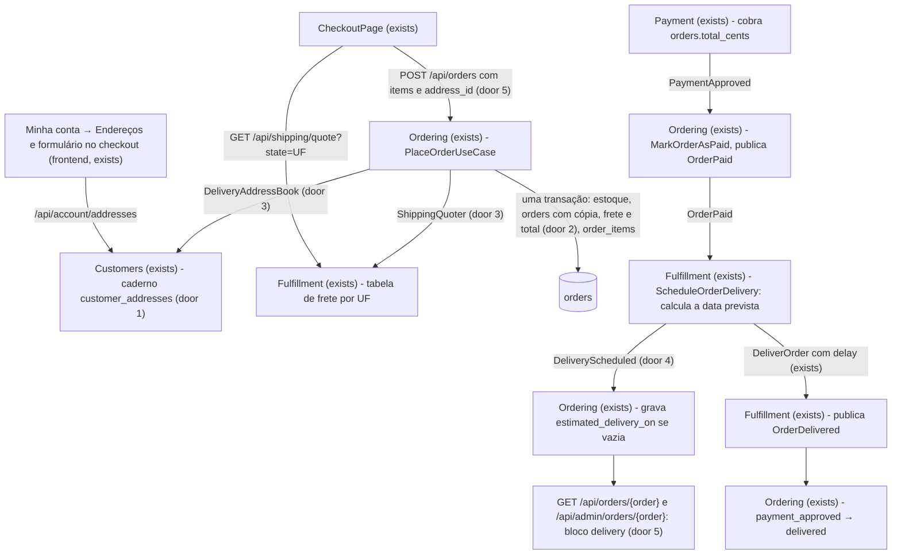
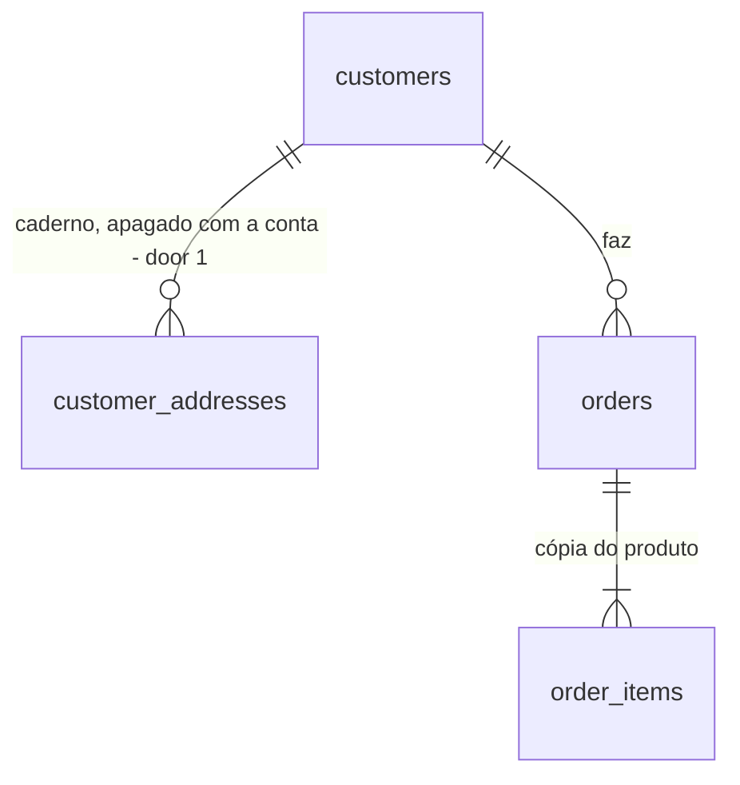

# Endereços e frete

## Problem

Hoje o pedido não tem destino. O `POST /api/orders` recebe só os itens, o `orders.total_cents` é só a soma das linhas, e a entrega é o job `DeliverOrder`, que espera `ORDER_DELIVERY_DELAY_SECONDS` e anuncia "entregue" para qualquer cliente, more onde morar. O cliente não tem onde guardar um endereço, a loja não cobra frete e ninguém diz quando o pedido chega. A análise de domínio dá 7/10 de coesão a dois contextos pela mesma lacuna: o Customers "não tem dados próprios de cliente (endereços)" e o Fulfillment "não tem estado próprio" nem regra própria. A fonte não traz número: é um projeto de estudo, sem usuários. O item foi decidido na discovery [.design/addresses-and-shipping.md](../../../.design/addresses-and-shipping.md).

Quando isto estiver entregue, o cliente guarda até 10 endereços em "Minha conta → Endereços" e escolhe um no checkout, onde vê o frete e o prazo da UF. Ele paga itens + frete, e depois que o pagamento é aprovado o pedido mostra a data prevista de entrega. Editar ou excluir um endereço nunca muda um pedido já feito.

## Flow

Reaproveita a transação do `PlaceOrderUseCase` (trava, confere e baixa o estoque e copia os itens), a cadeia `OrderPaid` → `ScheduleOrderDelivery` → `DeliverOrder` → `OrderDelivered` do Fulfillment, o contrato definido por quem consome do `ProductOrderHistory`, a policy por dono no molde da `OrderPolicy`, o `BusinessRuleException` para o `409` e o `usePolling` da página do pedido. O Payment não muda: ele já cobra `orders.total_cents`.

1. in: `POST /api/orders` com `items` e `address_id` -> `OrderController` (exists) valida o corpo num Form Request (exists, ganha `address_id`)
2. `PlaceOrderUseCase` (exists) -> `DeliveryAddressBook` (door 3), implementado no Customers: devolve a cópia `DeliveryAddress` do endereço do cliente, ou nada (`422`)
3. `PlaceOrderUseCase` -> `ShippingQuoter` (door 3), implementado no Fulfillment: devolve `ShippingQuote` (preço e dias úteis) para a UF da cópia
4. `PlaceOrderUseCase` -> `OrderRepository` (exists) - na mesma transação da baixa do estoque, grava `orders` com a cópia, `shipping_cents`, `delivery_business_days` e `total_cents` = linhas + frete (door 2), e os `order_items`. O `OrderPlaced` sai depois do commit, como hoje
5. out: `201` com o `Order` e o bloco `delivery` (door 5)
6. depois: `OrderPaid` -> `ScheduleOrderDelivery` (exists) calcula a data prevista pela regra de dias úteis do Fulfillment e publica `DeliveryScheduled` (door 4) antes de agendar o `DeliverOrder` (exists)
7. `DeliveryScheduled` -> listener do Ordering (new, no door - placement per conventions) grava `orders.estimated_delivery_on` só se estiver vazia, sem tocar no status
8. frontend: o caderno (new, no door - placement per conventions), o `CheckoutPage` (exists) e as páginas de detalhe do pedido da loja e do admin (exist) leem a API

## Impact

| Front | What changes |
| --- | --- |
| domain | novo termo `CustomerAddress` (Customers): um endereço do caderno do cliente, até 10 por cliente. Ninguém lê hoje, porque é novo |
| domain | novo termo `DeliveryAddress` (Ordering): a cópia de um endereço que o pedido guarda. É também o que o `DeliveryAddressBook` devolve |
| domain | novo termo `ShippingQuote` (Ordering, calculado pelo Fulfillment): frete em centavos e prazo em dias úteis para uma UF |
| domain | novo termo `BrazilianState` (Ordering): as 27 UFs. Usado pelo Customers, pelo Fulfillment e pelo Ordering |
| domain | novo evento `DeliveryScheduled` (Fulfillment): a entrega foi agendada com uma data prevista |
| domain | termo existente `orders.total_cents`: era a soma das linhas, passa a ser linhas + `shipping_cents`. Quem lê hoje: o `PayOrderUseCase` (cobra o total, e isso é o desejado); o docblock de `OrderRepository::createWithItems` ("o total que as linhas calculam"); o `CheckoutTest` ("stores an order total equal to the sum of its item subtotals"); o `OrderSeeder`, que soma os itens; e o `OrderItemsTable` do frontend, que mostra `total_cents` como "Total" logo abaixo dos itens e passaria a somar um frete sem linha de frete. O dashboard não soma `total_cents` |
| contract | `POST /api/orders` passa a exigir `address_id`. Único consumidor: `orderService.place` no frontend, que muda no mesmo pull request. Os testes que criam pedidos pela rota mudam junto: `CheckoutTest` (4), `MoneyInCentsTest` (2) e `OrderStatusFlowTest` (1) |
| contract | o recurso `Order` ganha `items_total_cents`, `shipping_cents` e `delivery` em todas as rotas que o devolvem (loja e admin, detalhe e listagem). Só acrescenta campos |
| stored data | nothing to migrate - tabela nova e colunas novas em `orders` na migration original, com o banco recriado pelo `make fresh`. Dumps antigos de `storage-dumps/` deixam de ser compatíveis, como no money-in-cents |
| tests | a `OrderFactory` precisa de valores padrão para as colunas `NOT NULL` novas, ou todo teste que cria pedido pela factory quebra; o `SeederTest` passa a conferir endereços e frete; o `ModuleBoundariesTest` ganha as regras novas e a lista `MODULES` continua igual |
| config | a tabela de frete entra na configuração do Fulfillment; nenhuma variável de ambiente nova |
| docs | README (estrutura de Customers e Fulfillment, fluxo de eventos com o `DeliveryScheduled`, modelo de dados, API, testes, "Escopo e decisões" sem frete e endereços em "fora do escopo") e análise de domínio (seções Customers e Fulfillment, coesão, matriz, pendência "Customers grava pelo repositório do `CustomerAccount`" resolvida), como pede o `AGENTS.md` |

## Relations

One-way constraints: `customer_addresses.customer_id` aponta para um `customers` existente e é apagado junto com ele (door 1); o CEP tem exatamente 8 dígitos e a UF é uma das 27, no caderno e na cópia do pedido (doors 1 e 2); todo `orders` tem destinatário, CEP, logradouro, número, bairro, cidade, UF, frete e prazo (door 2); o total de um pedido nunca é menor que o seu frete (door 2). `orders` não referencia `customer_addresses`: o endereço chega como cópia (door 2).

## Surface

| Route | In | Out | Status |
| --- | --- | --- | --- |
| `GET /api/account/addresses` | - | `data: CustomerAddress[]` | `200`, `401` |
| `POST /api/account/addresses` | `recipient_name`, `postal_code`, `street`, `number`, `complement?`, `district`, `city`, `state` | `data: CustomerAddress` · `message` | `201`, `401`, `409`, `422` |
| `PUT /api/account/addresses/{address}` | mesmo corpo do `POST` | `data: CustomerAddress` · `message` | `200`, `401`, `403`, `404`, `422` |
| `DELETE /api/account/addresses/{address}` | - | vazio | `204`, `401`, `403`, `404` |
| `GET /api/shipping/quote` | `state` (query) | `data: state · price_cents · delivery_business_days` | `200`, `422`, `429` |
| `POST /api/orders` | `items`, `address_id` | `data: Order` (com `items_total_cents`, `shipping_cents`, `delivery`) · `message` | `201`, `401`, `409`, `422`, `429` |
| `GET /api/orders/{order}` | - | `data: Order` com `items_total_cents`, `shipping_cents`, `delivery` | `200`, `401`, `403`, `404` |
| `GET /api/admin/orders/{order}` | - | `data: Order` com `items_total_cents`, `shipping_cents`, `delivery` | `200`, `401`, `404` |

As listagens `GET /api/orders` e `GET /api/admin/orders` usam o mesmo recurso e ganham os mesmos campos, sem mudar entrada nem status.

## Landing

| One-way door | Literal shape | Alternative rejected |
| --- | --- | --- |
| 1. tabela `customer_addresses` (migration nova) | `id`; `customer_id` FK `customers`, `cascadeOnDelete`, índice; `recipient_name varchar(120)`; `postal_code char(8)` com `CHECK (postal_code ~ '^[0-9]{8}$')`; `street varchar(150)`; `number varchar(20)`; `complement varchar(100) NULL`; `district varchar(100)`; `city varchar(100)`; `state char(2)` com `CHECK (state IN ('AC','AL','AM','AP','BA','CE','DF','ES','GO','MA','MG','MS','MT','PA','PB','PE','PI','PR','RJ','RN','RO','RR','RS','SC','SE','SP','TO'))`; timestamps. Model `CustomerAddress` com `#[UseFactory]` e `#[UsePolicy]` | colunas de endereço em `customers`: guardam um endereço só. Coluna JSON: perde o `CHECK` por campo. `restrictOnDelete`: impediria apagar a conta, e não há nada a preservar, porque os pedidos guardam cópia |
| 2. a cópia e o frete em `orders` (migration original editada) | `shipping_cents bigint NOT NULL` com `CHECK (shipping_cents >= 0)`; `delivery_business_days smallint NOT NULL` com `CHECK (delivery_business_days > 0)`; `estimated_delivery_on date NULL`; `delivery_recipient_name varchar(120)`, `delivery_postal_code char(8)` (mesmo `CHECK` de dígitos), `delivery_street varchar(150)`, `delivery_number varchar(20)`, `delivery_complement varchar(100) NULL`, `delivery_district varchar(100)`, `delivery_city varchar(100)`, `delivery_state char(2)` (mesmo `CHECK` das 27), todos `NOT NULL` exceto o complemento; `CHECK (total_cents >= shipping_cents)`; `total_cents` = soma das linhas + `shipping_cents` | FK `orders.customer_address_id`: editar o endereço reescreveria o histórico, e excluí-lo seria bloqueado ou zeraria a referência. Tabela 1:1 `order_delivery_addresses`: não garante que todo pedido tenha destino. Coluna `items_total_cents`: é derivável de `order_items`, e um terceiro total poderia divergir |
| 3. contratos definidos pelo Ordering (precedente `ProductOrderHistory`) | `App\Modules\Ordering\Contracts\DeliveryAddressBook::find(int $customerId, int $addressId): ?DeliveryAddress`; `App\Modules\Ordering\Contracts\ShippingQuoter::quote(BrazilianState $state): ShippingQuote`; `DeliveryAddress(string $recipientName, string $postalCode, string $street, string $number, ?string $complement, string $district, string $city, BrazilianState $state)` e `ShippingQuote(int $priceCents, int $deliveryBusinessDays)`, `final readonly`, em `Ordering\ValueObjects`; `enum BrazilianState: string` com os 27 casos em `Ordering\Enums`; ligações em `CustomersServiceProvider::$bindings` e `FulfillmentServiceProvider::$bindings`, registrados em `bootstrap/providers.php` | contratos publicados pelo Customers ou pelo Fulfillment: o Ordering passaria a depender de módulos que já dependem dele. O Ordering lendo o `CustomerAddress`: atravessa a fronteira. `BrazilianState` no `Shared`: o `AGENTS.md` reserva o `Shared` para infraestrutura. `find` lançando exceção: quem decide a mensagem do `422` é o checkout |
| 4. evento `DeliveryScheduled` | `App\Modules\Fulfillment\Events\DeliveryScheduled(Order $order, CarbonImmutable $estimatedDeliveryOn)` com `Dispatchable, SerializesModels`; listener do Ordering com `ShouldQueue` e `$tries = 3`; grava só onde `estimated_delivery_on IS NULL`, sem mudar o status | o Fulfillment escrevendo em `orders`: só o Ordering escreve no pedido, e o `ModuleBoundariesTest` proíbe o `OrderRepository` fora dele. O Ordering calculando a data ao marcar o pedido como pago: a regra de dias úteis sairia do Fulfillment. Tabela `shipments`: não há ciclo de vida próprio (Shape da discovery) |
| 5. contrato da API | `POST /api/orders` exige `address_id` (inteiro). `Order` ganha `items_total_cents`, `shipping_cents` e `delivery: { business_days, estimated_on: "YYYY-MM-DD" \| null, address: { recipient_name, postal_code, street, number, complement, district, city, state } }`. `CustomerAddress` = `{ id, recipient_name, postal_code, street, number, complement, district, city, state, created_at }`. Orçamento: `{ state, price_cents, delivery_business_days }`. `postal_code` sempre com 8 dígitos, sem hífen | campos `delivery_*` soltos no recurso: expõem os nomes das colunas. O cliente enviando `shipping_cents`: o servidor calcula (Key decision 2 da discovery). CEP com hífen na API: a formatação é da tela, como acontece com o dinheiro |

- Nothing else in this change is hard to reverse: os valores da tabela de frete ficam na configuração e mudam com um deploy

## Criteria

### S1: Caderno de endereços (P1)

O cliente lista, cadastra, edita e exclui os próprios endereços em "Minha conta → Endereços".

**Acceptance Criteria**

1. WHEN an authenticated customer with no addresses sends `GET /api/account/addresses` THEN the system SHALL return `200` with `data` equal to `[]`
2. WHEN an authenticated customer sends `POST /api/account/addresses` with `recipient_name` `"Ana Souza"`, `postal_code` `"01310-100"`, `street` `"Avenida Paulista"`, `number` `"1000"`, `complement` `"Apto 12"`, `district` `"Bela Vista"`, `city` `"São Paulo"` and `state` `"SP"` THEN the system SHALL return `201` with `message` `"Endereço cadastrado com sucesso."` and `data` holding `id`, `created_at` and those values with `postal_code` `"01310100"`, and SHALL store one `customer_addresses` row with that customer's id
3. WHEN `state` is sent as `" sp "` THEN the system SHALL store and return `"SP"`
4. WHEN `complement` is omitted or sent as `""` THEN the system SHALL store and return `complement` `null`
5. WHEN a customer has two addresses created one after the other and another customer has one THEN `GET /api/account/addresses` SHALL return only that customer's two, the most recently created first
6. IF `postal_code` is neither 8 digits nor 5 digits, a hyphen and 3 digits (`"1234567"`, `"0131-0100"`, `"0131010a"`, `"01310 100"`) THEN the system SHALL return `422` `VALIDATION_FAILED` with an error under `errors.postal_code` and store nothing
7. IF `state` is missing or, after trimming and upper-casing, is not one of the 27 UFs (`"XX"`, `""`) THEN the system SHALL return `422` with an error under `errors.state` and store nothing
8. IF any of `recipient_name`, `street`, `number`, `district` or `city` is missing or empty THEN the system SHALL return `422` with an error under that field and store nothing
9. IF `recipient_name` exceeds 120 characters, `street` 150, `number` 20, `complement` 100, `district` 100 or `city` 100 THEN the system SHALL return `422` with an error under that field
10. IF the customer already has 10 addresses THEN `POST /api/account/addresses` SHALL return `409` `BUSINESS_RULE_VIOLATION` with `message` `"Você pode cadastrar até 10 endereços."` and the customer SHALL still have 10 addresses
11. WHEN the owner sends `PUT /api/account/addresses/{address}` with a full valid body THEN the system SHALL return `200` with the new values in `data` and `message` `"Endereço atualizado com sucesso."`, and the row SHALL hold the new values
12. WHEN the owner sends `DELETE /api/account/addresses/{address}` THEN the system SHALL return `204` and the row SHALL no longer exist
13. IF a customer sends `PUT` or `DELETE` to an address of another customer THEN the system SHALL return `403` and that address SHALL remain unchanged
14. IF `PUT` or `DELETE` targets an address id that does not exist THEN the system SHALL return `404`
15. IF a request to any of the four `/api/account/addresses` routes carries no session, or only a staff session, THEN the system SHALL return `401`
16. IF a `customers` row is deleted THEN the database SHALL delete its `customer_addresses` rows
17. IF a `customer_addresses` row is written with `postal_code` `'0131010A'` or with `state` `'XX'` THEN the database SHALL reject it
18. The customer area menu SHALL show the link "Endereços" to `/account/addresses`, right after "Meus pedidos"
19. WHILE the address list is loading the page SHALL show the `LoadingState`, and IF loading fails THEN it SHALL show "Não foi possível carregar os endereços."
20. WHILE the customer has no addresses the page SHALL show "Nenhum endereço cadastrado" and the button "Cadastrar endereço"
21. WHEN the list is loaded THEN each address SHALL show the recipient, street, number and complement, district, city/UF and the CEP as `01310-100`, with "Editar" and "Excluir", most recent first
22. The address form SHALL offer the UF as a select with the 27 UFs in alphabetical order of the abbreviation
23. WHEN the API answers `422` to the address form THEN the page SHALL show each message under its field, and WHEN it answers `409` THEN the page SHALL show the API `message` above the form
24. WHEN "Excluir" is clicked THEN the page SHALL ask `window.confirm` with `Excluir o endereço de "<recipient_name>"?`, send no request if cancelled, and send the `DELETE` and drop the address from the list if confirmed

**Independent test:** em "Minha conta → Endereços", cadastrar um endereço com CEP `01310-100`, editá-lo para outra UF e excluí-lo.

### S2: Orçamento de frete (P1)

O Fulfillment responde quanto custa e quanto demora a entrega para cada UF.

**Acceptance Criteria**

25. The Fulfillment rate table SHALL quote exactly, for each of the 27 `BrazilianState` cases: SP `1500` cents in `2` business days; RJ, MG, ES `2200` in `4`; PR, SC, RS `2500` in `5`; DF, GO, MT, MS `3000` in `6`; BA, SE, AL, PE, PB, RN, CE, PI, MA `3800` in `8`; PA, AP, AM, RR, AC, RO, TO `4500` in `10`
26. WHEN anyone, with or without a session, sends `GET /api/shipping/quote?state=BA` THEN the system SHALL return `200` with `data` equal to `{ "state": "BA", "price_cents": 3800, "delivery_business_days": 8 }`
27. WHEN the query is `state=sp` THEN the system SHALL return `200` with `state` `"SP"`, `price_cents` `1500` and `delivery_business_days` `2`
28. IF `state` is missing or is not one of the 27 UFs (`XX`) THEN the system SHALL return `422` with an error under `errors.state`
29. IF the same client sends more than 60 requests to `GET /api/shipping/quote` within one minute THEN the system SHALL return `429` for the 61st
30. The container SHALL resolve `ShippingQuoter` to a class of `App\Modules\Fulfillment`, and for each of the 27 UFs its quote SHALL equal the `price_cents` and `delivery_business_days` of `GET /api/shipping/quote`
31. The namespace `App\Modules\Fulfillment` SHALL NOT use `App\Modules\Customers`

**Independent test:** `GET /api/shipping/quote?state=BA` sem sessão devolve R$ 38,00 em 8 dias úteis.

### S3: Checkout com endereço e frete (P1)

O cliente escolhe o endereço no checkout, vê o frete e paga itens + frete. O pedido guarda a cópia.

**Acceptance Criteria**

32. WHEN a customer sends `POST /api/orders` with 2 units of a product priced `10000` and the `address_id` of their own RJ address THEN the system SHALL return `201` with `data.items_total_cents` `20000`, `data.shipping_cents` `2200`, `data.total_cents` `22200`, `data.delivery.business_days` `4`, `data.delivery.estimated_on` `null` and `data.delivery.address` equal to the 8 fields of that address
33. WHEN that order is created THEN its `orders` row SHALL hold `shipping_cents` `2200`, `delivery_business_days` `4`, `total_cents` `22200` and each `delivery_*` column equal to the matching field of the address
34. WHEN that order is paid with `card_token` `fake_card_approved` THEN the stored `payments.amount_cents` SHALL be `22200`
35. IF `address_id` is missing THEN the system SHALL return `422` with `errors.address_id` equal to `["Escolha um endereço de entrega."]`, create no `orders` row and leave the stock unchanged
36. IF `address_id` does not exist or belongs to another customer THEN the system SHALL return `422` with `errors.address_id` equal to `["Endereço de entrega não encontrado."]`, create no `orders` row and leave the stock unchanged
37. IF the body of AC 32 also carries `shipping_cents: 0`, `total_cents: 1` and `delivery_state: "SP"` THEN the order SHALL still have `shipping_cents` `2200`, `delivery_state` `RJ` and `total_cents` `22200`
38. WHEN the customer changes the address to another UF, or deletes it, after placing the order THEN `GET /api/orders/{order}` SHALL return the original `delivery.address`, `shipping_cents` and `delivery.business_days`
39. IF the stock is insufficient for an order with a valid `address_id` THEN the system SHALL return `409` `INSUFFICIENT_STOCK`, as today, and create no `orders` row
40. IF an `orders` row is written with a required `delivery_*` column null, `shipping_cents` `-1`, `delivery_business_days` `0`, `total_cents` lower than `shipping_cents` or `delivery_state` `'XX'` THEN the database SHALL reject it
41. The container SHALL resolve `DeliveryAddressBook` to a class of `App\Modules\Customers`, and `App\Modules\Ordering\Contracts` SHALL contain only interfaces
42. The namespace `App\Modules\Ordering` SHALL NOT use `App\Modules\Customers`, nor any namespace of `App\Modules\Fulfillment` other than `App\Modules\Fulfillment\Events`, each namespace in its own architecture expectation
43. WHILE the customer has no addresses the checkout SHALL show the address form inline and keep "Confirmar compra" disabled
44. WHEN the inline form is saved THEN the checkout SHALL create the address through `POST /api/account/addresses`, select it and quote its UF
45. WHILE the customer has addresses the checkout SHALL list them with the most recently created selected, quote its UF through `GET /api/shipping/quote`, and offer "Adicionar outro endereço", which opens the inline form
46. WHEN the quote returns THEN the checkout SHALL show "Subtotal" (the validated cart total), "Frete" (`price_cents`), "Total" (their sum) and "Entrega em até N dias úteis após a aprovação do pagamento" with N equal to `delivery_business_days`
47. WHEN another address is selected THEN the checkout SHALL quote its UF and update "Frete" and "Total"
48. WHILE a quote is loading, or IF the last quote failed, "Confirmar compra" SHALL be disabled, and on failure the checkout SHALL show "Não foi possível calcular o frete." with "Tentar novamente"
49. WHEN "Confirmar compra" is clicked THEN the checkout SHALL send `POST /api/orders` with the cart items and the selected `address_id`, and on `201` go to the payment page, as today
50. WHEN `POST /api/orders` answers `422` with an error under `errors.address_id` THEN the checkout SHALL show that message and reload the addresses

**Independent test:** com um endereço no RJ, confirmar a compra de um item de R$ 100,00 e ver R$ 122,00 na página de pagamento.

### S4: Data prevista e bloco de entrega (P1)

Depois do pagamento, o pedido ganha a data prevista. A loja e o admin mostram o endereço, o frete e o prazo.

**Acceptance Criteria**

51. WHEN the Fulfillment handles `OrderPaid` on Wednesday 2026-10-07 at 10:00 in `America/Sao_Paulo` for an order with `delivery_business_days` `2` THEN it SHALL dispatch `DeliveryScheduled` for that order with the date 2026-10-09
52. WHEN it handles `OrderPaid` on Friday 2026-10-09 or on Saturday 2026-10-10 for an order with `delivery_business_days` `2` THEN the date SHALL be 2026-10-13
53. WHEN it handles `OrderPaid` at 2026-10-08 02:30 UTC (Wednesday 23:30 in `America/Sao_Paulo`) for an order with `delivery_business_days` `2` THEN the date SHALL be 2026-10-09
54. WHEN it handles `OrderPaid` on Wednesday 2026-10-07 for an order with `delivery_business_days` `10` THEN the date SHALL be 2026-10-21
55. WHEN it handles `OrderPaid` THEN it SHALL still dispatch `DeliverOrder` delayed by `ORDER_DELIVERY_DELAY_SECONDS`
56. WHEN the Ordering handles `DeliveryScheduled` with 2026-10-09 for an order in `payment_approved` with no estimate THEN `orders.estimated_delivery_on` SHALL be 2026-10-09 and the status SHALL stay `payment_approved`
57. IF the Ordering handles `DeliveryScheduled` again for that order with 2026-10-12 THEN `orders.estimated_delivery_on` SHALL stay 2026-10-09
58. IF `DeliveryScheduled` is handled for an order already `delivered` THEN the date SHALL be written and the status SHALL stay `delivered`
59. WHEN the Fulfillment schedules a delivery THEN it SHALL log `"Delivery scheduled."` at `info` with `order_id` and `estimated_delivery_on` as `Y-m-d`, and the log context SHALL hold no `delivery_*` address value
60. WHEN an order for an SP address is placed and paid with `fake_card_approved` on Wednesday 2026-10-07 at 10:00 in `America/Sao_Paulo` and the queue runs THEN `GET /api/orders/{order}` SHALL return `delivery.estimated_on` `"2026-10-09"`, and before the payment it SHALL return `null`
61. The system SHALL return from `GET /api/admin/orders/{order}` the same `items_total_cents`, `shipping_cents` and `delivery` as `GET /api/orders/{order}` for the same order
62. WHILE `delivery.estimated_on` is `null` and the order is not `delivered` the store order detail SHALL show "Entrega em até N dias úteis após a aprovação do pagamento" with N equal to `delivery.business_days`
63. WHEN `delivery.estimated_on` is `"2026-10-09"` THEN the store order detail SHALL show "Entrega prevista: 09/10/2026" in a browser whose timezone is `America/Sao_Paulo`
64. WHILE the order is `delivered` the store order detail SHALL show "Pedido entregue" in place of the forecast
65. The store and admin order details SHALL show the recipient, street, number, complement, district, city/UF and the CEP as `01310-100`, and "Subtotal", "Frete" and "Total" from `items_total_cents`, `shipping_cents` and `total_cents`

**Independent test:** pagar um pedido com o cartão aprovado, com o worker rodando, e ver "Entrega prevista" na página do pedido.

### S5: Dados de demonstração (P2)

O banco semeado já tem endereços e pedidos coerentes com a tabela de frete.

**Acceptance Criteria**

66. WHEN the database is seeded THEN every seeded customer SHALL have at least one address, and `cliente@example.com` SHALL have an address with `state` `SP`
67. WHEN the database is seeded THEN every order SHALL have `delivery_*` equal to an address of its customer, `shipping_cents` and `delivery_business_days` equal to the rate of its `delivery_state`, and `total_cents` equal to the sum of its items plus `shipping_cents`
68. WHEN the database is seeded THEN the orders in `payment_approved` and `delivered` SHALL have `estimated_delivery_on` set, and the orders in `placed` and `awaiting_payment` SHALL have it `null`

**Independent test:** `make fresh`, entrar como `cliente@example.com` e confirmar uma compra com o endereço já cadastrado.

## Out of scope

| Excluded | Why |
| --- | --- |
| edição da tabela de frete pela equipe | a tabela é fixa e muda com deploy; reabre com a decisão sobre frete que muda entre o orçamento e a compra (discovery, Boundary) |
| mais de uma modalidade (Econômica/Expressa) | uma só, "Padrão" (discovery) |
| frete por peso ou dimensões | os produtos não têm esses dados |
| consulta de CEP (ViaCEP) e tarifa por faixa de CEP | o CEP é validado só no formato |
| frete grátis acima de um valor | não pedido |
| rastreio, etapa "Enviado" e tabela `shipments` | o pedido mantém os 4 status (discovery, Shape) |
| feriados na contagem de dias úteis | segunda a sexta apenas |
| endereços do cliente na tela "Clientes" do admin | fora da discovery |
| transportadora real ou serviço de frete pronto | o objetivo é o módulo ter regras próprias |
| simular o frete no carrinho antes do login | o orçamento aparece só no checkout |
| endereço "principal" | o checkout pré-seleciona o último cadastrado |

## Assumptions

| Assumption | Chosen default | Rationale | Confirmed? |
| --- | --- | --- | --- |
| prova das telas sem biblioteca de teste de componente | a lógica do caderno e do checkout (seleção, orçamento, total exibido, tratamento de `422`/`409`) fica em composables testados com Vitest e os services simulados; a formatação de CEP e de data fica em `utils`, testada com Vitest. Os estados visuais (AC 18 a 24, 43 a 50, 62 a 65) são conferidos no navegador | o frontend só tem Vitest, sem `@vue/test-utils`, e é o mesmo acordo do fake-payment-gateway | n |
| limite de requisições nas rotas do caderno | nenhum *throttle*, como `PUT /api/account/profile` | o limite de 10 endereços já limita o que um cliente grava | n |
| limite de 10 sob concorrência | dois cadastros simultâneos podem deixar o cliente com 11, e isso é aceito sem trava | escrito no estado "11º endereço" da discovery; travar o cliente para isso não compensa | n |
| formatos de CEP aceitos | `12345678` e `12345-678`; nada além disso | o formulário usa um desses dois; normalizar qualquer caractere aceitaria lixo como `abc01310100` | n |
| `PUT` do endereço | substituição completa, com os mesmos campos obrigatórios do `POST` | o formulário sempre envia o endereço inteiro | n |
| UF em minúsculas e com espaços | normalizada (trim e maiúsculas) antes de validar, no caderno e no orçamento | segue o precedente do `NormalizesEmailInput` | n |
| mensagem do `403` do endereço | a mensagem padrão do `ApiErrorResponse` | é a mesma da `OrderPolicy` | n |
| data só-dia no frontend | `"YYYY-MM-DD"` é formatada sem passar por `new Date(iso)` | o `formatDate` atual lê a string como meia-noite UTC e mostraria 08/10 para 09/10 em São Paulo | n |
| total exibido no checkout | a soma de `total_cents` da validação do carrinho com `price_cents` do orçamento, só para exibir | o total cobrado é o do pedido, que aparece na página de pagamento antes de pagar (Key decision 2 da discovery) | n |

**Open questions:** none - all resolved or logged above.

## Observable

| Surface | Decision | Landing |
| --- | --- | --- |
| API `/api/account/addresses*` | response shape | AC 1, 2, 5, 11, 12 |
| API `/api/account/addresses*` | error shape and codes | AC 6, 7, 8, 9, 10, 13, 14 |
| API `/api/account/addresses*` | who may call it | AC 13, 15 |
| API `/api/account/addresses*` | rate limit | n/a - sem *throttle*, como `PUT /api/account/profile`; o limite de 10 endereços limita o que se grava (Assumptions) |
| API `GET /api/shipping/quote` | response shape | AC 26, 27 |
| API `GET /api/shipping/quote` | error shape and codes | AC 28 |
| API `GET /api/shipping/quote` | who may call it | AC 26 - pública, como `POST /api/cart/validate` |
| API `GET /api/shipping/quote` | rate limit | AC 29 |
| API `POST /api/orders` | response shape | AC 32 |
| API `POST /api/orders` | error shape and codes | AC 35, 36, 39 |
| API `POST /api/orders` | who may call it, rate limit | existing - `auth:customer` e `throttle:20,1` |
| API `GET /api/orders/{order}`, `GET /api/admin/orders/{order}` | response shape | AC 32, 38, 60, 61 |
| all new and changed routes | versioning | n/a - o projeto não versiona a API, e o único consumidor muda no mesmo pull request |
| screen "Minha conta → Endereços" | empty state | AC 20 |
| screen "Minha conta → Endereços" | loading and error states | AC 19, 23 |
| screen "Minha conta → Endereços" | unauthorised state | existing - o guard `requiresShopper` manda para o login e o cliente `api` trata o `401` |
| screen "Minha conta → Endereços" | density and ordering | AC 21 - um cartão por endereço, o mais recente primeiro |
| screen "Minha conta → Endereços" | destructive action confirms | AC 24 - `window.confirm`, como as exclusões do admin |
| screen `CheckoutPage` | empty state | AC 43 - sem endereço, o formulário abre no checkout |
| screen `CheckoutPage` | loading state | AC 48; existing - "Validando carrinho..." |
| screen `CheckoutPage` | error state | AC 48, 50; existing - o conflito de estoque (`409`) |
| screen `CheckoutPage` | unauthorised state | existing - o guard `requiresShopper` |
| screen `CheckoutPage` | density and ordering | AC 45, 46 - endereços do mais recente para o mais antigo; Subtotal, Frete e Total nessa ordem |
| screen `CheckoutPage` | destructive action confirms | n/a - o checkout não exclui nada; confirmar a compra já é a ação explícita de hoje |
| screen detalhe do pedido (loja e admin) | empty state | n/a - todo pedido tem endereço, frete e prazo (door 2) |
| screen detalhe do pedido (loja e admin) | loading, error and unauthorised states | existing - `LoadingState`, a mensagem de erro de carregamento e os guards |
| screen detalhe do pedido (loja e admin) | density and ordering | AC 62 a 65 |
| screen detalhe do pedido (loja e admin) | destructive action confirms | n/a - a tela só lê |
| copy no checkout e no pedido | tone and what the reader does next | AC 46, 62, 63, 64 - o prazo em dias úteis antes do pagamento e a data depois dele |

## Sources

- [.design/addresses-and-shipping.md](../../../.design/addresses-and-shipping.md) - binding: Key decisions 1 a 6, slices CustomerAddress, Shipping Quote, Place Order e Delivery Estimate
