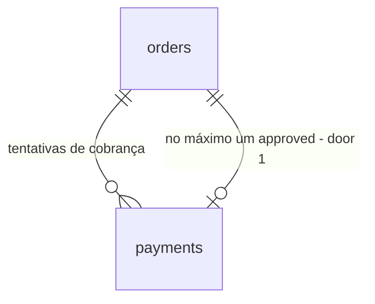

# Gateway de pagamento fake

## Problem

Hoje todo pagamento é aprovado: o `PayOrderUseCase` confere só o status do pedido e anuncia `PaymentApproved`. Não existe gateway, não existe registro de pagamento e não existe recusa. Por isso o cliente não consegue ter um pagamento recusado nem tentar de novo. Trocar a forma de cobrar também exigiria mexer no use case e no controller, porque não há uma costura onde um gateway se encaixe. A análise de domínio dá nota 7/10 de coesão ao Payment por não ter modelo próprio, e o README registra a recusa como "não implementada". A fonte não traz número: é um projeto de estudo, sem usuários. O item foi decidido na discovery [.design/fake-payment-gateway.md](../../../.design/fake-payment-gateway.md).

Quando isto estiver entregue, o cliente escolhe um cartão de teste e o pagamento é aprovado ou recusado com um motivo. Na recusa, ele pode tentar de novo, e toda tentativa fica gravada. Trocar o gateway passa a ser uma classe nova e uma ligação.

## Flow

Reaproveita a policy `pay`, a verificação de status do `PaymentService`, o evento `PaymentApproved` (já `ShouldDispatchAfterCommit`), o listener `MarkOrderAsPaid` com a sua transição idempotente e o formato de erro do `ApiErrorResponse`. Nada no Ordering muda.

1. in: `POST /api/orders/{order}/payment` `{card_token}` -> `PaymentController` (exists) - valida o `card_token` num Form Request (new, no door - placement per conventions) e autoriza pela policy `pay` (exists)
2. `PayOrderUseCase` (exists) -> `PaymentService` (exists) - o pedido pode ser pago se estiver em `awaiting_payment` **e** não tiver `Payment` aprovado (door 1)
3. `PayOrderUseCase` -> `PaymentGateway` (door 2) - envia a referência do pedido, `orders.total_cents` e o `card_token`. O `FakePaymentGateway` (door 2) devolve aprovado ou recusado, o motivo e o id da transação
4. `PayOrderUseCase` -> repositório do Payment (new, no door - placement per conventions) - grava um `Payment` (door 1) com o resultado, numa transação só dele
5. recusado: a transação é confirmada **antes** de a recusa virar erro, e a resposta é `402` `PAYMENT_DECLINED` (door 3)
6. aprovado: o banco recusa um segundo aprovado para o mesmo pedido (door 1). Quem perde a corrida recebe `409`; quem ganha anuncia `PaymentApproved` depois do commit, e o `MarkOrderAsPaid` (exists) move o pedido na fila
7. out: `202` com o pedido, `402` ou `409`
8. frontend: `PaymentPage` (exists) lista os cartões de teste (new, no door - placement per conventions) e envia o `card_token` pelo `orderService` (exists)

## Impact

| Front | What changes |
| --- | --- |
| domain | novo termo `Payment` (Payment): uma tentativa de cobrar um pedido, `approved` ou `declined`, final depois de gravada. Ninguém lê hoje, porque é novo |
| domain | novo termo `PaymentGateway` (Payment): a porta para quem cobra. `FakePaymentGateway` é o único adaptador |
| domain | novo termo `DeclineReason`: `insufficient_funds`, `card_declined`, `invalid_card` |
| domain | "pode ser pago" (`PaymentService`) passa a exigir também "sem `Payment` aprovado". Quem chama hoje: só o `PayOrderUseCase` e o `PaymentServiceTest` |
| contract | `POST /api/orders/{order}/payment` passa a exigir `card_token` e ganha a resposta `402`. Único consumidor: `orderService.approvePayment` no frontend, que muda no mesmo pull request |
| contract | `ApiErrorCode` ganha `PAYMENT_DECLINED`. Quem ramifica em códigos: o `ApiError.code` do frontend |
| stored data | nothing to migrate - tabela nova, e o banco é recriado pelo `make fresh` |
| tests | `PaymentTest`, `PayOrderUseCaseTest` e `PaymentServiceTest` passam a enviar `card_token` e a contar com a tabela `payments`; o `ModuleBoundariesTest` ganha as regras da porta |
| docs | README (estrutura do Payment, fluxo de eventos, tabela de modelo de dados, API, testes, "Escopo e decisões" sem a linha "Pagamento recusado não foi implementado") e análise de domínio (seção Payment, coesão, matriz, observação da ACL), como pede o `AGENTS.md` |

## Relations

One-way constraints: no máximo um `payments` com `status = 'approved'` por `order_id` (door 1); `decline_reason` presente se e só se `status = 'declined'` (door 1); um `payments` sempre aponta para um `orders` existente, que não pode ser apagado enquanto tiver tentativas (door 1).

## Surface

| Route | In | Out | Status |
| --- | --- | --- | --- |
| `POST /api/orders/{order}/payment` | `card_token` | `202`: `data` (pedido, como hoje) · `message`; `402`: `code: PAYMENT_DECLINED` · `message` | `202`, `402`, `403`, `409`, `422`, `429` |

## Landing

| One-way door | Literal shape | Alternative rejected |
| --- | --- | --- |
| 1. tabela `payments` e as suas garantias | colunas `order_id` (FK `orders`, `restrictOnDelete`), `amount_cents bigint`, `status` (`approved` \| `declined`), `decline_reason`, `card_token`, `gateway`, `gateway_transaction_id`; `CREATE UNIQUE INDEX payments_order_id_approved_unique ON payments (order_id) WHERE status = 'approved'`; `CHECK (amount_cents >= 0)`; `CHECK ((status = 'declined') = (decline_reason IS NOT NULL))` | `order_id` único na tabela inteira: proíbe gravar a nova tentativa depois de uma recusa. Só uma checagem na aplicação: duas requisições simultâneas passam juntas por ela. Uma coluna `orders.payment_id`: o Payment passaria a escrever na tabela do Ordering |
| 2. a porta e o padrão porta/adaptador dentro do módulo (precedente) | `App\Modules\Payment\Contracts\PaymentGateway::charge(ChargeRequest): ChargeResult`; `ChargeRequest(int $orderId, int $amountCents, string $cardToken)`; `ChargeResult(PaymentStatus $status, ?DeclineReason $declineReason, string $transactionId, string $gateway)`, ambos `final readonly` em `Payment\DTOs`; enums `PaymentStatus` e `DeclineReason` em `Payment\Enums`; `FakePaymentGateway` em `Payment\Gateways`; ligação em `PaymentServiceProvider::$bindings`, registrado em `bootstrap/providers.php` | receber o model `Order` na porta: prende todo adaptador ao Eloquent e ao Ordering, e um gateway real só precisa da referência e do valor. Devolver `bool`: não carrega o motivo nem o id da transação. Escolher o adaptador por configuração: só existe um adaptador |
| 3. contrato de erro da recusa | `402` com `{ "code": "PAYMENT_DECLINED", "message": "<motivo em pt-BR>", "errors": {}, "request_id": … }`; caso novo `ApiErrorCode::PaymentDeclined = 'PAYMENT_DECLINED'` | `422`: o frontend trataria a recusa como erro de formulário, e o pedido é válido. `200` com o `Payment` no corpo: só compensa quando as tentativas virarem um recurso listável |

- Nothing else in this change is hard to reverse

## Criteria

### S1: PaymentGateway fake (P1)

A porta existe, o fake decide só pelo token, e nada além do service provider conhece o fake.

**Acceptance Criteria**

1. WHEN `FakePaymentGateway` charges with card token `fake_card_approved` THEN it SHALL return status `approved`, decline reason `null`, gateway `fake` and a transaction id starting with `fake_`
2. WHEN `FakePaymentGateway` charges with card token `fake_card_insufficient_funds` THEN it SHALL return status `declined` with decline reason `insufficient_funds`
3. WHEN `FakePaymentGateway` charges with card token `fake_card_declined` THEN it SHALL return status `declined` with decline reason `card_declined`
4. IF `FakePaymentGateway` charges with any other card token (`tok_unknown`, `""`) THEN it SHALL return status `declined` with decline reason `invalid_card`
5. WHEN `FakePaymentGateway` charges the same card token with amounts `0` and `9999999999` THEN it SHALL return the same status for both and a different transaction id on each call
6. The container SHALL resolve `PaymentGateway` to `FakePaymentGateway`
7. The namespaces `App\Modules\Payment\UseCases`, `App\Modules\Payment\Services` and `App\Modules\Payment\Http` SHALL NOT use `FakePaymentGateway`, each in its own architecture expectation, and `App\Modules\Payment\Contracts` SHALL contain only interfaces

**Independent test:** resolver `PaymentGateway` no container e cobrar com cada um dos quatro tokens.

### S2: Pay Order (P1)

O pagamento passa pela porta, toda tentativa fica gravada, e a recusa volta para o cliente sem mexer no pedido.

**Acceptance Criteria**

8. WHEN the owner sends `POST /api/orders/{order}/payment` with `card_token: "fake_card_approved"` for an order in `awaiting_payment` with `total_cents` `12345` THEN the system SHALL return `202` with `data.id` equal to the order id and `message` `"Pagamento aprovado. O pedido será atualizado em instantes."`
9. WHEN that approval succeeds THEN the system SHALL store exactly one `payments` row for the order with `status` `approved`, `amount_cents` `12345`, `decline_reason` `null`, `card_token` `fake_card_approved`, `gateway` `fake` and a `gateway_transaction_id` starting with `fake_`, and SHALL dispatch `PaymentApproved` exactly once, for that order
10. WHEN the owner pays with `card_token: "fake_card_insufficient_funds"` THEN the system SHALL return `402` with `code` `PAYMENT_DECLINED` and `message` `"Pagamento recusado: saldo insuficiente."`, store one `payments` row with `status` `declined` and `decline_reason` `insufficient_funds`, keep the order in `awaiting_payment` and dispatch no `PaymentApproved`
11. WHEN the owner pays with `card_token: "fake_card_declined"` THEN the system SHALL return `402` `PAYMENT_DECLINED` with `message` `"Pagamento recusado pelo emissor do cartão."` and store one `declined` row with `decline_reason` `card_declined`
12. WHEN the owner pays with `card_token: "tok_unknown"` THEN the system SHALL return `402` `PAYMENT_DECLINED` with `message` `"Cartão inválido."` and store one `declined` row with `decline_reason` `invalid_card`
13. WHEN the owner pays with `fake_card_approved` after a declined attempt on the same order THEN the system SHALL return `202` and the order SHALL have two `payments` rows, one `declined` and one `approved`
14. IF `card_token` is missing, is not a string, or is longer than 64 characters THEN the system SHALL return `422` with `code` `VALIDATION_FAILED` and an error under `errors.card_token`, store no `payments` row and not call the gateway
15. IF the order is in `placed`, `payment_approved` or `delivered` THEN the system SHALL return `409` with `message` `"Este pedido não está aguardando pagamento."`, store no `payments` row and not call the gateway
16. IF the order is in `awaiting_payment` and already has an `approved` `payments` row THEN the system SHALL return `409` with `message` `"Este pedido não está aguardando pagamento."`, store no new row and not call the gateway
17. IF another request records an `approved` payment for the same order after the eligibility check and before this request's insert THEN the system SHALL return `409` with `message` `"Este pedido não está aguardando pagamento."`, leave exactly one `approved` row for the order and dispatch no `PaymentApproved` for the losing request
18. IF the request body carries `amount_cents: 1` or `total_cents: 1` THEN the amount sent to the gateway and stored in `payments.amount_cents` SHALL be the order's `total_cents`
19. IF a customer pays an order of another customer THEN the system SHALL return `403`, store no `payments` row and not call the gateway
20. IF a second `payments` row with `status` `approved` is inserted for the same `order_id` THEN the database SHALL reject it, while a `declined` row for that order SHALL be accepted
21. IF a `payments` row is written as `declined` without `decline_reason`, as `approved` with a `decline_reason`, or with a negative `amount_cents` THEN the database SHALL reject it
22. WHEN a `payments` row is stored THEN the system SHALL log `"Payment attempt recorded."` at `info` with `order_id`, `payment_id`, `status` and `decline_reason`, and the log context SHALL NOT contain the `card_token`
23. IF the same user sends more than 20 requests to `POST /api/orders/{order}/payment` within one minute THEN the system SHALL return `429` for the 21st

**Independent test:** pagar um pedido com o cartão de saldo insuficiente, ver o `402` e o pedido parado em `awaiting_payment`, pagar de novo com o cartão aprovado e ver o pedido chegar a `payment_approved` com o worker rodando.

### S3: PaymentPage (P2)

A página de pagamento deixa escolher o cartão de teste e mostra a recusa com a nova tentativa.

**Acceptance Criteria**

24. WHILE the order is in `awaiting_payment` the payment page SHALL list the test cards "Cartão aprovado", "Recusado: saldo insuficiente" and "Recusado pelo emissor", none selected, with the "Pagar" button disabled until one is selected
25. WHEN a test card is selected and "Pagar" is clicked THEN the page SHALL send `POST /api/orders/{order}/payment` with that card's `card_token` (`fake_card_approved`, `fake_card_insufficient_funds` or `fake_card_declined`)
26. WHILE the payment request is in flight the "Pagar" button SHALL be disabled and read "Pagando..."
27. WHEN the API answers `202` THEN the page SHALL show the success notification and navigate to `account.order` with `paid=1`, as today
28. WHEN the API answers `402` THEN the page SHALL stay, show the API `message` inline on the page, keep the selected card and re-enable "Pagar"
29. WHEN the API answers `409` THEN the page SHALL show the error notification and reload the order, as today
30. WHILE the order is in `placed` the page SHALL keep the test cards and "Pagar" disabled and show "Processando o pedido na fila...", as today

**Independent test:** abrir `/payment/:orderId`, pagar com "Recusado: saldo insuficiente", ver a mensagem na página e pagar de novo com "Cartão aprovado".

## Out of scope

| Excluded | Why |
| --- | --- |
| simular falha do gateway (fora do ar, timeout) | terceiro caminho com erro e retry próprios; reabre com um gateway real (discovery, Boundary) |
| pagamento assíncrono (pendente, webhook, Pix, 3DS) | exige estado pendente e endpoint de callback; reabre com um gateway que confirme depois |
| idempotência com tentativa pendente gravada antes da cobrança | só compensa quando um gateway movimenta dinheiro de verdade (discovery, Shape) |
| estorno e cancelamento | não há fluxo de cancelamento de pedido |
| histórico de tentativas no pedido do cliente ou no admin | os dados ficam gravados; `OrderResource` não muda |
| escolher o gateway por configuração | só existe um adaptador |
| mais de uma moeda | fora do escopo no README |

## Assumptions

| Assumption | Chosen default | Rationale | Confirmed? |
| --- | --- | --- | --- |
| prova das telas sem biblioteca de teste de componente | a lógica da página (lista de cartões, envio, tratamento de `202`/`402`/`409`) fica num composable testado com Vitest e o `orderService` simulado; os estados visuais (AC 24, 26, 30) são conferidos no navegador | o frontend só tem Vitest, sem `@vue/test-utils`; adicionar uma dependência para uma página seria uma porta nova | n |
| limite de requisições no pagamento | `throttle:20,1`, como `POST /api/orders` | as tentativas são ilimitadas no produto, mas uma rota que aceita qualquer token e grava uma linha por chamada precisa de teto, como o checkout já tem | n |
| tamanho do `card_token` | até 64 caracteres, igual à coluna | um token maior seria cortado ou rejeitado pelo banco depois da cobrança | n |
| onde a recusa vira erro | depois do commit da linha recusada, com uma exceção que renderiza `402` | Key decision 3 da discovery: lançar dentro da transação desfaz a linha | y |
| nome do método do `orderService` | `approvePayment(id)` vira `pay(id, cardToken)` | o botão deixa de "aprovar" e passa a pagar com um cartão | n |

**Open questions:** none - all resolved or logged above.

## Observable

| Surface | Decision | Landing |
| --- | --- | --- |
| API `POST /api/orders/{order}/payment` | response shape | AC 8, 9 |
| API `POST /api/orders/{order}/payment` | error shape and codes | AC 10, 11, 12, 14, 15, 16, 17 |
| API `POST /api/orders/{order}/payment` | who may call it | AC 19; existing - `auth:sanctum` and policy `pay` |
| API `POST /api/orders/{order}/payment` | rate limit | AC 23 |
| API `POST /api/orders/{order}/payment` | versioning | n/a - the project has no API versioning, and the only consumer ships in the same pull request |
| screen `PaymentPage` | empty state | n/a - the test card list is fixed and never empty |
| screen `PaymentPage` | loading state | AC 26, 30; existing - `LoadingState` while the order loads |
| screen `PaymentPage` | error state | AC 28, 29; existing - the load error message |
| screen `PaymentPage` | unauthorised state | existing - the router guard sends guests to login and the API `403` is handled by the `api` client |
| screen `PaymentPage` | density and ordering | AC 24 - three cards in the fixed order approved, insufficient funds, declined |
| screen `PaymentPage` | destructive action confirms | n/a - paying a fake order with a test card destroys nothing and is retryable |
| copy on `PaymentPage` | tone and what the reader does next | AC 24, 28 - test card labels and the API decline message; the "Pagamento simulado para fins de estudo" note stays |

## Sources

- [.design/fake-payment-gateway.md](../../../.design/fake-payment-gateway.md) - binding: Key decisions 1 a 6, slices PaymentGateway, Pay Order e PaymentPage
