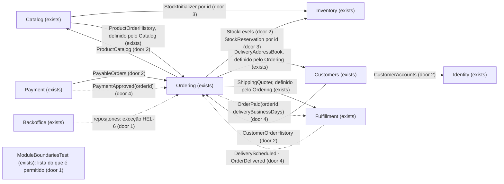

# Facades dos módulos

## Problem

Hoje um módulo usa as classes internas de outro. Há 102 referências de um módulo para outro, sem contar o `Shared`, e só 12 passam por `Contracts` ou `Events`. Das outras 90, 48 entram em `Models`, `Repositories` e `Services` de outro módulo:

- o `Order` aparece no Payment e no Fulfillment;
- o `Product` e o `Stock` aparecem no checkout;
- o `CustomerAccount`, o seu repositório e o `UserService` aparecem no Customers;
- o `OrderRepository` aparece no Customers.

Até os contratos públicos vazam modelo: o `StockInitializer` recebe um `Product` e devolve um `Stock`, e o `StockReservation` devolve uma coleção de `Stock`.

O `ModuleBoundariesTest` é uma lista de proibições: tudo o que nenhuma das suas regras nomeia é permitido. Por isso uma pasta nova já nasce pública, e mudar um model obriga a revisar módulos que nem deveriam conhecê-lo. Quem paga é o próximo passo do projeto. A HEL-9 (outbox) precisa de eventos cujo payload possa ser gravado, e a HEL-6 (CQRS) precisa saber quais leituras atravessam módulos. A contagem saiu das declarações `use` em `backend/app/Modules` em 2026-10-08, durante a discovery [.design/module-facades.md](../../../.design/module-facades.md).

Quando isto estiver entregue, cada módulo é usado de fora só pelos seus contratos e eventos, que falam em dados. O teste de fronteira falha em qualquer travessia nova para as partes internas. Para quem usa a loja nada muda, com duas exceções:
- a resposta do pagamento traz a tentativa de pagamento em vez do pedido;
- os pedidos recentes da conta e do admin de clientes vêm resumidos.

## Flow

Reaproveita os contratos por papel que já existem (`DeliveryAddressBook`, `ShippingQuoter`, `ProductOrderHistory` e `PaymentGateway`), o padrão de o repositório implementar o contrato e ser ligado no service provider do módulo dono (como o `OrderRepository` com o `ProductOrderHistory`), a cadeia de eventos e listeners que já move o status do pedido, a transação do `PlaceOrderUseCase` e a regra de disponibilidade do `PurchaseAvailabilityService`, que continua sendo o único lugar dessa regra.

Os dois caminhos que este trabalho reescreve:

1. Checkout: `POST /api/orders` -> `Ordering` (exists) pega a cópia do endereço (`DeliveryAddressBook`, exists) e o frete (`ShippingQuoter`, exists). Abre a transação e bloqueia o estoque pelo `StockReservation` (door 3), que devolve as quantidades lidas sob o bloqueio. Lê os produtos pelo `ProductCatalog` (door 2), confere a disponibilidade pelo `PurchaseAvailabilityService` (exists), baixa por `product_id` (door 3) e grava `orders` e `order_items`. Depois do commit, publica `OrderPlaced(orderId)` (door 4).
2. Pagamento: `POST /api/orders/{order}/payment` -> `Payment` (exists) busca o pedido pelo `PayableOrders` (door 2): `404` se não existe, `403` se é de outro cliente, `409` se não está aguardando pagamento. Depois cobra pelo `PaymentGateway` (exists), grava a tentativa, publica `PaymentApproved(orderId)` (door 4) e responde `202` com a tentativa (door 5).

## Impact

| Front | What changes |
| --- | --- |
| domain | novo termo `CatalogProduct` (Catalog): o produto como o Catalog o entrega a outro módulo (id, nome, imagem, preço, se está ativo). Ninguém lê hoje |
| domain | novo termo `StockQuantities` (Inventory): a quantidade em estoque por produto, com 0 para o produto sem linha de estoque. Ninguém lê hoje |
| domain | novo termo `OrderForPayment` (Ordering): o que o Payment precisa saber de um pedido (id, cliente, total, status). Ninguém lê hoje |
| domain | novo termo `OrderSummary` (Ordering): um pedido resumido (id, status, total, data) para as telas da conta e de clientes. Ninguém lê hoje |
| domain | novo termo `CustomerProfile` (Identity): os dados de uma conta de cliente sem credenciais (id, nome, e-mail, data de criação). Ninguém lê hoje |
| domain | termo existente: os eventos do pedido (`OrderPlaced`, `PaymentApproved`, `OrderPaid`, `DeliveryScheduled`, `OrderDelivered`) e o job `DeliverOrder` carregavam o model `Order` e passam a carregar `orderId` e valores. Quem lê `$event->order` hoje: os listeners `MarkOrderAsAwaitingPayment`, `MarkOrderAsPaid`, `MarkOrderAsDelivered`, `RecordEstimatedDelivery` (Ordering) e `ScheduleOrderDelivery` (Fulfillment), e as asserções de `Event::assertDispatched` em `PaymentTest`, `PayOrderUseCaseTest`, `CheckoutTest`, `PlaceOrderUseCaseTest`, `OrderStatusFlowTest` e `DeliveryEstimateTest` |
| domain | contratos existentes: o `StockInitializer` e o `StockReservation` trocam `Product` e `Stock` por ids e `StockQuantities`. Quem chama hoje: o `CreateProductUseCase` e o `PlaceOrderUseCase`. Quem testa: `StockRepositoryTest` |
| domain | regra existente `PurchaseAvailabilityService`: recebia `Product` e `Stock` e passa a receber dados (se está ativo, a quantidade). Quem chama hoje: o `CartValidationService` e o `CheckoutService` (Ordering), o `ProductResource` e o `ProductController` (Catalog, exceção HEL-6) e o `StockResource` (Inventory, exceção HEL-6). Quem testa: `PurchaseAvailabilityServiceTest` e `CheckoutServiceTest` |
| domain | relações Eloquent removidas: `Payment::order()` (ninguém chama) e `OrderItem::product()` (ninguém carrega). As chaves estrangeiras continuam |
| domain | a permissão `pay` sai da `OrderPolicy`: a checagem de dono do pedido passa para o Payment. Quem chama hoje: só o `PaymentController` |
| contract | `POST /api/orders/{order}/payment`: o `data` passa do pedido para a tentativa de pagamento (door 5). Quem lê: `orderService.pay` e `usePayment` no frontend (só o `message` é usado) e o `PaymentTest` (`data.id` era o id do pedido) |
| contract | `GET /api/account` (`last_order` e `recent_orders`) e `GET /api/admin/customers/{customer}` (`orders`): cada pedido passa a ter só `id`, `status`, `status_label`, `total_cents` e `created_at` (door 5). Quem lê: os tipos `AccountSummary` e `Customer` do frontend, a `AccountDashboardPage` e a `CustomerDetailPage`, que já usam só esses campos, e os testes `AccountTest` e `CustomerTest` |
| contract | as assinaturas dos use cases do Customers (`CreateCustomerAddressUseCase`, `UpdateOwnProfileUseCase`, `UpdateCustomerUseCase`, `ShowCustomerUseCase`, `ListCustomersUseCase`) trocam `CustomerAccount` por id ou `CustomerProfile`. Quem testa: `UserUseCasesTest` e `CustomerAddressUseCasesTest` |
| tests | o `ModuleBoundariesTest` ganha a regra de lista permitida e mantém todas as regras de hoje. O `TypedListSignaturesTest` passa a cobrir os contratos novos e alterados; a linha `ProductRepository::findManyKeyedById` vai para o `ProductCatalog` se o método sair do repositório |
| config | `bootstrap/providers.php` ganha os service providers do Catalog e do Identity, para ligar o `ProductCatalog` e o `CustomerAccounts`. Nenhuma variável de ambiente nova |
| stored data | nothing to migrate - nenhuma tabela, coluna ou chave estrangeira muda |
| docs | README (camadas, fronteiras, eventos com ids, a resposta do pagamento e o resumo dos pedidos da conta), análise de domínio (padrões de integração, matriz de coesão, pendências "eventos carregam o model `Order`" e "Catalog usa uma regra do Ordering na vitrine", que fica apontando para a HEL-6) e `AGENTS.md` (a facade de um módulo é o seu `Contracts` mais os seus `Events`) |

## Relations

None - no stored-data shape change. Nenhuma tabela, coluna, índice ou chave estrangeira muda; só deixam de existir as relações Eloquent `Payment::order()` e `OrderItem::product()`, e as chaves `payments.order_id` e `order_items.product_id` continuam.

## Surface

Only routes this adds or whose signature changes.

| Route | In | Out | Status |
| --- | --- | --- | --- |
| `POST /api/orders/{order}/payment` | `card_token` | `data.id` · `data.order_id` · `data.status` · `data.amount_cents` · `message` | `202`, `401`, `402`, `403`, `404`, `409`, `422`, `429` |
| `GET /api/account` | - | `data.customer` · `data.orders_count` · `data.last_order` · `data.recent_orders` (pedidos no formato resumido) | `200`, `401` |
| `GET /api/admin/customers/{customer}` | - | `data.id` · `data.name` · `data.email` · `data.created_at` · `data.orders_count` · `data.orders` (pedidos no formato resumido) | `200`, `401`, `404` |

## Landing

| One-way door | Literal shape | Alternative rejected |
| --- | --- | --- |
| 1. a regra de fronteira (`ModuleBoundariesTest`) | Para cada par de módulos distintos A e B, com B diferente de `Shared`, `App\Modules\A` não usa nenhum `App\Modules\B\<pasta>`, gerado das pastas que existem em `app/Modules/B`, exceto `Contracts`, `Events`, `DTOs`, `ValueObjects`, `Enums` e `Http` (os quatro últimos até a HEL-10). Também não usa nenhuma classe da raiz de `app/Modules/B`. Exceções, cada uma comentada com `HEL-6`: `Backoffice` → `Catalog\Repositories`, `Identity\Repositories`, `Inventory\Repositories`, `Ordering\Repositories`; `Catalog\Models` → `Inventory\Models\Stock`; `Inventory\Models` → `Catalog\Models\Product`; `Catalog\Http` → `Ordering\Services\PurchaseAvailabilityService`; `Inventory\Http` → `Ordering\Services\PurchaseAvailabilityService`. `Contracts` só com interfaces em todos os módulos. Todas as regras de hoje continuam | lista de proibições (a de hoje): uma pasta nova nasce pública. Catraca com as violações congeladas: decidido limpar tudo agora (discovery). Deptrac: o precedente do projeto é o arch test do Pest |
| 2. contratos novos (interfaces em `Contracts`, ligadas no service provider do módulo dono a um repositório dele) | `Catalog\Contracts\ProductCatalog::findMany(ProductIds $ids): CatalogProducts`; `Inventory\Contracts\StockLevels::quantitiesFor(ProductIds $ids): StockQuantities`; `Ordering\Contracts\PayableOrders::findForPayment(int $orderId): ?OrderForPayment`; `Ordering\Contracts\CustomerOrderHistory::countForCustomer(int $customerId): int`, `countPerCustomer(CustomerIds $customerIds): OrderCountsByCustomer`, `recentForCustomer(int $customerId, int $limit): OrderSummaries`; `Identity\Contracts\CustomerAccounts::register(CreateUserDTO $data): CustomerProfile`, `updateProfile(int $customerId, UpdateUserProfileDTO $data): CustomerProfile`, `findProfile(int $customerId): ?CustomerProfile`, `paginateNewestFirst(int $perPage): LengthAwarePaginator` (de `CustomerProfile`). Value objects `final readonly` no módulo que define o contrato: `CatalogProduct(int $id, string $name, ?string $imageUrl, int $priceCents, bool $isActive)`; `CatalogProducts` (lista por id com `find(int $productId): ?CatalogProduct`); `StockQuantities` (com `of(int $productId): int`, 0 quando não há linha); `OrderForPayment(int $id, int $customerId, int $totalCents, OrderStatus $status)`; `OrderSummary(int $id, OrderStatus $status, int $totalCents, CarbonImmutable $createdAt)`; `OrderSummaries` (lista, do mais recente para o mais antigo, com `first(): ?OrderSummary`); `CustomerProfile(int $id, string $name, string $email, CarbonImmutable $createdAt)` | uma interface por módulo (`OrderingFacade`): todo consumidor dependeria de tudo (discovery). Facade estática do Laravel: esconde a dependência do construtor e não é fronteira. Devolver models ou coleções Eloquent: o vazamento só muda de lugar. Uma classe de implementação fora de `Repositories`: o `AGENTS.md` reserva o acesso a dados aos repositórios e deixa os `Services` puros |
| 3. contratos do Inventory que mudam | `StockInitializer::createForProduct(int $productId, int $quantity): void`; `StockReservation::lockForProducts(ProductIds $productIds): StockQuantities` (quantidades lidas sob o bloqueio, linhas bloqueadas em ordem de `product_id`, na transação de quem chama) e `StockReservation::decrement(int $productId, int $quantity): void` | manter `Product` e `Stock` nas assinaturas: é a travessia que esta feature remove. O Catalog devolver a quantidade junto com o produto: só leva o `Product::stock` para dentro do Catalog (discovery) |
| 4. payload dos eventos e do job | `OrderPlaced(int $orderId)`; `OrderPaid(int $orderId, int $deliveryBusinessDays)`, ainda `ShouldDispatchAfterCommit`; `PaymentApproved(int $orderId)`; `DeliveryScheduled(int $orderId, CarbonImmutable $estimatedDeliveryOn)`; `OrderDelivered(int $orderId)`; job `DeliverOrder(int $orderId)`. Os listeners do Ordering carregam o pedido pelo id | manter o model: a regra não fecha no Payment nem no Fulfillment, e a HEL-9 precisa de um payload que possa ser gravado. Um DTO com o pedido inteiro: o envelope é da HEL-9, e aqui vai só o que cada consumidor usa |
| 5. contrato da API | `POST /api/orders/{order}/payment` → `202` `{ data: { id, order_id, status: "approved", amount_cents }, message }`. Pedido resumido em `last_order`, `recent_orders` e `orders`: `{ id, status, status_label, total_cents, created_at }`, com `created_at` em ISO 8601 | manter o pedido na resposta do pagamento: o Payment teria que segurar o model `Order` ou pedir ao Ordering uma representação HTTP. Manter o `OrderResource` completo nos resumos: o Customers teria que segurar o model `Order` |
| 6. o cliente autenticado fora do Identity | `OrderPolicy::view(Authenticatable $account, Order $order)` e `CustomerAddressPolicy::update/delete(Authenticatable $account, CustomerAddress $address)` comparam com `getAuthIdentifier()`; os use cases do Customers recebem `int $customerId`; `{order}` no pagamento e `{customer}` no admin de clientes chegam como `int` e são resolvidos pelo contrato do dono, com `404` quando ele devolve `null` | uma exceção na regra para o `CustomerAccount`: abre a fronteira justamente na classe mais usada. Route model binding com o model de outro módulo: é a mesma travessia, escondida no roteador |

- Nothing else in this change is hard to reverse: nomes de classes privadas, pastas e a forma interna de cada implementação ficam para o diff

## Criteria

### S1: ModuleBoundariesTest (P1)

A fronteira passa a ser uma lista do que é permitido, e falha em qualquer travessia nova.

**Acceptance Criteria**

1. The `ModuleBoundariesTest` SHALL fail WHEN a class under `App\Modules\<A>` uses a class from any directory of `app/Modules/<B>` other than `Contracts`, `Events`, `DTOs`, `ValueObjects`, `Enums` and `Http`, for every pair of distinct modules A and B with B different from `Shared`
2. The `ModuleBoundariesTest` SHALL fail WHEN a class under `App\Modules\<A>` uses a class declared directly in `app/Modules/<B>` (a module root class such as `PaymentServiceProvider`)
3. WHEN a new directory is created under `app/Modules/<B>` THEN the `ModuleBoundariesTest` SHALL treat it as private with no edit to the test
4. The `ModuleBoundariesTest` SHALL allow exactly the eight exceptions listed in Landing door 1, each written next to the text `HEL-6`
5. The `ModuleBoundariesTest` SHALL fail WHEN a class under `App\Modules\<M>\Contracts` that is not an interface exists, for every module M
6. The system SHALL declare no parameter type and no return type that is an Eloquent `Model` subclass or an Eloquent `Collection` in any method of an interface under `App\Modules\*\Contracts`
7. The `ModuleBoundariesTest` SHALL keep every rule it has today, including the stock repository, catalog and ordering, identity and ordering, staff user, order repository, payment and fulfillment, ordering and customers, ordering and fulfillment, fulfillment and customers, payment gateway, shared kernel, value object and password policy rules
8. WHEN a deliberate violation of each new rule kind (private directory, module root class, non-interface contract, model in a contract signature) is introduced THEN the `ModuleBoundariesTest` SHALL fail
9. WHEN `make test` runs on the finished branch THEN the `ModuleBoundariesTest` SHALL pass
10. The `TypedListSignaturesTest` SHALL cover `ProductCatalog`, `StockLevels`, `StockReservation`, `PayableOrders`, `CustomerOrderHistory` and `CustomerAccounts` and find no `array` in their signatures

**Independent test:** rodar o `ModuleBoundariesTest` com uma violação de cada tipo e vê-lo falhar; depois sem ela e vê-lo passar.

### S2: Eventos do pedido (P1)

Os eventos e o job carregam ids e valores, e o ciclo do pedido continua igual.

**Acceptance Criteria**

11. The system SHALL type no public property of `OrderPlaced`, `OrderPaid`, `PaymentApproved`, `DeliveryScheduled`, `OrderDelivered` or `DeliverOrder` as an Eloquent `Model` subclass
12. WHEN an order is placed THEN the system SHALL dispatch `OrderPlaced` with `orderId` equal to the new order's id
13. WHEN a payment is approved THEN the system SHALL dispatch `PaymentApproved` with `orderId` equal to the paid order's id, exactly once
14. WHEN the ordering side moves an order from `awaiting_payment` to `payment_approved` THEN the system SHALL dispatch `OrderPaid` with `orderId` equal to that order's id and `deliveryBusinessDays` equal to its `delivery_business_days`
15. WHEN the fulfillment side handles `OrderPaid` with `deliveryBusinessDays` 3 on Monday 2026-10-05 10:00 in São Paulo THEN the system SHALL dispatch `DeliveryScheduled` with that `orderId` and `estimatedDeliveryOn` 2026-10-08, and queue `DeliverOrder` with that `orderId`
16. WHEN an order goes through placement, approved payment and delivery with the queue running THEN it SHALL end with status `delivered` and `estimated_delivery_on` set
17. IF `DeliveryScheduled` arrives for an order that already has `estimated_delivery_on` THEN the system SHALL keep the first date
18. IF `OrderDelivered` arrives twice for the same order THEN the order SHALL stay `delivered` and the second event SHALL change nothing
19. IF `PaymentApproved` arrives for an order that is no longer `awaiting_payment` THEN the system SHALL not dispatch `OrderPaid`

**Independent test:** rodar o `OrderStatusFlowTest` e o `DeliveryEstimateTest` com a fila síncrona.

### S3: StockInitializer (P2)

O Catalog abre o estoque de um produto novo passando só o id e a quantidade.

**Acceptance Criteria**

20. WHEN an admin creates a product with `stock_quantity` 7 THEN the system SHALL return `201` and store exactly one `stocks` row with that `product_id` and `quantity` 7
21. IF opening the stock fails during product creation THEN the system SHALL leave no `products` row and no `stocks` row for it

**Independent test:** criar um produto pela rota do admin e conferir a linha de estoque.

### S4: ProductCatalog e StockLevels (P1)

O carrinho e o checkout usam os dados dos produtos e as quantidades pelos contratos, com as mesmas respostas de hoje.

**Acceptance Criteria**

22. WHEN `POST /api/cart/validate` receives a `product_id` with no product THEN the system SHALL return `200` with that line's `problem` `"Produto não encontrado."`, `is_available` `false` and `is_valid` `false`
23. WHEN `POST /api/cart/validate` receives an inactive product THEN that line's `problem` SHALL be `"Produto indisponível."`
24. WHEN `POST /api/cart/validate` asks for 5 units of a product with 3 in stock THEN that line SHALL have `available_quantity` 3 and `problem` `"Estoque insuficiente. Disponível: 3."`
25. WHEN `POST /api/cart/validate` receives an active product with no `stocks` row THEN that line SHALL have `available_quantity` 0 and `problem` `"Produto indisponível."`
26. WHEN `POST /api/cart/validate` receives only active products in stock THEN each line SHALL carry the product's `name`, `image_url` and `unit_price_cents` from `products`, and `is_valid` SHALL be `true`
27. WHEN a customer places an order for available products THEN the system SHALL return `201`, store each `order_items` row with the product's name and `price_cents` at that moment, and lower each `stocks.quantity` by the quantity bought
28. IF a product in the order does not exist, is inactive or has fewer units than asked THEN the system SHALL return `409` with an error under `errors.items.{product_id}`, store no order and leave every `stocks.quantity` unchanged
29. WHEN two customers place orders at the same time for the last unit of a product THEN exactly one order SHALL be created, the other request SHALL get `409`, and `stocks.quantity` SHALL end at 0
30. IF the `address_id` is not in the customer's address book THEN the system SHALL return `422` under `errors.address_id` and leave every `stocks.quantity` unchanged
31. WHEN `GET /api/products` lists an active product with 0 units THEN its `is_available` SHALL be `false`, as today

**Independent test:** rodar o `CheckoutTest`, incluindo os casos de concorrência, e o teste da validação do carrinho.

### S5: PayableOrders (P1)

O Payment cobra um pedido lendo-o pelo contrato, e a resposta traz a tentativa de pagamento.

**Acceptance Criteria**

32. WHEN the owner pays an `awaiting_payment` order with `card_token` `"fake_card_approved"` THEN the system SHALL return `202` with `data.id` equal to the new `payments` row id, `data.order_id` equal to the order id, `data.status` `"approved"`, `data.amount_cents` equal to `orders.total_cents`, and `message` `"Pagamento aprovado. O pedido será atualizado em instantes."`
33. The `202` response `data` SHALL hold exactly the keys `id`, `order_id`, `status` and `amount_cents`
34. IF the `{order}` id does not exist THEN the system SHALL return `404` and store no `payments` row
35. IF the order belongs to another customer THEN the system SHALL return `403` and store no `payments` row
36. IF the order is not `awaiting_payment`, or already has an approved payment, THEN the system SHALL return `409` with `message` `"Este pedido não está aguardando pagamento."`
37. IF the gateway declines the charge THEN the system SHALL return `402`, store the declined attempt and leave the order `awaiting_payment`
38. WHEN two approvals race for the same order THEN only one approved `payments` row SHALL exist and the loser SHALL get `409`
39. The system SHALL charge `orders.total_cents` and ignore any amount sent in the request

**Independent test:** rodar o `PaymentTest`.

### S6: CustomerAccounts (P2)

As telas de conta e de clientes funcionam pelo contrato do Identity, sem mudar o JSON.

**Acceptance Criteria**

40. WHEN an admin creates a customer with a free e-mail THEN the system SHALL return `201` with `data.id`, `data.name`, `data.email` (lower-cased), `data.created_at` and `data.orders_count` 0
41. IF the e-mail already belongs to another customer THEN `POST /api/admin/customers` SHALL return `422` under `errors.email`
42. IF `GET` or `PUT /api/admin/customers/{customer}` targets an id that does not exist THEN the system SHALL return `404`
43. WHEN an admin lists customers THEN the system SHALL return 15 per page, newest first, each with its `orders_count`
44. WHEN a customer sends `PUT /api/account/profile` with a new name and e-mail and no password THEN the system SHALL return `200` with `message` `"Dados atualizados com sucesso."` and `data` holding exactly `id`, `name`, `email` and `created_at`, and the password SHALL stay the same
45. IF a customer sends `PUT` or `DELETE` to another customer's address THEN the system SHALL return `403` and the address SHALL stay unchanged
46. WHEN a customer creates an address THEN the stored `customer_addresses.customer_id` SHALL be that customer's id

**Independent test:** rodar `CustomerTest`, `AccountTest` e `CustomerAddressTest`.

### S7: CustomerOrderHistory (P1)

A conta e o admin de clientes mostram a contagem e os pedidos recentes pelo contrato do Ordering, no formato resumido.

**Acceptance Criteria**

47. WHEN a customer with no orders sends `GET /api/account` THEN the system SHALL return `200` with `orders_count` 0, `last_order` `null` and `recent_orders` `[]`
48. WHEN a customer with 6 orders sends `GET /api/account` THEN the system SHALL return `orders_count` 6, `recent_orders` with the 5 most recent from newest to oldest, and `last_order` equal to the newest
49. The system SHALL render each order in `last_order`, `recent_orders` and `orders` with exactly the keys `id`, `status`, `status_label`, `total_cents` and `created_at`, with `created_at` in ISO 8601
50. WHEN an admin opens a customer with 12 orders THEN `GET /api/admin/customers/{customer}` SHALL return `orders_count` 12 and `orders` with the 10 most recent from newest to oldest
51. WHEN an admin lists a page of customers THEN the order counts SHALL come from one query for the whole page, whatever the page size
52. The `orders_count` of a customer SHALL never include orders of another customer
53. The frontend SHALL type `last_order`, `recent_orders` and `orders` as a summary with those five fields, and the `orderService.pay` result as the payment attempt, and `npm run type-check` and `npm run test` SHALL pass

**Independent test:** abrir "Minha conta" e o detalhe de um cliente no admin com pedidos já feitos.

## Out of scope

| Excluded | Why |
| --- | --- |
| travessias para `Http`, `ValueObjects`, `Enums` e `DTOs` de outro módulo | HEL-10 |
| envelope dos eventos, outbox e disparo transacional | HEL-9 |
| dashboard do Backoffice, vitrine e lista de estoque do admin sem as exceções | HEL-6 |
| persistência separada por módulo (FKs entre módulos, o `Customer` do Ordering lendo `customers`) | nada no roadmap extrai um módulo (discovery, Shape) |
| facades estáticas do Laravel | dá para pôr depois por cima de um contrato (discovery) |

## Assumptions

| Assumption | Chosen default | Rationale | Confirmed? |
| --- | --- | --- | --- |
| nomes dos métodos e dos value objects | os da Landing (doors 2 a 4) | evitam colisão com o `BaseRepository` (`create`, `update`, `delete`, `count`) e reaproveitam os nomes que o `OrderRepository` e o `CustomerAccountRepository` já usam | n |
| mensagem do `404` no pagamento e no admin de clientes | a genérica do `ApiExceptionRenderer` | é a que o route model binding dá hoje | n |
| mensagem do `403` no pagamento | a padrão do `ApiErrorResponse`, como a `OrderPolicy` dá hoje | o `PaymentTest` só confere o código | n |
| ordem das recusas no pagamento | `404`, depois `403`, depois `409`, depois a validação do corpo como hoje | é a ordem do route model binding, da policy e da regra de hoje | n |
| o pedido do evento não existe mais | o listener falha o job, como acontecia quando o model sumia | pedidos nunca são apagados | n |
| regras de direção que a regra nova já cobre | ficam no teste | o retrospecto do Packwerk: a direção das dependências é o que importa, e apagar uma regra é enfraquecer o teste | n |
| assinatura do `PurchaseAvailabilityService` | passa a receber se o produto está ativo e a quantidade (e a quantidade pedida); continua o único lugar da regra, e as exceções da HEL-6 passam esses valores a partir dos models | a regra fica escrita uma vez (Key decision 7 da discovery) e o Ordering deixa de importar `Product` e `Stock` | n |
| prova do frontend | `vue-tsc` e Vitest; as duas telas conferidas no navegador | o frontend só tem Vitest, e as telas já usam só os cinco campos | n |

**Open questions:** none - all resolved or logged above.

## Observable

| Surface | Decision | Landing |
| --- | --- | --- |
| API `POST /api/orders/{order}/payment` | response shape | AC 32, 33 |
| API `POST /api/orders/{order}/payment` | error shape and codes | AC 34, 35, 36, 37, 38 |
| API `POST /api/orders/{order}/payment` | who may call it, rate limit | existing - `auth:customer` e `throttle:20,1` |
| API `GET /api/account` | response shape | AC 47, 48, 49 |
| API `GET /api/account` | error shape, who may call it | existing - `auth:customer`, `401` sem sessão |
| API `GET /api/admin/customers/{customer}` | response shape | AC 49, 50 |
| API `GET /api/admin/customers/{customer}` | error shape and codes | AC 42 |
| API `GET /api/admin/customers/{customer}` | who may call it | existing - guard `staff`, os dois papéis |
| all changed routes | versioning, rate limits | n/a - o projeto não versiona a API, o único consumidor muda no mesmo pull request e os limites não mudam |
| screen "Minha conta" (`AccountDashboardPage`) | empty, loading, error and unauthorised states | existing - a tela não muda; só o tipo dos pedidos (AC 53) |
| screen detalhe do cliente no admin (`CustomerDetailPage`) | empty, loading, error and unauthorised states | existing - a tela não muda; só o tipo dos pedidos (AC 53) |
| screen pagamento (`PaymentPage`) | error state | existing - `usePayment` trata `402` e `409` e só lê o `message` |

## Sources

- [HEL-7](https://linear.app/helter/issue/HEL-7/vamos-evoluir-a-estrutura-e-determinar-algums-limites-para-os) - a decisão e o objetivo
- [.design/module-facades.md](../../../.design/module-facades.md) - o design confirmado: forma, Key decisions e slices
