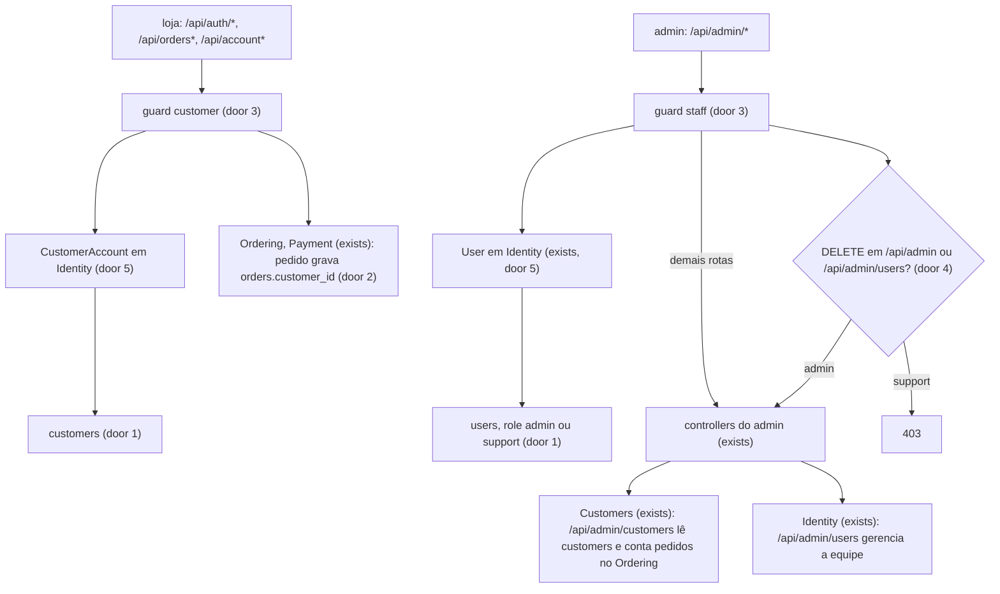
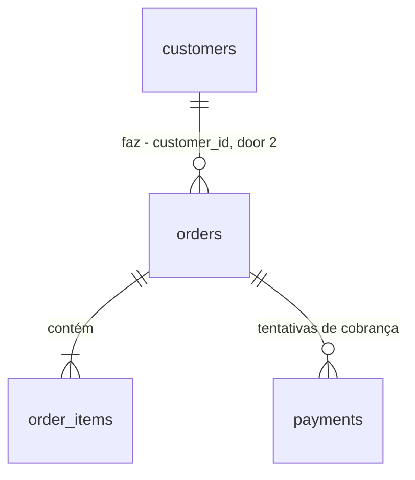

# Contas de equipe e contas de cliente

## Problem

Hoje existe uma única tabela de contas, `users`. Nela, cliente e administrador se distinguem só pelo `role` (`admin` ou `customer`), entram pelo mesmo `POST /api/auth/login` e não podem usar o mesmo e-mail. A área administrativa tem um único perfil, o admin, que pode tudo. Por isso não há como dar acesso a quem atende clientes e mantém o catálogo sem dar também o poder de excluir produtos e categorias. Também não há como um funcionário comprar na loja com uma conta separada. E a tela "Clientes" do admin lista os administradores junto com os compradores. A fonte não traz número: é um projeto de estudo, sem usuários. O item foi decidido na discovery [.design/staff-and-customer-accounts.md](../../../.design/staff-and-customer-accounts.md).

Quando isto estiver entregue, a equipe (admin e suporte) entra por `/admin/login` com uma conta própria, e os clientes entram pela loja com outra conta, mesmo que usem o mesmo e-mail. O suporte cadastra, edita e consulta, mas só o admin remove itens e gerencia a equipe. A tela "Clientes" mostra só os compradores.

## Flow

Reaproveita o Sanctum SPA (sessão em cookie, CSRF), o `ApiExceptionRenderer` e os seus códigos, os value objects `Email` e `Password` com `EmailRule` e `PasswordRule`, a composição do `CustomerSummaryDTO`, as regras de exclusão do `DeleteProductUseCase` e do `DeleteCategoryUseCase`, e o padrão `BusinessRuleException` → `409`.

1. in, loja: `POST /api/auth/register|login` → `AuthController` (exists) autentica no guard `customer` (door 3) contra `customers` (door 1) pelo `CustomerAccount` (door 5); a resposta é o recurso do cliente (door 6)
2. loja autenticada: `/api/orders*`, `/api/orders/{order}/payment`, `/api/account*` exigem o guard `customer` (door 3); `OrderPolicy` (exists) recebe o `CustomerAccount`, e o `PlaceOrderUseCase` (exists) grava `orders.customer_id` (door 2)
3. in, admin: `POST /api/admin/auth/login` → controller de login da equipe (new, no door - placement per conventions) autentica no guard `staff` (door 3) contra `users` (door 1)
4. admin autenticado: todo `/api/admin/*` exige o guard `staff` (door 3); os `DELETE` e o recurso `/api/admin/users` exigem também o papel `admin` (door 4)
5. `/api/admin/customers` → `Customers` (exists) lê e grava `customers` pelo repositório do `CustomerAccount` (new, no door - placement per conventions) e conta pedidos pelo `OrderRepository` (exists)
6. `/api/admin/users` → `Identity` (exists) gerencia `users`; o próprio admin não se remove nem muda o próprio papel (`BusinessRuleException`, exists)
7. `GetAdminDashboardUseCase` (exists) conta `customers` em `total_customers`
8. frontend: o store `auth` (exists) passa a guardar o cliente; um store da equipe (new, no door - placement per conventions) guarda o membro da equipe; o guard do `router` (exists) leva `/admin/*` sem sessão de equipe para `/admin/login`; o `api` (exists) envia o `401` de `admin/*` para `/admin/login` e o da loja para `/login`
9. out: `customers` e `users` separados, e cada área só responde à sua própria sessão

## Impact

| Front | What changes |
| --- | --- |
| domain | termo existente `User` (Identity): era "quem se autentica, admin ou cliente"; passa a ser "membro da equipe, admin ou suporte". Quem ramifica nele hoje: `OrderPolicy`, `UserPolicy`, `EnsureUserIsAdmin`, `AuthController`, `UserRepository::countCustomers`, `ListCustomersUseCase`, `ShowCustomerUseCase`, `CreateCustomerUseCase`, `UpdateCustomerUseCase`, `UpdateOwnProfileUseCase`, `CustomerSummaryDTO`, `UserSeeder`, `UserFactory` e os helpers `customer()` e `admin()` do `tests/Pest.php` |
| domain | novo termo `CustomerAccount` (Identity): a conta de quem compra na loja, na tabela `customers` |
| domain | termo existente `Customer` (Ordering): continua a projeção somente leitura do comprador, agora sobre `customers` em vez de `users` |
| domain | termo existente `UserRole`: era `admin` \| `customer`; passa a ser `admin` \| `support`. Quem ramifica nele: `User::isAdmin`/`isCustomer`/`scopeCustomers`, `OrderPolicy::create`, `CreateCustomerUseCase`, `UserSeeder`, `UserFactory`, `UserResource` e, no frontend, `auth.isAdmin`/`isCustomer` e o guard do router (`requiresAdmin`, `requiresCustomer`, `guestOnly`) |
| domain | o nome "usuários" em `/api/admin/users` e em `/admin/users`: era a tela "Clientes"; passa a ser a tela da equipe |
| contract | `GET /api/auth/me`, `POST /api/auth/login` e `POST /api/auth/register` perdem `role` e `role_label` na resposta. `GET /api/account` troca `data.user` por `data.customer`. Único consumidor: o frontend do repositório, que muda no mesmo pull request |
| contract | `/api/admin/users` deixa de ser a tela "Clientes" e vira a gestão da equipe; a tela "Clientes" vai para `/api/admin/customers`. Único consumidor: `adminUserService` e as páginas `User*Page` do frontend |
| contract | `/api/admin/*` passa a responder `401` a uma sessão de cliente (antes, `403`), e as rotas da loja que pedem login passam a responder `401` a uma sessão de equipe (antes, `403` em `POST /api/orders` para o admin) |
| stored data | nothing to migrate - o banco é recriado pelo `make fresh`, sem dados reais |
| config | `config/auth.php` troca o guard `web` pelos guards `customer` e `staff` e ganha o provider `customers`; nenhuma variável nova no `.env.example` |
| tests | toda a suíte que usa `customer()`, `admin()` ou `actingAs` passa a autenticar no guard certo: `Feature/Admin/*`, `Feature/Account/*`, `Feature/Auth/*`, `CheckoutTest`, `PaymentTest`, `OrderStatusFlowTest`, `AuthorizationTest`, `SeederTest`, `UserRepositoryTest`, `CustomerTest`, `UserPolicyTest`; o `ModuleBoundariesTest` ganha as regras de Ordering, Payment e Fulfillment sem `User` |
| docs | README (estrutura, modelo de dados, usuários de teste, API, fluxos, "Escopo e decisões"), análise de domínio (seções 6 e 7, matriz Identity × Ordering, glossário, pendências) e o design, como pede o `AGENTS.md`. As decisões que valem para features futuras (guard por área, `DELETE` do admin só para o papel `admin`) entram no "Escopo e decisões" do README, que é o registro de decisões do repositório |

## Relations

One-way constraints: e-mail único dentro de `customers` e dentro de `users`, sem unicidade entre as duas (door 1); `users.role` obrigatório, só `admin` ou `support` (door 1); `orders.customer_id` aponta para `customers` e impede apagar um cliente com pedidos (door 2). `users` não se liga a nenhuma tabela de negócio.

## Surface

| Route | In | Out | Status |
| --- | --- | --- | --- |
| `POST /api/auth/register` | `name`, `email`, `password`, `password_confirmation` | `data`: `id` · `name` · `email` · `created_at` | `201`, `422`, `429` |
| `POST /api/auth/login` | `email`, `password` | `data`: `id` · `name` · `email` · `created_at` | `200`, `422`, `429` |
| `GET /api/auth/me` | - | `data`: `id` · `name` · `email` · `created_at` | `200`, `401` |
| `GET /api/account` | - | `data`: `customer` · `orders_count` · `last_order` · `recent_orders` | `200`, `401` |
| `POST /api/admin/auth/login` | `email`, `password` | `data`: `id` · `name` · `email` · `role` · `role_label` · `created_at` | `200`, `422`, `429` |
| `POST /api/admin/auth/logout` | - | - | `204`, `401` |
| `GET /api/admin/auth/me` | - | `data`: `id` · `name` · `email` · `role` · `role_label` · `created_at` | `200`, `401` |
| `GET /api/admin/customers` | `page` | `data[]`: `id` · `name` · `email` · `created_at` · `orders_count`; `meta`, `links` | `200`, `401` |
| `POST /api/admin/customers` | `name`, `email`, `password`, `password_confirmation` | `data`: cliente · `orders_count` | `201`, `401`, `422` |
| `GET /api/admin/customers/{customer}` | - | `data`: cliente · `orders_count` · `orders` | `200`, `401`, `404` |
| `PUT /api/admin/customers/{customer}` | `name`, `email`, `password?`, `password_confirmation?` | `data`: cliente · `orders_count` | `200`, `401`, `404`, `422` |
| `GET /api/admin/users` | `page` | `data[]`: `id` · `name` · `email` · `role` · `role_label` · `created_at`; `meta`, `links` | `200`, `401`, `403` |
| `POST /api/admin/users` | `name`, `email`, `password`, `password_confirmation`, `role` | `data`: membro da equipe | `201`, `401`, `403`, `422` |
| `GET /api/admin/users/{user}` | - | `data`: membro da equipe | `200`, `401`, `403`, `404` |
| `PUT /api/admin/users/{user}` | `name`, `email`, `password?`, `password_confirmation?`, `role` | `data`: membro da equipe | `200`, `401`, `403`, `404`, `409`, `422` |
| `DELETE /api/admin/users/{user}` | - | - | `204`, `401`, `403`, `404`, `409` |
| `DELETE /api/admin/products/{product}` | - | - | `204`, `401`, `403`, `404`, `409` |
| `DELETE /api/admin/categories/{category}` | - | - | `204`, `401`, `403`, `404`, `409` |

## Landing

| One-way door | Literal shape | Alternative rejected |
| --- | --- | --- |
| 1. duas tabelas de contas | tabela nova `customers` (`name`, `email`, `password`, `remember_token`, timestamps) com `email` único e `CHECK customers_email_normalized (email = lower(btrim(email)))`; `users` mantém `email` único e o seu `CHECK`, e `role` passa a `string(20)` obrigatório, **sem default**, com `CHECK users_role_valid (role IN ('admin', 'support'))` | uma tabela com coluna `kind`: o mesmo e-mail nos dois lados exigiria unicidade composta, e uma sessão continuaria podendo virar a outra por um campo. Tabela `accounts` com perfis 1:1: obriga uma senha só para os dois lados, e a discovery decidiu contas independentes |
| 2. FK do pedido | `orders.customer_id` `foreignId` → `customers.id`, `restrictOnDelete`, no lugar de `orders.user_id` | manter `user_id`: depois da troca, o nome passaria a dizer "um membro da equipe fez o pedido" |
| 3. um guard de sessão por área (precedente) | `config/auth.php`: guards `customer` (`session`, provider `customers` → `CustomerAccount`) e `staff` (`session`, provider `users` → `User`); default `customer`; rotas da loja em `auth:customer`, rotas do admin em `auth:staff`; **nenhuma rota usa `auth:sanctum`**; o Sanctum continua só pelo `statefulApi()` (sessão e CSRF) | `auth:sanctum` com `sanctum.guard = ['customer', 'staff']`: o `Sanctum\Guard` devolve a primeira sessão que autentica, então uma sessão de equipe passaria nas rotas da loja. Token para o admin: o SPA não guarda token por decisão do projeto |
| 4. só o admin remove (precedente) | `/api/admin` em `auth:staff`; todos os `DELETE` de `/api/admin` e o `apiResource('users')` num grupo com o middleware `admin` (`EnsureUserIsAdmin`, papel `admin`); um teste percorre `Route::getRoutes()` e falha se algum `DELETE` com URI `api/admin/*` responder diferente de `403` a uma sessão `support` | `delete` em cada policy (`ProductPolicy`, `CategoryPolicy`): uma rota nova sem o método na policy libera o suporte em silêncio, e a regra fica espalhada em N arquivos |
| 5. as duas contas no Identity | `App\Modules\Identity\Models\CustomerAccount` (`Authenticatable`, tabela `customers`, `#[UseFactory]`); `App\Modules\Identity\Enums\UserRole` com `Admin = 'admin'` e `Support = 'support'`; `App\Modules\Ordering\Models\Customer` continua somente leitura, com `$table = 'customers'`; `ModuleBoundariesTest`: `App\Modules\Ordering`, `App\Modules\Payment` e `App\Modules\Fulfillment` não usam `App\Modules\Identity\Models\User`, uma expectativa por namespace | `CustomerAccount` no módulo Customers: a `OrderPolicy` do Ordering dependeria do Customers, que já depende do Ordering (`OrderRepository`), e isso criaria um ciclo |
| 6. contrato das contas | recurso do cliente `{ id, name, email, created_at }`, sem `role`; recurso da equipe `{ id, name, email, role, role_label, created_at }`, com `role_label` `Administrador` \| `Suporte`; `GET /api/account` com a chave `data.customer` | manter `role: "customer"` no recurso do cliente: o valor seria sempre o mesmo, e o frontend continuaria ramificando num papel que não existe mais |

- Nothing else in this change is hard to reverse

## Criteria

### S1: CustomerAccount (P1)

O comprador tem a sua própria conta na tabela `customers`, usada pelo cadastro, pelo login da loja, por "Minha conta" e pelos pedidos.

**Acceptance Criteria**

1. WHEN a visitor calls `POST /api/auth/register` with an e-mail not present in `customers` THEN the system SHALL create one row in `customers`, create no row in `users`, authenticate the `customer` guard and respond `201` with `data` holding exactly the keys `id`, `name`, `email`, `created_at`
2. WHEN a visitor calls `POST /api/auth/register` with an e-mail that exists only in `users` THEN the system SHALL respond `201` and create a `customers` row with that e-mail
3. IF a visitor calls `POST /api/auth/register` with an e-mail that already exists in `customers` THEN the system SHALL respond `422` with an error on `email` and create no row
4. WHEN a visitor calls `POST /api/auth/login` with the e-mail and password of a `customers` row THEN the system SHALL respond `200` with `data` holding exactly `id`, `name`, `email`, `created_at`
5. IF a visitor calls `POST /api/auth/login` with the e-mail and password of a `users` row and no `customers` row has that e-mail THEN the system SHALL respond `422` with `errors.email` equal to `["E-mail ou senha inválidos."]` and authenticate no guard
6. WHILE the request carries only a `staff` session, WHEN it calls any of `GET /api/auth/me`, `GET /api/orders`, `POST /api/orders`, `GET /api/orders/{order}`, `POST /api/orders/{order}/payment`, `GET /api/account`, `PUT /api/account/profile` THEN the system SHALL respond `401` and write nothing
7. WHEN a customer places an order through `POST /api/orders` THEN the system SHALL store the customer's `customers.id` in `orders.customer_id`
8. IF a `customers` row that has orders is deleted at database level THEN the database SHALL refuse the delete
9. IF a `customers` row is written with an e-mail that is not lower-case and trimmed, or with an e-mail already in `customers`, THEN the database SHALL refuse the write
10. WHEN a customer calls `PUT /api/account/profile` with an e-mail that exists only in `users` THEN the system SHALL respond `200` and store that e-mail
11. IF a customer calls `PUT /api/account/profile` with an e-mail of another `customers` row THEN the system SHALL respond `422` with an error on `email`
12. WHEN a customer calls `GET /api/account` THEN the system SHALL respond `200` with the keys `data.customer`, `data.orders_count`, `data.last_order`, `data.recent_orders`, and `data.customer` SHALL have no `role` key
13. The namespaces `App\Modules\Ordering`, `App\Modules\Payment` and `App\Modules\Fulfillment` SHALL NOT use `App\Modules\Identity\Models\User`, each in its own architecture expectation
14. WHEN the database is seeded THEN `customers` SHALL contain `cliente@example.com` and `UserSeeder::CUSTOMERS` (10) customer rows in total, and `users` SHALL contain no customer
15. WHILE the browser has only a `staff` session, WHEN it opens `/checkout` THEN the frontend SHALL redirect to `/login?redirect=/checkout`

**Independent test:** cadastrar `a@example.com` na loja depois de criar `a@example.com` na equipe, fazer um pedido e ver `orders.customer_id` apontando para `customers`.

### S2: Staff login (P1)

A equipe tem conta, papel e login próprios, e o admin só responde à sessão da equipe.

**Acceptance Criteria**

16. WHEN a visitor calls `POST /api/admin/auth/login` with the e-mail and password of a `users` row THEN the system SHALL authenticate the `staff` guard and respond `200` with `data` holding exactly `id`, `name`, `email`, `role`, `role_label`, `created_at`
17. IF a visitor calls `POST /api/admin/auth/login` with the e-mail and password of a `customers` row and no `users` row has that e-mail THEN the system SHALL respond `422` with `errors.email` equal to `["E-mail ou senha inválidos."]` and authenticate no guard
18. IF a visitor calls `POST /api/admin/auth/login` with a `users` e-mail and a wrong password THEN the system SHALL respond `422` with `errors.email` equal to `["E-mail ou senha inválidos."]`
19. WHILE the request carries only a `customer` session, WHEN it calls any `/api/admin/*` route except `POST /api/admin/auth/login` THEN the system SHALL respond `401`
20. WHILE the request carries no session, WHEN it calls any `/api/admin/*` route except `POST /api/admin/auth/login` THEN the system SHALL respond `401`
21. WHEN a staff member calls `POST /api/admin/auth/logout` THEN the system SHALL respond `204`, and a following `GET /api/admin/auth/me` SHALL respond `401`
22. IF a `users` row is written with `role` absent or with a value other than `admin` or `support` THEN the database SHALL refuse the write
23. WHEN the database is seeded THEN `users` SHALL contain `admin@example.com` with role `admin` and `suporte@example.com` with role `support`, both with password `password`
24. WHILE the browser has no `staff` session, WHEN it opens a route under `/admin` other than `/admin/login` THEN the frontend SHALL redirect to `/admin/login?redirect=<that path>`
25. WHILE the browser has a `staff` session, WHEN it opens `/admin/login` THEN the frontend SHALL redirect to `/admin`
26. IF an API call to a path starting with `admin/`, other than `admin/auth/*`, returns `401` THEN the frontend SHALL redirect to `/admin/login`, and IF any other API call except `auth/*` returns `401` THEN it SHALL redirect to `/login`; a `401` from `auth/*` or `admin/auth/*` SHALL redirect nowhere, because the session check of a visitor is expected to fail
27. WHILE the browser has only a `staff` session, the store navbar SHALL show the "Entrar" link and SHALL NOT show the "Painel admin" link

**Independent test:** entrar em `/admin/login` com `suporte@example.com`, abrir o dashboard, e confirmar que `/login` da loja recusa essas mesmas credenciais.

### S3: Admin customers (P1)

A tela "Clientes" lê só `customers`, em `/api/admin/customers`, para admin e suporte.

**Acceptance Criteria**

28. WHEN a staff member of either role calls `GET /api/admin/customers` THEN the system SHALL respond `200` listing only `customers` rows, newest first, 15 per page, each with `orders_count` equal to that customer's number of orders, and no `users` row
29. WHEN a staff member of either role calls `POST /api/admin/customers` with a new e-mail THEN the system SHALL respond `201` and create the row in `customers`
30. WHEN a staff member calls `POST /api/admin/customers` with an e-mail that exists only in `users` THEN the system SHALL respond `201`
31. IF a staff member calls `POST /api/admin/customers` with an e-mail already in `customers` THEN the system SHALL respond `422` with an error on `email`
32. WHEN a staff member of either role calls `GET /api/admin/customers/{customer}` THEN the system SHALL respond `200` with `orders` holding at most the 10 most recent orders of that customer
33. WHEN a staff member of either role calls `PUT /api/admin/customers/{customer}` with valid data THEN the system SHALL respond `200` and store the change in `customers`
34. IF a staff member calls `DELETE /api/admin/customers/{customer}` THEN the system SHALL respond `405` and keep the row
35. WHEN a staff member calls `GET /api/admin/dashboard` THEN `data.cards.total_customers` SHALL equal the number of `customers` rows, whatever the number of `users` rows
36. The admin menu entry "Clientes" SHALL point to `/admin/customers`, and `/admin/customers`, `/admin/customers/new`, `/admin/customers/{id}` and `/admin/customers/{id}/edit` SHALL render the list, form and detail pages

**Independent test:** com 3 clientes e 2 membros da equipe, a lista do admin mostra 3 linhas e o dashboard mostra 3.

### S4: Admin-only removal (P1)

Todo `DELETE` do admin, presente e futuro, é exclusivo do papel `admin`.

**Acceptance Criteria**

37. WHILE the request carries a `support` session, WHEN it calls `DELETE /api/admin/products/{product}` for a product never ordered THEN the system SHALL respond `403` and keep the product
38. WHILE the request carries a `support` session, WHEN it calls `DELETE /api/admin/categories/{category}` for a category without products THEN the system SHALL respond `403` and keep the category
39. WHILE the request carries an `admin` session, WHEN it calls `DELETE /api/admin/products/{product}` for a product never ordered THEN the system SHALL respond `204` and remove it
40. The system SHALL respond `403` to a `support` session on every route registered with method `DELETE` and a URI starting with `api/admin/`, checked by enumerating the route table
41. WHILE the request carries a `support` session, WHEN it calls each of `POST /api/admin/products`, `PUT /api/admin/products/{product}`, `PATCH /api/admin/products/{product}/status`, `POST /api/admin/categories`, `PUT /api/admin/categories/{category}`, `PUT /api/admin/stocks/{stock}`, `GET /api/admin/orders`, `GET /api/admin/orders/{order}` and `GET /api/admin/dashboard` with valid input THEN the system SHALL respond with the same success status it gives an `admin` session
42. WHILE the browser has a `support` session, the product list and the category list SHALL NOT show the "Excluir" button, and WHILE it has an `admin` session they SHALL show it

**Independent test:** com o suporte logado, `DELETE` de um produto nunca vendido responde `403`; com o admin, `204`.

### S5: Staff management (P2)

O admin cadastra, edita, troca o papel e remove membros da equipe na tela "Usuários".

**Acceptance Criteria**

43. WHEN an admin calls `GET /api/admin/users` THEN the system SHALL respond `200` listing only `users` rows, newest first, 15 per page, each with `role` and `role_label`
44. WHEN an admin calls `POST /api/admin/users` with a new e-mail and `role` `support` THEN the system SHALL respond `201` and create a `users` row with role `support`
45. IF an admin calls `POST /api/admin/users` with `role` absent or other than `admin` or `support` (`customer`, `superadmin`) THEN the system SHALL respond `422` with an error on `role` and create no row
46. IF an admin calls `POST /api/admin/users` with an e-mail already in `users` THEN the system SHALL respond `422` with an error on `email`
47. WHEN an admin calls `POST /api/admin/users` with an e-mail that exists only in `customers` THEN the system SHALL respond `201`
48. WHEN an admin changes another member's `role` from `support` to `admin` through `PUT /api/admin/users/{user}` THEN the system SHALL respond `200`, and that member's next `DELETE /api/admin/products/{product}` SHALL be authorized by the role `admin`
49. IF an admin calls `PUT /api/admin/users/{user}` on their own account with a `role` different from their current one THEN the system SHALL respond `409` with `message` equal to "Você não pode alterar o próprio papel." and keep the role
50. WHEN an admin calls `PUT /api/admin/users/{user}` on their own account with their current `role` and a new `name` THEN the system SHALL respond `200` and store the name
51. WHEN an admin calls `DELETE /api/admin/users/{user}` on another member THEN the system SHALL respond `204`, remove the row, and that member's next request to `GET /api/admin/auth/me` SHALL respond `401`
52. IF an admin calls `DELETE /api/admin/users/{user}` on their own account THEN the system SHALL respond `409` with `message` equal to "Você não pode remover a própria conta." and keep the row
53. WHILE the request carries a `support` session, WHEN it calls any `/api/admin/users` route THEN the system SHALL respond `403` and write nothing
54. WHILE the browser has a `support` session, the admin menu SHALL NOT show "Usuários", and opening `/admin/users` SHALL redirect to `/forbidden`
55. WHILE the browser has an `admin` session, the admin menu SHALL show "Usuários" pointing to `/admin/users`

**Independent test:** o admin cria `novo@example.com` como suporte, promove esse membro a admin, e a tentativa de remover a própria conta responde `409`.

## Out of scope

| Excluded | Why |
| --- | --- |
| Excluir clientes | `orders.customer_id` impede a exclusão, e ainda não há decisão de LGPD sobre anonimizar |
| Endereços e outros dados próprios do cliente | a pendência "Customers grava pelo repositório do Identity" continua com o mesmo motivo |
| "Esqueci minha senha" para equipe e clientes | não existe hoje |
| Log de auditoria de quem criou, editou ou removeu o quê | não pedido nesta rodada |
| Permissões configuráveis por papel (tabela de permissões) | dois papéis fixos bastam enquanto o produto tiver dois perfis |
| Admin em origem própria, com cookie e logout independentes | o repositório serve um único SPA numa única origem |

## Assumptions

| Assumption | Chosen default | Rationale | Confirmed? |
| --- | --- | --- | --- |
| Logout com as duas sessões abertas no mesmo navegador | `POST /api/auth/logout` e `POST /api/admin/auth/logout` invalidam a sessão do navegador e desconectam as duas | mais simples e mais seguro; o caso é raro (um membro da equipe testando a loja) | n |
| Dois admins se removendo ou se rebaixando ao mesmo tempo | aceito sem trava: pode sobrar zero admins, e a recuperação é pelo seed | projeto de estudo; uma trava exigiria lock em `users` para um caso que só existe com dois admins agindo no mesmo instante | n |
| E-mail do suporte no seed | `suporte@example.com`, senha `password` | segue `admin@example.com` e `cliente@example.com` | n |
| Testes de tela no frontend | sem nova dependência de teste (o Vitest roda sem DOM). Os critérios 15, 24–27, 36, 42, 54 e 55 são provados por testes unitários da lógica do guard do router, do store e do roteamento de `401` no `api`, mais uma passada no navegador na verificação | uma biblioteca de teste de componente seria uma dependência nova, e a lógica de decisão é testável sem DOM | n |
| Mensagem de `403` | a mensagem padrão do `ApiExceptionRenderer` ("Você não tem permissão para realizar esta ação.") | já é o contrato de `403` do projeto | y |
| Código de erro dos `409` da equipe | `BUSINESS_RULE_VIOLATION`, via `BusinessRuleException` | é o precedente do projeto para regra de negócio | n |

**Open questions:** none - all resolved or logged above.

## Observable

| Surface | Decision | Landing |
| --- | --- | --- |
| screen `/admin/login` | empty, loading, error states | existing - copia a `LoginPage`: botão desabilitado ao enviar, erro de campo pelo `useFormErrors` |
| screen `/admin/login` | unauthorised state | AC 25 |
| screen `/admin/users` (lista) | empty state | existing - `EmptyState`, como a `UserListPage` atual |
| screen `/admin/users` (lista) | loading and error states | existing - `LoadingState` e notificação global, como a `UserListPage` atual |
| screen `/admin/users` (lista) | unauthorised state | AC 54 |
| screen `/admin/users` (lista) | density and ordering | AC 43 |
| screen `/admin/users` (lista) | destructive action confirms | existing - `window.confirm` antes de remover, como em `ProductListPage` |
| screen `/admin/users` (form) | error state | AC 45, 46, 49 (mensagens de campo e de `409` na página) |
| screen `/admin/customers` | empty, loading, error states | existing - as páginas `User*Page` atuais, renomeadas |
| screen `/admin/customers` | density and ordering | AC 28 |
| screen `/admin/customers` | destructive action confirms | n/a - não há remoção de clientes (AC 34) |
| screens `/admin/products`, `/admin/categories` | unauthorised state for removal | AC 42 |
| store navbar | unauthorised state | AC 27 |
| all new `/api/admin/auth/*`, `/api/admin/users*`, `/api/admin/customers*` | error shape and codes | existing - `ApiErrorResponse` com `code`, `message`, `errors`, `request_id` |
| `POST /api/admin/auth/login` | rate limit | existing - `throttle:10,1`, como `POST /api/auth/login` |
| all new `/api/admin/users*`, `/api/admin/customers*` | rate limit | n/a - as outras rotas do admin não têm throttle e exigem sessão de equipe |
| all routes | versioning | n/a - a API não tem prefixo de versão e o único consumidor é o frontend do mesmo repositório |
| docs README e análise de domínio | structure and what the reader does next | existing - regra de atualização do `AGENTS.md` |

## Sources

- [.design/staff-and-customer-accounts.md](../../../.design/staff-and-customer-accounts.md) - origem: as 7 Key decisions, os slices e o escopo
- [AGENTS.md](../../../AGENTS.md) - fronteiras entre módulos, `ModuleBoundariesTest` com um namespace por expectativa, atualização de documentação
